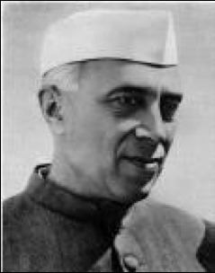
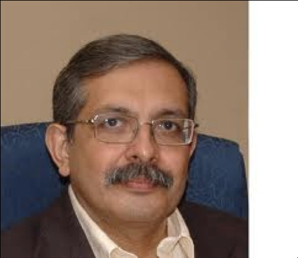
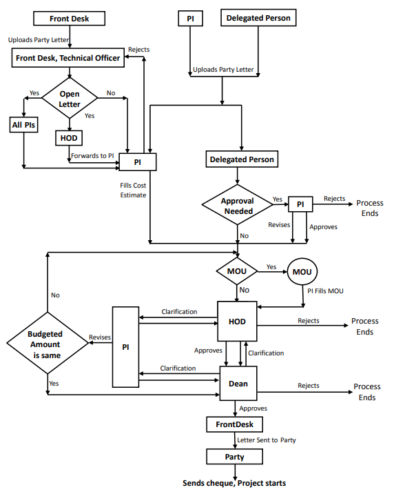

\newgeometry{margin=0.5in,top=0in}
# Preface {.unlisted .unnumbered}
\vspace{-0.9cm}

The Faculty Handbook is an extremely useful document since it consolidates much of the information that the faculty members need during their careers at IIT Bombay.  The first edition was brought out in 2014. Over the years, there have been several far-reaching changes in the governance, recruitment policies, salary structure, etc. This second edition of the Handbook has been thoroughly revised and updated to take all the changes into account.

There are many written (and some unwritten) rules that govern any institution like IIT.  Many such rules have been captured succinctly, although some have no doubt been left out inadvertently. A handbook such as this, I believe, is particularly useful for young faculty members of the institute. Significant efforts have therefore been made to address the issues that concern young faculty members.

Disclaimer: While every effort has been made to keep the Handbook up-to-date and accurate, it should not be regarded as authoritative. Going by the very name, it should be viewed as a guide; the details of rules and regulations concerning specifics require confirmation from the authorities of administration as and when needed.

The need to update the Handbook was originally brought to the fore by Prof. Abhay Karandikar (erstwhile Dean (FA)) in 2017. A committee with  Prof. Swaroop Ganguly as the Convener prepared the first draft  of the handbook with crucial inputs from faculty members. Prof.  K. P. Kaliappan, the former Dean (FA) has invested a tremendous amount of time to document as many details as possible in the handbook and bring it to this current form. Special thanks to Prof. Kumar Appaiah (Department of Electrical Engineering) for his hard work, dedication, and consistent support that helped to publish this document. The revised draft was reviewed by Prof. Devang Khakhar (former Director, IIT Bombay), Prof. S. Sudarshan, DD (AIA), Prof. Avinash Mahajan, Dean (AP), Prof. A.M. Pradeep, Associate Dean (R&D), Prof. Santanu Banerjee (Earth sciences Department, other functionaries and Heads of academic units and their very valuable suggestions have been incorporated. The timely help and efforts of Dr. K.V.Reghuthaman, Joint Registrar, Mr. Sanjay Shah, Assistant Registrar, Ms. Falguni Banerjee Naha (PRO) and the staff from their offices and Ms. Archita Patil, Dean (FA) office who checked the details for accuracy deserve special appreciation. Finally, the Director, Prof. Subhasis Chaudhuri, has always offered constant support and encouragement throughout the handbook revision process.

I trust that this version will serve as a handy reference on day-to-day matters for all faculty members.

Prof. Neela Nataraj

(Dean, Faculty Affairs)
\clearpage

\restoregeometry
\normalsize
\newpage

**Committee Members**

- Prof. Swaroop Ganguly (Convener)
- Prof. Kumar Appaiah
- Prof. Ronita Bardhan
- Prof. Himanshu Bahirat
- Prof. Subimal Ghosh
- Mr. Sanjay K. Shah

**Staff Acknowledgements**

- Ms. Tejaswi Kamath
- Ms. Seena Shyjo
- Mr. Sachin Shirishkar
- Ms. Sneha Chavan
- Ms. Madhavi Biwalkar
- Ms. Rajashri Ghegad
- Ms. Vandana Hate
- Ms. Archita Patkar
- Ms. Ashwini Shirsat
- Mr. Vaibhav Patil
- Ms. Shamal Padwal
- Ms. Madhavi Borkar

<!-- Faculty Handbook is the single most important document, which  consolidates much of the information that the faculty members need during their careers at IIT Bombay.  This is the third edition of the hand book; the first two were brought out in … and 2014. -->

<!-- IITB is an institution that is adapting dynamically to the evolving changes and endeavoring constantly to be an institution par excellence. Over the years, there have been several far-reaching changes in the governance, recruitment policies, salary structure, etc. In view of certain paradigm changes that have come into being, it was deemed prudent that the faculty handbook is thoroughly revised and updated. -->

<!-- A committee with  Prof. Swaroop Ganguly as the Convener prepared the first draft  of the handbook with invaluable inputs from faculty members. Prof.  K. P. Kaliappan, the former Dean (FA) and Prof. Kumar Appaiah have invested a tremendous amount of time to document as many details as possible in the handbook and bring it to this current form. Prof. S. Sudarshan DD (AIA) who has a keen  eye for details reviewed this handbook despite his busy schedule.  The revised draft was gone through by several people, who in turn provided important feedback and input. I must make a particular mention of xxxxx, who checked every detail for accuracy. Subsequently, the document was made accessible to all the faculty members of the institute for their feedback, which was duly taken care of. -->

<!-- I sincerely wish that this final version, for which the cover has been designed by Industrial Design Centre, will serve as a very handy reference on day-to-day matters for all faculty members. -->

<!-- It's with time that we will learn about the written and unwritten rules, some captured succinctly and some left out inadvertently. Nonetheless, a handbook such as this, I believe, is immensely useful for young faculty members, who will not have to consult senior colleagues for everything. Particular effort has therefore been made to address the issues that concern young faculty members. -->

<!-- Disclaimer: While every effort has been made to keep the Handbook up-to-date and accurate, it may not be regarded as comprehensive and authoritative. Going by the veryname, it should be viewed as a guide with the details of rules and regulations concerning specifics requiring confirmation from the authorities of administration as and when needed. -->

<!-- Prof. Neela Nataraj -->
<!-- (Dean, Faculty Affairs) -->

<!-- **Committee Members** -->

<!-- - Prof. Swaroop Ganguly (Convener) -->
<!-- - Prof. Kumar Appaiah -->
<!-- - Prof. Ronita Bardhan -->
<!-- - Prof. Himanshu Bahirat -->
<!-- - Prof. Subimal Ghosh -->

# The Institute
The Indian Institutes of Technology (IITs) were established on the recommendation of a Committee headed by Sir Nalini Ranjan Sarkar, a businessman, educationist, industrialist and public figure. The Committee had recommended the establishment of institutes of national importance to be set up in different regions of India. The first of the IITs was set up in Kharagpur in 1950 at a site in Hijli village which used to be a British-era detention camp. <!-- The vision of establishing these Institutes is best stated in the words of India's first Prime Minister Pt. Jawaharlal Nehru in his convocation speech at the Institute: -->

<!-- {width=200px} -->
<!-- {width=200px} -->

Four more IITs followed in quick succession. IIT Bombay (officially
‘Indian Institute of Technology Bombay’) was established in 1958,
followed by those at Madras (1959), Kanpur (1959) and Delhi
(1961). Though the names of the cities Bombay and Madras were later
changed respectively to Mumbai and Chennai, the Institutes at these
two places retain the original names. Thus our institute is IIT
Bombay.  IIT Bombay celebrated its Golden Jubilee in 2008 and Diamond
Jubilee in 2018.

In 1994, a sixth IIT was established in Guwahati, Assam. Seven years
later, in the year 2001, one of the oldest engineering colleges of the
country situated in Roorkee, Uttarakhand, was given the status of an
IIT in its 150$^{\text{th}}$ anniversary year. The Government of India decided to
open eight more IITs from the academic year 2008-2009. These are
located in Bhubaneswar (Odisha), Gandhinagar (Gujarat), Hyderabad
(Telengana), Indore (Madhya Pradesh), Mandi (Himachal Pradesh), Patna
(Bihar), Ropar (Punjab) and Jodhpur (Rajasthan). In 2012, the
Institute of Technology of Banaras Hindu University at Varanasi (Uttar
Pradesh) was conferred the status of an IIT. Then, in 2015-2016, a few
more IITs were set up in Tirupati, Goa, Palakkad, Bhilai, Dharwad and
Jammu; at the same time, the Indian School of Mines, Dhanbad
(Jharkhand) was converted to IIT Dhanbad, making a total of 23, as of 2021.

## Who's who

There are two statutory documents that stipulate the way the Institute is to be run. The first one is [The Institutes of Technology Act, 1961](https://www.iitb.ac.in/en/about-iit-bombay/institutes-technology-act), passed by the Indian Parliament. The act stipulates that the IITs are institutions of national importance and prescribes the broad framework of their governance. The second one is the Statutes of I.I.T. Bombay, which gives the detailed [rules of governance](http://www.iitb.ac.in/en/about-iit-bombay/statutes-iit-bombay).

### The Visitor
Formally, the President of India is officially the chief of the IITs;
(s)he is  called the Visitor of the Institutes. In reality, the
Institute does not deal directly with the Visitor, but routes all
paperwork requiring their approval through the Ministry of Education (MoE).

### The IIT Council
At the very top of all the IITs' administration is the [IIT
Council](https://www.iitsystem.ac.in). The Chairperson of the Council is
the Minister of Education, which is the central
ministry under which our Institute belongs to. The Council is an
organization with a large (ex-officio) members, e.g. the
Chairpersons and the Directors of all IITs, Chairperson and Director of IISc,
Bangalore, Director General of CSIR, Chairperson UGC and a few nominated
members.

### The Board of Governors

Each IIT has its own Board of Governors (BOG), the highest governing
body of the Institute, which meets, at least four times a year. Almost
all major policy decisions have to be approved by the Board. For
instance, all appointments, major purchases, constructions
etc. require approval and authorization of the Board. The meetings of
the Board are generally held once in three months. The Chairperson of the
Board approves urgent items that cannot wait for the next Board
Meeting; these are approved _post facto_ by the BOG.

The Board has 11 members. In addition to the Chairperson (appointed by
MoE) and the Director of the Institute, who are _ex officio_ members
of the Board, one nominee from each of the governments of the states
Maharashtra, Goa and the Union Territory of Dadra and Nagar Haveli,
which comprise the zone in which the Institute is situated, are
members of the Board.  There are four members, having special
knowledge or practical experience in respect of education, engineering
or science, nominated by the IIT Council to the Board. The remaining two
members are nominees of the Senate of IIT Bombay. These members are,
in practice, recommended by the Senate Nominations Committee. The
Registrar of the Institute is the _ex officio_ Secretary of the Board
of Governors.

Two crucial Institute committees, namely the _Finance Committee_ and
the _Building and Works Committee_ report to the Board. Any proposal,
which requires major fund allocation is generally routed through the
Finance Committee that acts as the watchdog of the Institute
funds. The Financial Advisor to MoE is a member of the Finance
Committee. The Building and Works Committee is responsible for all the
major construction projects in the Institute and has the power to make
recommendations related to these.

### The Senate

The Senate is the highest academic body of the Institute, which
approves courses of study, frames rules of academic programmes,
conducts evaluations and finally recommends the award of degrees to
the Board of Governors.  For example, any new academic programme or
change to an existing one have to be first proposed by the
Department/other academic unit to the programme committees (UGPC/PGPC) of the
Senate where it is discussed and approved, possibly with revisions,
for final presentation to the Senate for approval. Likewise,
evaluation committees (UGAPEC/PGAPEC) of the Senate formally scrutinize
academic performance evaluated by the individual instructors or boards
of examiners, before it is presented to the Senate for approval.

All (full) Professors of the Institute are _ex officio_ members of the
Senate. It also has some rotating members from the non-professorial
faculty, student representatives and a few members from outside the
Institute. The Registrar of the Institute is the Secretary of the
Senate.

### Who's who at the Institute

<!---
## The Director and Other Functionaries
{width=200px}
Prof. Devang Khakhar
--->

The Director is the "head" of the Institute and runs the Institute as per
the policies decided by the Board. The Director is appointed by the
Government of India and usually has a tenure of five years, which may
be extended until (s)he reaches the age of superannuation (70 years).

The Director is helped in the administration by a committee of Deputy
Directors and Deans ([listed
here](http://www.iitb.ac.in/en/about-iit-bombay/iit-bombay-functional-organisation)). At
the time of writing, there are two Deputy Directors, Deputy Director
(Academic and Infrastructural Affairs or AIA) and Deputy Director
(Finance and External Affairs, or FEA), one of whom serves as Acting
Director whenever the Director is away.  The powers vested in the
Director have been delegated by the Board, up to certain limits, to various Deans
in the interest of smooth administration. There are eight (8)
Deans. They are as follows:

   1. The _Dean (Faculty Affairs, FA)_ The Dean (FA) is responsible for conducting faculty recruitment, hiring Institute postdoctoral fellows, appraisals and recommending special leaves of absence in consultation with the relevant academic unit. Similarly,
   the Dean (FA) Office might interface with the offices of other Deans on other
   matters pertaining to faculty welfare.

   2. The _Dean (Alumni Corporate Relations, ACR)_ looks after
   relations with alumni, and coordinates donations received from
   alumni, corporate and philanthropic sources ([more
   details](http://www.iitb.ac.in/alumni/en/content/about-acr-office)). There
   is also a Development Office under the Dean (ACR) which catalyses
   the alumni relations and funding.

   3. _Dean (Research and Development, R&D)_ leads a large office
      called the [Industrial Research and Consultancy
      Center](https://www.ircc.iitb.ac.in/) (IRCC) to take care of
      sponsored projects and consultancy matters as well as filing patents. There is an
      Associate Dean (R&D) who assists the Dean (R&D) to discharge his/her
      responsibilities. [Later sections](#sec:researchfunding) of this handbook
      will provide more detail on a few R&D related topics.

   4. The _Dean (Academic Programmes, AP)_ leads the [Academic
      Office](http://www.iitb.ac.in/newacadhome/offdetail.jsp), which
      is the repository of all records connected with academic
      performance of students. The Dean (AP) also presides over the
      undergraduate and postgraduate programme committees (UGPC and
      PGPC) of the Institute which processes all academic proposals
      received from academic units such as Departments, Schools and
      Centres. The Dean (AP) is assisted in his/her work by an
      Associate Dean (AP). [Later sections](#sec:acadrules) of this handbook will provide
      more detail on a few topics related to Academic Programmes.

   5. The _Dean (Infrastructure, Planning and Support, IPS)_ looks
      after all matters connected with creation of new civil
      infrastructure and maintenance of the existing civil
      infrastructure and all related facilities, such as roads,
      electricity and water supply ([more
      details](https://www.iitb.ac.in/deanpl/)). (S)he is also
      responsible for all estate related matters, including allotment
      of accommodation. As such, the Dean (IPS) leads four offices:
      the Estate Office, which is responsible for civil infrastructure
      maintenance, the Electrical Maintenance Division, which is
      responsible for power supply and electrical maintenance
      (including air conditioners), the Design Cell, which is
      responsible for interior design and renovation and the Public
      Health Office. Associate Dean-I (IPS) and Associate Dean-II
      (IPS) assist the Dean in discharging these
      responsibilities. Associate Dean - I (IPS) focuses on civil
      infrastructure maintenance, while Associate Dean -II (IPS)
      focuses on power supply and electrical maintenance including
      air-conditioners. Associate Dean - II
      (IPS) also serves as the Chairperson, Accommodation Allotment
      Committee (AAC); that is, (s)he is directly responsible for housing
      related matters. A [later section of this handbook](#sec:morehousing) will provide
      more detail on this. The post of Associate Dean - III (IPS) has
      also been proposed and is awaiting approval as of mid-2021.

   6. The _Dean (International Relations, IR)_ promotes and
      administers international linkages (see [International Relations
      Office](http://www.ir.iitb.ac.in/)). The Institute has a very
      large number of MoUs with many foreign and national
      institutions, including for joint/dual degree programmes. All
      foreign students in the Institute are required to report to the
      IR office for all their interactions with the Institute. The IR
      office also co-ordinates visits to the Institute by foreign
      nationals, whether for conferences or other types of academic
      exchanges, including Visiting faculty. This office also runs
      foreign language courses for the campus community.

   7. The _Dean (Students Affairs, SA)_ is responsible for student
      activities and welfare ([more
      details](https://gymkhana.iitb.ac.in/students/contact.html)),
      other than academic matters (which are dealt with by the Dean
      (AP)). These include hostel, sports and cultural affairs. The
      Dean (SA) also chairs the Disciplinary Action Committee (DAC) to
      look into infringement of disciplinary rules applicable to the
      students.  The Dean (SA) is assisted in their duties by an
      Associate Dean.

   8. The _Dean (Administrative Affairs, AA)_ deals with broad policy
      issues relating to administration, such as the management of
      staff manpower, continuous planning and reworking of
      administrative workflows and automation of administrative
      procedures.

   9. The _Dean (Strategy)_ deals with

   10. The _Dean (Educational Outreach, EO)_ deals with

The Registrar is officially the custodian of all
records and funds received by the Institute. (S)he signs the cheques
issued by the Institute and all payments payable to the Institute are
paid to the Registrar, IIT Bombay. (S)he is also the Member-Secretary
of the Senate and the Secretary of the Board of Governors. (S)he is
also the Head of the administration.

## Academic Units & their administration

The broad disciplines
in which IIT Bombay has its teaching and research activities are those of
Engineering, Science, Humanities & Social Sciences, Management, Design, Educational Technology,
Entrepreneurship and Policy ([more
details](http://www.iitb.ac.in/en/education/academic-divisions)). Academic
programmes in these areas are hosted in 16 Departments, 2 Schools, 19
Centres and 4 Interdisciplinary programmes.

Broadly speaking:

 - A **'Department'** is a unit that offers a whole range of academic
   programmes ranging from undergraduate to doctoral degrees.
 - A **'Centre'** hosts only postgraduate and research programmes.
 - **Interdisciplinary programmes (IDPs)** are nucleated by faculty coming
   together from different disciplines to define a common research
   agenda and over time, as the activities take a definite shape and
   build up enough strength, IDPs may be converted to Centres.
-  **Schools** are set up in targeted areas, with significant
   funding from external sources.
 - In addition, there are **service centres** such as the **Computer
   Centre**, which do not host any academic or research programmes.

\newpage

Below is a list of departments, centres, schools and other functional units.

**Departments**

1. [Aerospace Engineering](http://www.aero.iitb.ac.in/)
1. [Biosciences and Bioengineering](http://www.bio.iitb.ac.in/)
1. [Chemical Engineering](http://www.che.iitb.ac.in/)
1. [Chemistry](http://www.chem.iitb.ac.in/)
1. [Civil Engineering](http://www.civil.iitb.ac.in/)
1. [Computer Science and Engineering](http://www.cse.iitb.ac.in/)
1. [Earth Sciences](http://www.geos.iitb.ac.in/)
1. [Economics](https://www.economics.iitb.ac.in/)
1. [Electrical Engineering](http://www.ee.iitb.ac.in/)
1. [Energy Science and Engineering](http://www.ese.iitb.ac.in/)
1. [Environmental Science and Engineering (ESED)](http://www.esed.iitb.ac.in/)
1. [Humanities and Social Sciences](http://www.hss.iitb.ac.in/)
1. [Mathematics](http://www.math.iitb.ac.in/)
1. [Mechanical Engineering](http://www.me.iitb.ac.in/)
1. [Metallurgical Engineering and Materials Science](http://www.met.iitb.ac.in/)
1. [Physics](http://www.phy.iitb.ac.in/)

**Schools**

1. [Desai Sethi School of Entrepreneurship (DSSE)](http://www.iitb.ac.in/dsce/)
1. [IDC School of Design (IDC SoD)](http://www.idc.iitb.ac.in/)
1. [Shailesh J. Mehta School of Management (SJMSoM)](http://www.som.iitb.ac.in/)

**Interdisciplinary Programs**

1. [Climate Studies](http://www.climate.iitb.ac.in/)
1. [Educational Technology](http://www.et.iitb.ac.in/)
1. [Industrial Engineering and Operations Research (IEOR)](http://www.ieor.iitb.ac.in/)
1. [Systems and Control Engineering](http://www.sc.iitb.ac.in/)

**Centres offering Academic Degrees**

1. [Ashank Desai Centre for Policy Studies (ADCPS)](http://www.cps.iitb.ac.in/)
1. [Centre for Machine Intelligence and Data Science (C-MinDS)](https://www.minds.iitb.ac.in/)
1. [Centre of Studies in Resources Engineering (CSRE)](http://www.csre.iitb.ac.in/)
1. [Centre for Technology Alternatives for Rural Areas (CTARA)](http://www.ctara.iitb.ac.in/)
1. [Centre for Urban Sciences and Engineering (C-USE)](http://cuse.iitb.ac.in/)
1. [Koita Centre for Digital Health (KCDH)](https://www.kcdh.iitb.ac.in/)
1. [IITB-Monash Research Academy (<strong>Section 8 Company</strong>)](http://www.iitbmonash.org/)

**Academic Advisory**

1. [Centre for Liberal Education (CLE)](https://cle0.iitb.ac.in/)

**Centres of Academic Outreach (education and research)**

1. [National Centre for Mathematics (NCM)](http://www.ncmath.org/)

**Centres providing research and support facilities**

These Centres host a large number of sophisticated equipment and advanced facilities for carrying out R&D activities at IIT Bombay. The following are the research facilities at IIT Bombay:

1. [Centre for Semiconductor Technologies (SemiX)](https://www.semix.iitb.ac.in/semix/)
1. [Centre of Excellence in Steel Technology(CoEST)](https://www.iitb.ac.in/mems/en/research/coest#:~:text=Indian%20Institute%20of%20Technology%20Bombay%20(IIT%20Bombay)%20establish%20a%20Centre,Board%20of%20Governors%2C%20IIT%20Bombay.)
1. [Centre of Excellence in Oil, Gas and Energy (CoE-OGE)](http://www.coeoge.iitb.ac.in/)
1. [DRDO-Industry-Academia Centre of Excellence (DIA-CoE)](https://rnd.iitb.ac.in/node/102326)
1. [Centre of Excellence in Quantum Information, Computing, Science and Technology (CoE-QuICST)](https://www.quicst.org/)
1. Geospatial Information Science and Engineering
1. National Centre of Excellence in Carbon Capture and Utilization (NCoE-CCU)
1. [National Centre of Excellence in Technology for Internal Security (NCETIS)](http://www.ncetis.iitb.ac.in/)
1. [National Centre for Photovoltaic Research and Education (NCPRE)](http://www.ncpre.iitb.ac.in/ncpre/)
1. [Wadhwani Research Centre for Bioengineering (WRCB)](http://www.iitb.ac.in/wrcb/)
1. [Biomedical Engineering and Technology Incubation Centre (BETiC)](https://www.betic.org/)
1. [Tata Centre for Technology and Design (TCTD)](http://www.tatacentre.iitb.ac.in/)
1. [Technocraft Centre for Applied Artificial Intelligence (TCAAI)](https://www.tcaai.iitb.ac.in/)
1. [Water Innovation Centre: Technology, Research and Education (WICTRE)](https://rnd.iitb.ac.in/node/104128)
1. [Sunita Sanghi Centre of Ageing and Neurodegenerative Diseases (SCAN)](https://www.scan.iitb.ac.in/)
1. [Centre of Excellence on Membrane Technologies for Desalination, Brine Management, and Water Recycling](https://www.desaltm.in/)

**Industry liaison and Startup incubation**

In addition, while not academic units, the following units help liaise with industry and promoting startups based on research done at IIT Bombay:

- [Society for Innovation and Entrepreneurship](http://www.sineiitb.org/sine) for start-up incubation support
- [Research Park](http://www.respark.iitb.ac.in/#/home) for engagement with companies on campus

The academic units mentioned above are headed, usually by a faculty
member of the unit itself and usually of the rank of Professor in the
role of the Head. The Head of an academic unit has a term of three
years. All paperwork and online approvals from the
academic unit are routed through the Head. This includes nearly all
official applications going from a faculty member to the Institute.

The Head of an academic unit functions with the aid of several
committees.

  - The largest and most important of these is the faculty itself,
    which meets **at least once every semester** for a Faculty Meeting
    (**DFM**), and takes major decisions of broad impact.
  - The Departmental Policy Committee (**DPC**) meets **at least
    twice** every semester and has the responsibility of framing
    policy on matters of interest to the Department. The DPC has the
    important role of ensuring continuity in broad policy directions
    and is an elected body with representation of all constituent
    cadres and groups of faculty in the department.
  - The Departmental Undergraduate Programme Committee (**DUGC**) and the
    Departmental Postgraduate Programme Committee (**DPGC**) to decide on
    matters related to respective academic programmes and issues
    pertaining to students therein.
  - The Department Post-doctoral Committee looks into matters concerning the Institute Post-Doctoral Scholars associated with the academic units.

The deliberations of these committees, in the form of minutes, **is
communicated to concerned functionaries in the central administration**,
who are updated of the issues of the faculty in the academic unit.

# When You Join
Welcome to IIT Bombay's faculty fraternity! The Institute promises
you interesting times ahead. Setting up home and workplace might
appear to be a tough proposition at first, especially if you are
arriving from a more orderly place (North America, Europe, Japan,
Australia etc.). Things you might have taken for granted abroad, may
not be so straightforward here. The Institute administration is
constantly improving its systems and processes - in particular, to
smooth the transition for new faculty - and is open to your
suggestions in this regard. The Head of your academic unit is
officially your liaison with the Institute and, as such, may be freely
approached for help if you face any issues. Also, most senior
colleagues would be more than happy to guide and help informally -
please do not hesitate to ask! What follows is a quick look at what
you need to do just before and after your arrival.

## Joining and settling down

Once you have decided on the date of your arrival, please write
an email to your Head of the academic unit with a copy (cc) to the Dean
(FA), requesting her/him to arrange an accommodation in the Institute Guest House,
where you can check in upon arrival.  You may also request
to arrange for a transportation to bring you to the campus from airport/railway station.

The Institute provides a relocation allowance of up to Rs 1,00,000/-
for faculty returning from abroad as reimbursement of air fare for
self and spouse and transportation of belongings. The limit is Rs
50,000/- for faculty joining from within India. As soon as you
complete the joining formalities and relocate, you may submit the
receipts and air tickets to claim this allowance. Settling accounts on
time applies to all financial transactions! If you accept the
relocation allowance, you have to agree to serve the Institute for a
minimum period of three years. In case you choose to leave the
Institute earlier, the relocation allowance paid by the Institute would
have to be returned fully.

If you are joining as an Assistant Professor, you are eligible to
receive the [Young Faculty Award (YFA) endowed by our
alumni](http://www.iitb.ac.in/alumni/en/contribution-purpose/young-faculty-awards). Please
do spend a few minutes to send a letter of appreciation to our Alumni
Association - through the Office of the Dean (ACR). The paperwork for
the YFA requires a legal process called Franking that can be completed
with the assistance of the Administration Section in the Main
Building.

The relocation allowance and YFA are also admissible to Assistant
Professors (Grade - II), appointed through statutorily constituted
selection committees.

The following are the things to do immediately after joining. As you
embark on the necessary running-around, it is better to call the
concerned office before you land up (here, to that end, is a link to
the [Institute’s telephone
directory](https://portal.iitb.ac.in/TelephoneDirectory/)).

Immediately on joining:

1. You have to make a visit to the Administration Section in the Main
   Building to complete the joining formalities. For this purpose you
   need:
   a. Original and copies of all academic certificates from SSC (10$^{\text{th}}$
   Board) to PhD and proof of date of birth.
   b. Several passport size photographs for various purposes.
   c. If you were previously employed, a certificate stating that you
   have been relieved of your position there. Proof of last drawn
   salary may be also be submitted.
   d. Bank details.
   e. PAN card.
   f. Aadhar card.

2. The Administration section will, in turn, give you several letters
   and forms. Two letters of immediate importance are the ones to: (i)
   Associate Dean-II (IPS), requesting that a quarter be allotted to
   you and (ii) IIT Hospital, to certify that you are
   medically fit.

3. Please take the Accommodation Committee letter to the office of the
   Associate Dean-II (IPS) where your options for *ad hoc*
   accommodation will be explained to you. At the time of writing,
   most new faculty members spend the first few years in off-campus
   accommodation. This could be an accommodation already leased out to
   IIT Bombay, or one of your choice that you can get IIT Bombay to
   lease for you. IIT Bombay will take care of the rent up to a limit
   of about ₹ 40,000 per month, which should get you a flat in the
   vicinity of the campus. If you are keen to stay on-campus, you may
   be allotted a Staff Hostel flat/quarter - 1 BHK (1 Bedroom, 1 Hall, 1
   Kitchen) allotted to you.

   After two to three years, you may expect to get a better accommodation on
   campus allotted to you as ‘regular accommodation’. (If you happen
   to have joined the Institute directly as a Professor, you may be
   eligible to get a C-type quarter - 2 or 3 BHK - as your ad-hoc
   allotment). Regular accommodation is done by a seniority rule (for
   details, please see [Seniority and Allotment
   Criteria](https://www.iitb.ac.in/deanpl/estOff1.html)).

   The on-campus quarters do not come furnished and you will have to
   furnish it yourself. A home telephone connected to the internal
   exchange will be provided which does not have external call
   facility. You may decide to get a personal landline or mobile
   phone connection either from MTNL or from one of the other private
   operators. The Manager Telephones, whose office is in the Telephone
   Exchange (Main Building) generally would be able to share
   information of some special mobile plans for IIT Bombay Faculty and
   Staff. Your quarter would also have internet facilities connected
   to the Institute network.

   Please retain your accommodation
   allotment letter in a safe place, as it will serve as proof of
   address for various purposes; in particular, it will come in handy
   for various purposes like applying for a LPG cooking cylinder
   connection, opening a bank account etc. Keeping a scanned copy for
   easy access is highly recommended, so that printouts can be taken
   on demand.

   For more on housing related matters, please refer to the [relevant section of the appendix](#sec:morehousing).

4. An LPG connection is essential if you plan to cook at home. The
   simplest way is to take your accommodation allotment letter to
   Maharashtra Gas Service, which is located in the building known as
   'Powai Plaza' on the main road outside IIT (Adi Shankaracharya Marg
   or Jogeshwari Vikhroli Link Road - JVLR). The gas connection comes
   in a few days and the hard copy record thereof can serve as an
   address proof in most places.

5. The letter to IIT Hospital is to be presented to the Hospital
   reception, where an appointment will be scheduled for your medical
   examination. Please proactively follow-up with the hospital to get
   the tests done in a timely manner.

6. There are a few more forms to be filled up, *viz.* an attestation
   form, a form declaring your dependents, a form for joining the New
   Pension Scheme (NPS) and Group Term Scheme Insurance (GTIS).
   a. New faculty have to join the NPS mandatorily, details of which are given in
   a the [chapter on retirement benefits](#sec:npsnote). (For people who joined on or before 1$^{\text{st}}$ January, 2004, there
   was a Pension scheme or a non-pension Contributory Provident Fund).

   b. You also need to join the compulsory Group Term Insurance Scheme
   (GTIS) and the premium for this will be deducted from the monthly
   salary.

   Please find a circular in respect of Group Term Insurance Policy implemented from 01-05-2021 [here](http://bighome.iitb.ac.in/index.php/s/6MnXxoXEACxsn5y). You also need the [nomination form](https://bighome.iitb.ac.in/index.php/s/qjR3b5DrekmW8Xw).

   b. Attestation Form is to be filled up so that the Institute can do
   a mandatory background check. You will have to provide all
   addresses where you have resided during the preceding five
   years. **A clearance from the police is mandatory before your
   services are made permanent (a process termed as confirmation).**

   c. You will have to make a declaration of your dependents who will
   be eligible for various service facilities like Leave Travel
   Concession, medical benefits etc. Your spouse is treated as a
   dependent, whether employed elsewhere or not. Sons are dependents
   till the age of 25 or till they start earning, whichever is earlier
   (no age bar for permanently disabled sons). Daughters are
   considered dependents till they start earning or till they get
   married, whichever is earlier. You can declare your parents as
   dependent provided that they do not have independent income
   exceeding a certain limit as per prevailing policy (about ₹
   120,000 per annum at the time of writing).

7. Now that you have completed the formalities of Administration Section, please
   return to your academic unit and fill up a joining report form which
   will be signed by the Head of the academic unit and sent to the
   Administration. The academic unit will provide you with an office
   space equipped with a telephone (with limited local and long
   distance calling facility), a personal desktop
   computer or laptop with printer and internet connection.

8. Once the Administration processes your joining report, intimation
   of your having joined is sent to various sections such as the
   Library, Security Section, Hospital etc. Identity cards will be issued to you and family members after a visit to the Security section, located on the ground floor of the Main
   Building. For the employee, the identity card doubles as the
   Library card as well. You will have an employee salary code number
   that is needed for all payments and financial
   transactions within the Institute. It will be useful to memorize
   this even though you have your identity card  handy.

9. After joining formalities are completed, you may have to pay attention to
   other important matters, like getting your child/children admitted to a school. The campus
   has two schools: one Kendriya Vidyalaya (Central School),
   affiliated to the Central Board of Secondary Education (CBSE) and
   the other, the Campus School, affiliated to the Maharashtra State
   Board. Campus School is exclusively for the children of IIT Bombay
   employees, while in the Kendriya Vidyalaya, most of the seats are
   reserved for children of IIT Bombay employees. The Campus School also has a kindergarten school for
   children above the age of three. For younger kids there is a
   private creche (Shishu Vihar, located at the time of writing in
   bungalows A-4 and A-5 in the Lakeside area of Campus near the Main
   Gate) and run by an NGO. Detailed information on all of the above
   is provided in [the appendix](#sec:moreschools).

10. You will need to apply for a Permanent Account Number (PAN) (if
    you don't have one already), which is used to file income tax
    returns. You need to provide copies of your photograph and address
    proof for the same. It may also be possible to get the PAN card
    online at [this
    website](https://www.onlineservices.nsdl.com/paam/endUserRegisterContact.html). While
    you are at it, it is good to get a PAN for your spouse as well.

11. Among the first things you will want to get is a mobile
    connectivity. As much for communicating with family, friends,
    colleagues and students as for the fact that it is the preferred
    medium of authentication for many kinds of digital transactions
    (through a One Time Password, or OTP). The Manager (Telephones) in
    the Institute (internal number 8997), next to the
    Exchange in the Main Building, can help you to get a prepaid or postpaid mobile
    connection (prepaid or postpaid).

12. If you do not already have one, it is advisable to also get an
    Aadhar card [https://uidai.gov.in/](https://uidai.gov.in/). The Administration Section
    will be able to provide you with details of the nearest data
    collection center at which an application can be lodged. It is a
    good idea to take this for your whole family in one go. The
    post-office in campus accepts Aadhar applications.

13. You need to open a bank account where your salary will be deposited. There are branches of two banks on campus,
    viz. State Bank of India and Canara Bank. Please drop in there
    with your identity proof and a photograph and open a bank
    account. You may require one of your colleagues holding an account
    in the same branch to provide an introduction. There are several
    private banks (HDFC, ICICI, Axis Bank, South Indian Bank), public
    sector banks (e.g. Oriental Bank of Commerce, Andhra Bank, Vijaya
    Bank etc.) and foreign banks (HSBC) around IIT Bombay, particularly in
    the area known as Hiranandani Gardens. However, please note that
    salary is normally credited to either Canara Bank or State Bank
    of India accounts.

## Regularization/Confirmation of Service {#sec:regularization}

Under the current norms (viz. [7th Pay Commission
rules](https://www.education.gov.in/sites/upload_files/mhrd/files/7th%20CPC%20Order%20CFTIs.pdf),
in particular 1(b)), IITs cannot offer a confirmed faculty position to
one with less than 3 years professional/postdoctoral experience (not
counting any experience gained during the PhD and pre-PhD years). In
such cases, the Institute makes an appointment at the Assistant
Professor Grade-II through its regular selection process. Such
appointees are entitled to all facilities that regular faculty members
may avail. If you are appointed at this level, the administration
keeps track of when you complete the requirement of 3 years of
experience (the experience gained after the date of PhD defence is
counted) and sends a form to you through your academic unit which you
should fill as a part of regularization process. In this form you have
to fill in details of all you academic accomplishments obtained after
your PhD degree and a summary of your academic activities after
joining IIT Bombay. This form is forwarded to Dean (FA) by the Head of
academic unit after adding appropriate recommendations. The Dean (FA)
forwards this to the Director with his/her recommendations. In case
you have prior experience which is declared in the application form
for faculty position, or if you have acquired the experience after
submission of application to the Institute that you feel should be
counted against the 3 years requirement, you may make a representation
through your Head of Department to Dean (FA), along with documentary
evidence of the experience you are claiming.

A faculty member recruited to any cadre is placed on probation for a
period of 1 year. At the end of this period, administration requires
you to fill another form (where you fill in your academic
accomplishments during the probation year) and submit the same to Dean
(FA) through the Head of your academic unit for confirmation of your
appointment. Faculty members are eligible for the Post Retirement
Medical Scheme (PRMS) after confirmation in the service of the
Institute and PRMS is mandatory for every confirmed employee.

## ERP-SAP Activities
IIT Bombay has recently deployed leading Enterprise Resource Planning
software (ERP) from SAP which provides an IT enabled platform for
managing business processes such as purchase, payment, payroll, HR
actions as well as estate management. Student life cycle management,
however, is handled through the homegrown software created by the
Application Software Center (ASC). Several other home grown and open
source IT systems continue to handle key business processes.

Currently, following IT systems are available to faculty members:

  - [ASC](https://asc.iitb.ac.in) is the home grown system for
    managing academic processes. Faculty members use this interface
    for viewing academic programs, courses, bulletin and students
    related information. The ASC portal allows online submission of
    course grades and viewing past grading statistics. Access to ASC
    is available through your LDAP credentials. Helpdesk e-mail is
    [asc.help@iitb.ac.in](mailto:asc.help@iitb.ac.in).
  - [Drona](https://drona.ircc.iitb.ac.in) is the homegrown IT system which
    is used for submitting sponsored and consultancy project proposals
    and managing all project related activities. Drona is integrated
    with ERP and is independently managed by IRCC. Access to Drona is
    available through LDAP credentials.
  - [Employee Self Service Portal](https://ep.iitb.ac.in) is the SAP
    portal to view and manage all personal actions such as leave,
    salary, staff assessment and various HR actions. This portal is
    currently undergoing enhancements. When fully deployed, the portal
    shall allow 40 different actions including 'application and
    settlement' of advances, loans, CPDA, LTC, TA and IR-ITPP
    payments. The ERP portal requires allocation of user license as
    well as a SAP user ID which is same as your employee code. Online
    application form is available on ASC portal for requesting new SAP
    user id.  Helpdesk:
    [helpdesk.hcm@iitb.ac.in](mailto:helpdesk.hcm@iitb.ac.in).
  - [ERP portal](https://erp.iitb.ac.in) is available to faculty
    members for managing all purchase and payment activities. This
    portal allows execution of a variety of transactions and allows
    faculty members to view status of purchases, payments as well as
    fund availability in personal projects. ERP portal is accessible
    through your SAP login credentials. Several ERP support services
    are available post login on ASC portal through series of
    interfaces at ASC $\rightarrow$ ERP Master data
    $\rightarrow$ Helpdesks. For more information, contact
    [helpdesk.basis@iitb.ac.in](mailto:helpdesk.basis@iitb.ac.in),
    [EDP@iitb.ac.in](mailto:EDP@iitb.ac.in).
  - Teaching and learning management is handled through the [Moodle open
    source portal](https://moodle.iitb.ac.in) which is integrated with
    ERP servers. Helpdesk: [moodle.help@iitb.ac.in](mailto:moodle.help@iitb.ac.in).

The following services for specific activities managed by ASC are available through LDAP login:

 - [https://support.iitb.ac.in](https://support.iitb.ac.in) is the complaints ticketing portal for maintenance related services.
 - [https://surveys.iitb.ac.in](https://surveys.iitb.ac.in) is a self-service portal used for creating your own surveys and content sharing pages.
 - [https://portal.iitb.ac.in/IRBS](https://portal.iitb.ac.in/IRBS) is the interface to book classrooms and view room occupancy/availability.
 - [https://portal.iitb.ac.in/VRP](https://portal.iitb.ac.in/VRP) is a portal used for submitting/tracking ERP related service requests

### Resources for ERP support:
  - **Department storekeeper**: For any problem related to purchase and payments from Institute funds.
  - **Departmental ERP helpdesk stationed in each academic unit**: For
    any problem related to purchase from project funds, payment of
    honorarium to students and finding out project balances.
  - [helpdesk.basis@iitb.ac.in](mailto:helpdesk.basis@iitb.ac.in): For
    ERP password not working, problems with authorization for carrying
    out ERP transactions.
  - [Helpdesk.hcm@iitb.ac.in](mailto:Helpdesk.hcm@iitb.ac.in): For
    problems with leave application or any other issue on ESS portal.
  - All services provided by ASC: [asc.help@iitb.ac.in](mailto:asc.help@iitb.ac.in).

## Resources for Teaching and Research
To get started in the Institute, you can familiarize yourself with the resources available for helping you teach and conduct research effectively. The [Academic Rules](#sec:acadrules) discuss all aspects related to courses, curricula and other teaching related aspects and [Resources for Teaching](#sec:teachingresources) lists some resources to help with teaching. The Institute, while encouraging you to apply for external grants to support your research, also provides you a Seed grant to get you started on your research projects. More details on this are available [here](#sec:researchfunding). You also have access to a Research and Development Fund (RDF) that can be used with more flexibility for your research related activities. Your academic unit would also have a Department Development Fund to support development activities of interest to your academic unit as a whole. These are discussed in greater detail [here](#sec:rdfddf).

In addition to research projects, one may also take on [consultancy projects](sec:consultancy) for external organizations. Finally, the [Continuing Education Programme (CEP)](#sec:cep) permits you to conduct courses for external organizations through the Institute.

## Lab Space Allotment

As a new faculty (and if you need lab space), you need to contact the
Head of your academic unit discuss with him / her
about your requirements in advance.

1. After you have been allocated lab space, it may take time to convert it into a proper, functional lab and this would need your active involvement. You may also need to talk to the Head of the academic units about the funding required to get the civil, air-conditioning and interior work done through the Estate Office, Electrical Maintenance Division and Design Cell, respectively. Some senior faculty members may also be able to informally mentor you on getting these jobs done efficiently.

2. Please talk to the Head of your academic unit and find out about existing facilities on campus that might help you get started with something quickly.

3. You may also consider building shared labs with other faculty who work in similar research areas. This might help reduce the resources required (including space), get you a partner to share in the effort and thereby move things faster till you establish your own laboratory.

Please consider volunteering to help your Head of your academic unit on resource planning so that
these issues become progressively easier for future colleagues who
come after you.

## Medical Facilities
During the period of service, a staff member and his/her dependents (the term _dependent_ is clearly defined in the Service Rules) are provided medical facilities at the IIT Hospital, and whenever required, at various hospitals in the city which are empanelled by the Institute. Medical facility for employee and spouse is also available after retirement on a contributory basis (see the section on PRMS below).

### IIT Bombay Hospital
The Institute has a reasonably well-equipped Hospital with both in-patient and out-patient facilities. In addition to several full time doctors, there are several visiting specialists who attend the Hospital on certain days and are available for consultation. The Hospital also provides for dental care as well as for homeopathic medicine. Basic diagnostic facilities are provided at the Institute Hospital. These include pathology, X-Rays, Sonography, ECG etc. The Hospital also has a physiotherapy section. The Hospital administration is headed by a Chief Medical Officer (CMO)[^cmo]. A Committee known as the ["Hospital and Health Advisory Committee (HHAC)"](https://www.iitb.ac.in/hospital/HHAC.html), headed by a Professor of the Institute acts as a general policy watchdog for the Hospital and related issues. This Committee reviews Hospital policies from time to time and recommends measures that need to be taken to improve Hospital services. All major reimbursement claims are also recommended for approval by this committee.

[^cmo]: Currently, Dr. Nisha Shah.

### Your medical file
The Hospital maintains a family file for every employee, which is available in the outer office. For an outpatient (OPD) consultation, the file has to be presented at the Hospital reception, who will print out a blank prescription slip. The slip along with the file is to be taken to the doctor who you wish to consult. Each visit to the doctor costs you _one rupee_ which is directly debited from the salary.

### Healthcare

For regular medical officers (doctors) of the Hospital, there is no
system of taking an appointment. For visiting specialists, one has to
take an appointment. Some of the specialists will give
appointments only when recommended by a regular medical officer. For
scheduling such an appointment, you have to contact the reception.

Any medicine prescribed by the doctor on duty can be obtained from the Pharmacy attached to the Hospital. If a prescribed medicine is not available, one has to take a separate prescription for the same to purchase it from a medical shop outside the campus. The Institute reimburses the cost of medicines purchased from medical shops outside which could not be supplied from the Institute Pharmacy. Similarly, the cost of consultation, pathological or radiological investigations carried out outside the IIT Hospital on recommendation of the Institute doctors are also reimbursable. In some cases, only 80% of the cost is reimbursable. There are some fine prints to reimbursement rules (for instance, cost of spectacles or contact lenses or the cost of dental treatment in an outside clinic or hospital etc. are not reimbursable even when recommended by a medical officer of the Hospital). You can get a list of recognized hospitals and reimbursements at [https://www.iitb.ac.in/hospital/hindi/RecognisedHospitalList_tabular.html](https://www.iitb.ac.in/hospital/hindi/RecognisedHospitalList_tabular.html).

In case of illnesses which require hospitalization of a specialized nature (as may be determined by the C.M.O.), a patient may be referred to one of the many hospitals in the city which are recognized by IIT Bombay. The entitlement in the hospitals (that is,  the type of room or bed that can be availed) depends on the employee’s salary and it is useful to enquire about exact entitlement from the administration. While expenses in all Government Hospitals and several charitable hospitals (such as Sushrusha Hosp., Dadar and the Tata Memorial Hospital) is reimbursed 100%, the Institute only reimburses 80% of the cost in recognized Hospitals with sophisticated facilities and some specialty Hospitals[^hwebsite].

While basic pathology is available in the Hospital, the Institute Hospital has an arrangement with a few specialized pathology laboratories[^ranbaxy] for some advanced tests. For this purpose staff from these labs visit the Institute Hospital on specified days to collect samples. Hospital Doctor’s recommendation is required for use of this facility.

The Institute recognizes a few radiological centres for investigations with MRI, C.T. Scan, Digital X-rays etc. Hospital Doctor’s recommendation is required for use of this facility.

The Institute Hospital provides all major vaccinations for
children. You are advised to retain records of such vaccinations, as such data is increasingly being required for various purposes in future. In the current times, IIT Bombay  hospital is also facilitating vaccination against COVID.

The hospital has an ambulance which works 24 × 7 for transportation of patients within the campus and for transporting patients to hospitals outside when referred to by the IIT Hospital.

[^hwebsite]: The hospital website http://www.iitb.ac.in/hospital/ has a link to the list of recognized hospitals. This list is updated as and when new hospitals are added and hospitals removed.

[^ranbaxy]: Such as Ranbaxy Clinical Reference Laboratories, Raptakos Brett Testing Lab, Sanjeevani Diagnostic Centre.

### OPD Facilities for Vising Parents [Limited Contributory Medical Scheme (LCMS) Facility]
Though they may not be officially your dependents, the Institute offers OPD facilities to visiting parents of the employee and of employee's spouse. This facility is offered for a period of six months on payment of ₹ 1,500 and for a year on payment of ₹ 3,000. They will be treated on 'non-entitled' basis; however, medicines etc. will have to be purchased from outside without any reimbursement.

### Medical advance, reimbursement, etc.

When an employee or a dependent is admitted to an outside hospital, up to 90% of the estimated cost can be provided as an advance to the employee.

For the benefit of staff members staying outside the campus (as also for staff on vacation/leave), a list of Medicare Centres/Hospitals[^hosplist] is approved for OPD treatment. Medicines purchased on prescription by doctors from these hospitals are reimbursed fully. However, further referrals from these hospitals to outside hospitals need to be sanctioned by the IIT Bombay Hospital.

[^hosplist]: These hospitals, at present, are: Pragati Mitra Mandal (Mulund(W)), Smt. Nand Kunverben Rasiklal Seth Hosp. (Borivali (W)), Malad Jain Yuvak Mandal Med. Relief Centre (Malad (W)), Lions Clinic (Matunga), Vasani Diagnostic Centre (Andheri) and Seth Nanji Gangji Charitable Polyclinic (Dombivali). See the hospital website for up-to-date information.

For reimbursement, separate forms for OPD (inclusive of cost of medicine purchased from outside) and indoor treatment,  available in the Hospital office[^websiteforms], should be filled up and submitted along with cash memos within six months. Please note that **except in case of emergency**, no reimbursement is permissible unless the reference was made by the IIT Bombay Hospital to the outside hospital.

[^websiteforms]: These and most other forms you may require are also downloadable from http://asc.iitb.ac.in.

## Life in Powai and beyond

The city of Mumbai offers a wealth of cultural and entertainment
resources to its residents, befitting a global metropolis. This
includes famous places of worship, ancient historical caves, several
art and science museums, many theatres for plays and musical
performances, restaurants/cafes featuring cuisines from around the
world, amusement parks for children and adults and one of the few
national parks inside a big city anywhere in the world (from where we
get periodic Campus visits by leopards!).

One caveat is that traffic outside of campus may be a nightmare,
especially during office commuting hours (and even more so during the
very long monsoon season), so one may be well-advised to venture out
on weekends. In many situations, the well-developed train network may
get you to your destination on time with more certainty. A lot of hope
rests on the upcoming metro network. Its construction, however, has
added to traffic woes right now, but upon completion, it will benefit
commuters from IIT Bombay and the nearby areas. [This is the dream
anyway](https://en.wikipedia.org/wiki/Mumbai_Metro).

Powai and neighbouring areas beyond the campus, particularly
Hiranandani Gardens, have evolved into a bustling part of Mumbai with
regard to restaurants, cafes etc. It is also generally
well-provisioned, in terms of everything from doctors and chemists to
yoga and arts classes - however, one does not need to leave campus for
most of these!

## Should you choose to leave

While we sincerely hope that you will find the Institute and its
environment comfortable to live in and stimulating for your academic
pursuits, and that you will be with us until you retire (the age
whereof is 65 years, at the time of writing), should you decide to
resign and leave beforehand for any reason, you may do so giving a
three months' written notice. In principle, the Institute may
terminate the service of any employee by giving a three months' notice
or salary in lieu thereof along with sufficient reason justifying such
termination. During the period of probation, however, the Institute
needs to give only a month's notice for termination and no reason may
be given for such an act. Those who are covered under the old pension
scheme may also opt for `voluntary retirement' from the service of the
Institute by giving a three months' notice after having served the
Institute for a minimum period of 20 years. Voluntary retirement is
discussed in the chapter on [retirement benefits](#sec:retirement).

# The Institute's Hopes and Expectations
For most faculty members joining this Institute, this will be the first ‘job’, at least in an academic set-up. Since, in such a set up, it is largely up to the individual to plan out her activities and career, it is but natural that one is a little apprehensive as to how to manage one’s time in the initial years. While there are always some senior faculty and elder statesmen in the academic unit who will guide you in this respect, the following sections give some idea of what is expected of you and introduce you to the various Institute-supported activities that you will probably get involved in as a faculty member.

## What the Institute expects of you
When you join the Institute as a faculty, in order to assist you to settle in and get your research underway quickly and efficiently, the Institute and the academic unit extend certain facilities. These are:

1. A seed grant of ₹ 20,00,000 plus support for one PhD student in the project mode. Higher seed grant amounts may be considered for equipment intensive research (you need to consult Dean (R&D) office for information regarding this, soon after you join).

2. Space: A minimum of a faculty cabin (10' × 15’) and a working space
   of 300 sq. ft. to be identified by the academic unit before he/she
   joins and made available on joining. 10 feet $\times$ 30 feet
   space is called a "bay" in IIT Bombay parlance, so a faculty cabin
   is typically half a bay.

3. Reduced teaching load (say a course associateship) in the first semester (unless the faculty member wants to be involved in intensive teaching right from the start). Similarly, administrative load to be kept to a minimum in the initial semester.

\pagebreak
In return, the Institute has certain expectations from the new faculty members. These are:

1. At least one grant proposal submitted within the first 6-8 months after joining and independent research funding secured within about a year.

2. Independent handling (as sole instructor) of at least one teaching-intensive course within the first two years.

3. Demonstrated research productivity in terms of lab development and publications as relevant to the faculty member’s nature of work, as well as evidence of research guidance (in the form of PhD scholars and completed Masters’ projects) within a reasonable time period.

### Typical activity profile of a Faculty member and Annual self-assessment
The three main areas in which faculty members contribute to the
Institute are Teaching, Research and Service[^servicedetails]. It is
expected that, averaged over the year, a young faculty member spends
of the order of 30% of one’s time during the working week on teaching,
and up to 20% on service-related activities, leaving the rest of the
time (50% of the working week, in addition to weekends) for
research. It may therefore be expected that, at various points where
one’s contributions are to be assessed, these weightages shall apply.

[^servicedetails]: _Service_ includes administration as well as  contributions to the society at large and  to the profession. The latter contributions are usually through participation in  extension activities (continuing education, consultancy, etc., on which more in further sections),  membership of professional bodies, governmental committees, journal reviewerships and editorships and so on.

It is possible, as one grows into one’s career and gets into the
positions of an Associate Professor and Professor, that these profiles
may change somewhat: teaching may become easier, one may get more
involved with the academic unit and Institute’s administration, etc. The Institute therefore recognizes that these weightages may change at these levels, at the choice of the faculty member.

The various designations of faculty in the Institute, along with their responsibilities, is listed in the [next chapter](#sec:facultygrades).

<!---
The Board of Governors has approved a proposal, based on the above considerations, to implement a process of Annual self assessment for all faculty, beginning 2014. The Institute Faculty Affairs Committee (IFAC), an advisory body to the Dean (FA), has finalized the templates for carrying out this assessment, and the details are available on Dean (FA)'s webpage http://internal.iitb.ac.in/imcwork/faculty/ (also linked from the Institute's main webpage, under 'Internal links').
--->

<!-- ### Promotion to higher posts -->
<!-- Till recently, internal candidates could apply for higher posts only when the Institute issued a call for applications, which happened once every two years. Changes to the promotion process[^promotionprocess] recently approved by the Board make it possible for internal candidates to apply for the next higher post against the open advertisement on the Institute's webpage that is always active, when they satisfy the requirements specified in the advertisement and feel they are ready to go to the next level based on their performance in the present post[^performance]. Such applications will be reviewed first at the Departmental level and then by IFAC, and the shortlisted applications go through a peer review process before being put before a statutorily constituted selection committee chaired by the Director. Details of the new promotion policy are available on the Dean (FA)'s webpage (see under `Internal links' on the Institute's webpage). -->

<!-- [^promotionprocess]: Note that the term 'promotion' is used somewhat loosely here, since any faculty post at any of the IITs may only be filled by fresh selection, and there is no provision for `promotions' as in other organs of the Government. -->

<!-- [^performance]: The performance criteria are fairly clearly spelt out (see the Dean(FA)'s webpage), and it is expected in the course of two to three years that the performance criteria get linked to the annual self-assessments mentioned above. -->

## Academic Rules {#sec:acadrules}
As a faculty member, the academic responsibilities include: (i)
teaching existing courses (ii) starting new courses (iii) evaluating
student performance in courses (iv) supervising research performed by
students at various levels and (v) evaluating research performed by
students (supervised by oneself, or colleagues).

As a core activity (along with research), teaching involves delivery
of courses (and performance of associated activities such as
evaluation) as part of the Institute’s academic programmes. The rules
governing various aspects of administration and conduct of the
academic programmes are determined by the Senate. IIT Bombay prides
itself on a flexible curriculum for its programmes, which gives each
student ample opportunity to pursue her academic interests
irrespective of the discipline to which she belongs.

### Proposing a new course
As a faculty member, you can propose new courses as electives in your
area of expertise. Such courses go through a process of approval,
first at the academic unit level, then at the level of the appropriate
Programme committee (PC) of the Senate, and finally at the Senate.

### Evaluation Scheme at IIT Bombay
IIT Bombay follows a credit system for its educational programmes, in which
the credits assigned to an academic activity are indicative of the
quantum of work involved in that activity. Thus, the credits for a
course, for example, depend on the number of Lectures per week (2
credits per lecture hour), the number of tutorials per week (2 credits
per tutorial hour) and the number of Practicals or Laboratory hours
per week (1 credit per hour). Most theory courses are worth 6 credits
and are made up of 2 lecture hours and a tutorial hour per week (that is, ,
a 2-1-0-6 structure). Credits are also assigned to activities such as
seminars and projects. The assessment of a student’s performance in a
course is by continuous evaluation through the duration of the course,
and the Instructor has considerable freedom in deciding the components
of evaluation and their relative weights.

Typical components are assignments, tests and other activities such as
course projects which run through the semester, a mid-semester
examination (typically worth 30% towards the final grade) and the
end-semester examination (typically worth 50%). The final percentage
marks obtained by a student are converted to a letter grade, usually
based on the performance of the student relative to the class (the
conversion can also be on an absolute basis, for example if the
student strength is very small for a course). These and other details
are available on the [Academic office webpage](http://www.iitb.ac.in/acad/index.html).

Instructors are expected to announce the evaluation methodology at
the beginning of the course, and also make available the corrected
answer scripts for every assignment, quiz or examination (including
the end-semester exam) for the students’ inspection. The instructor
gets a feedback on the effectiveness of her teaching through a system
of online course evaluation by students, which happens at the end of
the teaching semester.

Students should be encouraged to participate in the mid-term and end-term course feedback processes. The feedback from midterm evaluation process may be used constructively for improvement in the course delivery. Teaching evaluations should be taken seriously, and introspection helps one become a better teacher.

### PhD supervision
Apart from teaching and instructing courses, you are also expected to
do a fair amount of supervision at the UG/PG and PhD levels. While
basic rules for guidance varies across academic units, the PhD
supervision entails certain basic criteria.

1. Only full time faculty are entitled to undertake PhD supervision.
2. At any given time, the number of Institute research scholars (TAs and/or RAs) working with under your supervision shall not exceed five. The DPGC/PGC of the academic unit can decide on the total number of research students of all categories working with him/her.
3. As a supervisor, you are expected to supervise the student till satisfactory results are achieved.
4. A supervisor must keep a check that the students being supervised deliver the Annual Progress Seminar (APS) every twelve months after joining the program. The APS report must contain information describing the research that has been performed in the completed year and submit it to the Research Progress Committee. The student must then deliver an open seminar, which all interested members of the academic unit are free to attend, where he/she will be examined by the RPC. The objective of the seminar is to provide feedback about the research completed by the student in the past year, and provide suggestions for continuing and refining his/her research. With the progress of a student’s PhD, the work presented is expected to evolve from a thorough understanding of fundamental concepts and reported literature to an in-depth solution to a novel research problem. The RPC lays emphasis on publications in reputed international journals, filing invention disclosures and patents based on nature of the research output, and also encourages the student to present his/her work in international conferences and workshops.
5. You can also serve as a co-supervisor if any student chooses to
   have more than one supervisor, and if this is approved by the DPGC.
6. If you are going on long leave, such as lien/sabbatical leave/special leave/deputation etc., you must propose an alternate arrangement to continue the academic activities of your students.
 a. Whenever a Supervisor leaves the Institute permanently or temporarily for a period greater than or equal to one year, the DPGCs/IDPCs/PGCs shall provide new supervisor(s) for the students being supervised by him/her before his/her departure.
 b. Whenever a Supervisor leaves the Institute temporarily for a period less than one year, the DPGCs/IDPCs/PGC shall make an alternate arrangement for the guidance of his/her students.
 c. The DPGC/ IDPC/ PGC may consider continuation of the original
 Supervisor upon his/her return to the Institute, as Co-Supervisor of
 his/her students depending on the period for which he/she has
 supervised the PhD programmes of the students concerned.
 d. Any such arrangements made shall be forwarded to PGAPEC for prior approval.
7. Change of supervisor is generally not advised and should be sought as a last resort. Under exceptional circumstances, if a student chooses to terminate the relationship, then it will only be permitted on recommendation of the DPGC/IDPC/PGCA. Every effort should be made to allow a fair transition for both the faculty and the concerned student.
8. Student supervision can also be done jointly with faculty or staff of other universities or educational institutes. In some cases, such as the IITB-Monash Research Academy, the Institute facilitates joint advising of students across Institutes. In other cases, permission may be sought from the Dean (AP) having co-guides from outside IIT Bombay.

## Resources for Teaching {#sec:teachingresources}

Teaching is considered to be an important component of faculty
activities. That said, most new faculty come in with strong research
experience, but modest teaching experience, if any. It helps that most
new faculty are given about a semester off from teaching in the
beginning - this is often academic unit's policy; in some cases, there may not be a choice if the faculty member joins after a semester has started. Here are a few tips to help with teaching, and preparing for it.

1. When you are assigned a course to teach, you can look at the
   Academic section of the ASC website
   (https://asc.iitb.ac.in/acadmenu/index.jsp) for course details
   such as syllabus and textbooks, as well as timing and venue. In
   general, it is mandatory to adhere to the specified syllabus,
   especially for core courses. However, instructors can enhance
   their course offerings with additional topics and learning content.
2. You may talk to the Head and ask for details of the previous instructors
   (this information is also available on ASC). That is assuming this
   is an existing course, not a new one you are starting; the
   procedure for starting a new course is described in the [form for proposing a new academic course](http://www.iitb.ac.in/newacadhome/RevisedCourseProposalFormat20154March.pdf). Senior faculty members who have taught the course may be
   able to help you with teaching material such as slides, homework
   problems, recommendations for textbooks, capable teaching
   assistants (TAs) and so forth.
3. A recent alumni supported initiative, called the Parimal and
   Pramod Chaudhari Centre for Learning and Teaching (PPCCLT), now
   provides a plethora of resources for teaching, drawing on internal
   and external expertise and experience. These include:
    a. (Annual) Faculty Development Workshops
	b. TLC Café - featuring training sessions for faculty on effective teaching
	c. Community of Practice (CoP) platform for sharing best teaching practices
    d. Active learning classroom (under construction at the time of	writing). Please check out the [PPCCLT	website](http://www.ppcclt.iitb.ac.in) for more details.They welcome and need faculty involvement to be effective, so please	  consider it.

4. There are several resources available to you to prepare video lectures (getting your regular lectures recorded, or, recording in a studio), and put them online if you desire. These include:

   a. Centre for Distance Engineering Education Programme (CDEEP) –
      which helps to prepare video lectures. Details are available on
      their [website](http://www.cdeep.iitb.ac.in/). Please look in
      the Related Projects section, for information on
      pedagogy-related projects, usually MoE-supported, like TEQIP,
      GIAN and NMEICT.

   b. [NPTEL](https://www.nptel.ac.in/) - a nationwide
      program supported by MoE for high-quality content development
      in science/technology and dissemination through Massive Open
      Online Courses (MOOCs), with facility for testing and
      certification.

   c. [IITBx](https://www.iitbombayx.in/) – this is an online platform
      for MOOCs, specializing in hybrid MOOCs that feature flipped
      classrooms, live interaction and so forth; in addition to more
      academic content, it provides skills training, teachers
      training, and lifelong learning type content.

5. IIT Bombay is one of the few institutes in the country to have an
   academic program in Education Technology. Faculty here pursue
   research in technology-enhanced learning, pedagogical tools and
   strategies. If you are interested in exploring new
   technologies/methodologies in your class, they might be happy to
   collaborate with you. Details about this Inter-Disciplinary
   Programme is available [here](http://www.et.iitb.ac.in/).

<!-- There are two categories of excellence in teaching awards. A) -->
<!-- Institute Awards: Fifteen per year; B) Department Awards: -->
<!-- Approximately Thirty per year. The guidelines for the excellence in -->
<!-- teaching award are as follow: -->

<!--    1. Course feedback data for each semester and each of the four categories of courses (B.Tech. common, UG courses, PG courses, 2 yr MSc courses) will be examined and, if warranted, transformed to follow a normal distribution using the Box-Cox transformations. The average and standard deviation of each data set (original data in case already normal or transformed data which is normal) will be determined. The average of the particular distribution will be subtracted from a faculty member’s score and then divided by the relevant standard deviation. The constant 3 will be added to this. This is the normalised score for that faculty member. A faculty member will get a “normalised” score for each semester that he/she teaches. The average of such scores over several courses will be computed. A rank list of faculty members will be generated based on the above score. -->

<!--    2. Fifteen Institute awards will be given each year. They will be -->
<!--       given to the top 15 scorers. The rank list will be obtained -->
<!--       considering the best 15 scores over the last 10 years for each -->
<!--       faculty member. -->

<!--    3. Department awards will be given (about 30 in the Institute; -->
<!-- 	  approx. 1 per faculty strength of 20 in a department). The rank -->
<!-- 	  list will be obtained by considering the best 8 scores over the -->
<!-- 	  last 5 years for each faculty member in that department. -->

<!--    4. Academic units with strength significantly less than 20 will be -->
<!--       combined with other such units to decide Dept awards. -->

<!--    5. On getting an Institute award, the faculty member will be -->
<!-- 	  ineligible to be considered for the same for the next ten -->
<!-- 	  academic years. Further, he/she will be ineligible to be -->
<!-- 	  considered for a Dept. award for the next 5 years. On getting a -->
<!-- 	  Dept award, the faculty member will be ineligible to be -->
<!-- 	  considered for the same for the next five academic -->
<!-- 	  years. However, in this period, he/she will be eligible for -->
<!-- 	  consideration for an Institute award in case he/she has not been -->
<!-- 	  awarded the same in the previous 10 years. -->

<!--    6. For a given year, if a faculty member is included in the list -->
<!-- 	  for Institute awards, he/she will be ineligible for the -->
<!-- 	  Dept. award. -->

## Research Funding {#sec:researchfunding}

Research funding could be one of the following three types
   1. (Institute) Seed Grant
   2. (External) Sponsored Research Project
   3. (External) Consultancy Project

### Seed Grant

IIT Bombay, through the Industrial Research and Consultancy Centre (IRCC),
offers seed grant to new faculty members to encourage and facilitate
their research activities at the Institute. Details of this grant are
as follows:

1. The faculty member should request for a seed grant within 6 months from the date of joining the Institute.
2. The duration of the seed grant project will usually not be more than 3 years and will be closed after that.
3. Seed grant proposals should highlight the objectives, expected outcome, time frame, budget with appropriate justification (especially for equipment) and other relevant details. Specify the equipment proposed to be procured under the seed grant.
4. Seed grant consists of a base amount up to ₹ 7,00,000 that can be apportioned under EQP (equipment), CON
(consumables) and CTE (contingency) budget heads. Reallocation of
funds between different budget heads is allowed. The following
conditions apply on expenditures from the seed grant (base amount):

  a. Procurement of small equipment, consumables and other contingent expenditure is allowed.
  b. Procurement of a laptop or a hand-held device (iPad, Tablets, etc.) is allowed. However, purchase of laptop / hand-held devices should normally be from allocations made by the academic unit. Such a purchase from the seed grant is allowed only with a self-declaration from the faculty to the effect that the purchase is made from only one of the sources (in the first three years).
  c. Travel within India using seed grant is allowed only for the concerned faculty member to defend research proposals and with prior permission of the Dean (R&D).
  d. Seed grant cannot be used for international travel, holding workshops or conferences, hiring administrative or project assistants or attendants, payment of honoraria, office furniture, air-conditioners, etc.
5. An additional ₹ 13,00,000 (₹ thirteen lakhs) will be provided, if needed, for purchase of (basic) equipment. Reallocation of this amount to other budget heads is not allowed.
6. Faculty members needing additional funding should seek the same from the concerned Academic Unit, which could review the request and provide support from its own funds such as DDF as per its own policies / guidelines.
7. Equipment grant may be augmented by up to ₹ 1 crore subject to the following:
   a. This augmentation is to be used exclusively to procure major equipment / facility of a specialized nature, if required for the proposed research work. It is NOT meant as a general grant to be used over time for miscellaneous EQP purchases; these should be procured out of the 13,00,000 or 20,00,000 (basic equipment + part or whole of base amount).
   b. Faculty member must have secured at least one research proposal to an external agency for funding. If need be, Institute will give a letter of ‘additional financial support’ to be used while seeking funding from external agencies.
   c. Request for additional support will be evaluated the Research Infrastructure Fund Committee (RIFC). Based on the review by RIFC, a suitable recommendation is made for possible funding to Deputy Director (Finance and External Affairs) and Director for approval.
   d. Faculty member must give an undertaking that the equipment will be made available to other users in the Institute. Potential users of the equipment and the extent to which the equipment will be made available to other users must be included in the proposal seeking additional funding.
   e. Purchase of equipment with this additional amount must be initiated within 3 months of the date of approval of the grant.
   f. Request for the augmented funds may be made anytime within the first two years of the Seed Grant project, so that the total period of Seed Grant support remains 3 years.
   g. Annual maintenance for 3-5 years must be built into the purchase.
   h. This augmented funds cannot be utilized to setup individual high-performance computing facilities. This augmented support is meant to
         - Supplement any shortfall in the equipment grant from external agencies
		 - Enhance capability of the equipment / facility proposed in the project
		 - Support additional accessories to the equipment funded by external agencies

8. Proposals, duly complete in all respects, must be submitted online on DRONA (http://drona.ircc.iitb.ac.in). There is no need to send a hard copy of the proposal.
9.  Completion Report: A project completion report highlighting the utilization of seed grant and the manner in which the seed grant helped the faculty to ‘seed’ his/her research must be submitted to the Dean (R&D) while closing the project. In case the faculty member received augmented EQP grants, the report should also include the following:
  - How the facility supported research of other users and the utilization data
  - Research plans / targets for further utilization of the special equipment / facility in the next few years
  - Plans for further R&D projects to be proposed to fully utilize the potential of the equipment / facility.
10. Institute will make an annual budget for seed grants. Source of
       funds can be either MoE grants or IRCC funds. Disbursals of
       seed grants will be subject to availability of funds under this
       budget.

### Sponsored Research Project
Sponsored research projects may be initiated by submitting project
proposals to various/appropriate funding agency. The project proposals
should be submitted in a suitable format given by the concerned
funding agency.

Some of the sponsoring agencies and their URLs are given below:

  - [Aeronautics Research  & Development Board (ARDB)](https://www.drdo.gov.in/aeronautics-research-development/about-us)
  - [Board of Research in  Nuclear Sciences (BRNS)](https://brns.res.in/)
  - [Central Board of Irrigation and Power (CBIP)](http://cbip.org/)
  - [Central Mine Planning  and Design Institute (CMPDI)](https://www.cmpdi.nic.in/)
  - [Department of Science and Technology  (DST)](https://dst.gov.in/)
  - [Department of  Biotechnology (DBT)](dbtindia.nic.in/index.asp)
  - [Indian Council for  Medical Research (ICMR)](https://www.icmr.nic.in/)
  - [Indo-French Centre for  the Promotion of Advanced Research (IFCPAR)](https://www.cefipra.org/home.htm)
  - [Indian National Science  Academy (INSA)](http://insaindia.org/index.php)
  - [Indian Space Research Organization (ISRO)](https://www.isro.org/)
  - [Ministry of  Electronics & Information Technology (MeitY)](https://www.meity.gov.in/)
  - [Department of Telecommunications (DoT)](https://www.dot.gov.in)
  - [Ministry of Education (MoE)](https://www.education.gov.in/)
  - [Naval Research  Board  (NRB)](https://www.drdo.gov.in/naval-research-board/about-us)
  - [Science and Engineering Research Board (SERB)](http://serbonline.in)

The agencies which can be approached for travel grants for attending
conferences, seminar, workshops, etc. include DST, CSIR, INSA, UGC and
the [All-India Council for Technical Education (AICTE)](https://www.aicte-india.org/).

Project proposals, duly completed in all respects, will have to be
submitted online by logging in through your LDAP login id.

This will automatically be routed through the concerned Head /
Convener of the Academic Unit to Dean(R&D).

After the proposal is approved online by the Dean(R&D), IRCC will
issue the "Endorsement of the Institution" letter which will have to
be submitted by the Project In-charge to the funding agency.

## Assessment and Promotion Policies

### Application Process

The schedule of faculty assessment and
promotion is announced by Dean (Faculty Affairs) after due approval by
the Director.

Applications are invited from faculty members who satisfy the minimum
qualifications and experience criteria as per MoE norms for the
respective position. The application form requires each candidate to furnish
information about their work during the assessment period (that is, period
being held in the current position).

### Experience (Required on the date of application):

_Professor:_ A minimum of ten years teaching/research/professional
experience of which at least 4 years should be at the level of
Associate Professor in a research organization or industry as on the
date of application.  The candidate should have demonstrated
leadership in research in a specific area of specialization in terms
of guidance of PhD students, strong record of publications in
reputed journals and conferences, patents, laboratory/course
development and/or other recognized relevant professional activities.

_Associate Professor:_ A minimum of six years’
teaching/research/professional experience of which 3 years should be
at the level of Assistant Professor Grade I, Senior Scientific
Officer/Senior Design Engineer in a research organization or
industry. The candidate should have demonstrated adequate experience
of independent research in terms of guidance of M.Tech. and
PhD students, publications in reputed journals and conferences,
patents, laboratory/course development and/or other recognized
relevant professional activities.

### Institute Faculty Advisory Committee

The Institute Faculty Advisory Committee (IFAC) as an advisory body to the
Dean (FA) on various matters of faculty interest, and matters of
faculty development.

_IFAC Composition:_ The committee is constituted by the Director and chaired by the Dean (FA). IFAC has the Deputy Director (AIA) as a permanent invitee. The committee is reconstituted every two years with the existing members in each category being replaced by Heads of academic units not represented in the committee.

_IFAC Role:_ The IFAC has the following broad roles. Apart from these roles, the Director may request IFAC to consider and make recommendations on matters related to faculty affairs.

  1. Consideration of short listing criteria of academic unit for entry level as well as promotion for different faculty positions
  2. Pre-processing of applications of internal candidates for promotions
  3. Processing of nominations for Chair Professor positions
  4. Nominations of faculty members for various national /international awards
  5. Faculty development and mentorship
  6. Faculty self-assessment

### Shortlisting Process

The applications submitted by the internal candidates are first
shortlisted by their respective academic units through the Department
their Policy Committee or Professors’ Committee as per the academic units
shortlisting criteria as approved by Institute Faculty Advisory
Committee (IFAC). The shortlisting criteria framed by each academic unit
ensures that (i) the effort put in by the candidate in the current
position is adequately recognized and (ii) promotion to the next
higher position in the minimum period (that is, just after the minimum
mandated number of years of experience have been completed) requires
performance at a high level as judged by the standards of the average
performance of the academic unit or subgroup within the academic unit to
which the candidate belongs. Each academic unit
recognizes the contributions of the candidate in research, teaching
and professional/department/institute Services. In addition to the
performance criteria of the academic unit approved by the IFAC, guidance
of one PhD scholar (in an advanced stage of her research) for the
Associate Professor’s post, or two completed PhDs under the
candidate’s guidance (at least one completed + one past the
pre-synopsis stage) for the Professor’s post would normally be
considered necessary. Any deviation from this norm would have to be
appropriately justified at the IFAC meeting. During the shortlisting
process, the academic unit may note, and give due importance to,
instances of exceptional performance, such as sustained excellence in
teaching, publications of high impact/ in high impact-factor journals,
highly successful translation and commercialization of the faculty’s
research.

### IFAC Review

Each application is required to have eight (8) peer reviews. Out of
these 8, at most 4 reviewers can be suggested by the candidate while
the remaining reviewers would be identified by the academic unit. All
applications considered by the academic units with their
recommendations are presented to the IFAC by the Heads of the
respective academic units for consideration. IFAC takes into account
the shortlisting done by the academic unit and verifies that the
criteria approved by the IFAC have been satisfied.

### Peer Review

Applications approved by IFAC enter into the next stage of peer
review. The Administration sends the application dossiers to the
selected academic referees, primarily for their inputs on the research
carried out by the candidate, as seen by her important publications
(reprints of such publications may form part of the dossier sent). The
letters requesting peer input also state in concise terms the range of
activities considered as important for a faculty member in IIT Bombay, so
that the referees can judge the quantum of research output in a proper
context. A minimum of three to four peer reviews are considered
necessary before a selection committee can be constituted.

### Selection Committee and Interview

The Dean (FA) recommends to the Director the setting up of a selection
committee for the candidates of an academic unit with composition as
per IIT Bombay statutes. All the applications received by the academic
unit, the shortlisting criteria of the academic unit and all
candidates considered by the academic unit are placed before the
selection committee for its consideration and approval. After the due
constitution of the statutory selection committees, interview
schedules are published by the administration, and the candidates are
invited for personal interview. All the internal candidates must
present a seminar based on the research performed during the
assessment period in the academic unit. External expert members of the
selection committee may be invited for the seminar. In addition,
candidates are also asked to present a research summary during the
personal interview. The selection committee recommends to the
competent authority whether or not a candidate may be promoted.

### Chairperson BoG Approval

The selection committee recommendations and decisions are placed
before the Chairperson BoG for approval.  The appointment letters are
then issued by the Director after necessary approval by the Board and
following other Institute norms and procedures regarding salary and
other terms etc.

### Method for Determining Professors to be Moved to HAG scale

1. _Composition of D-HAG Committee:_ Scoring should be done by a
   committee called Departmental committee for Higher Administrative Grade
   (D-HAG) constituted by the Head of the academic unit. The committee
   is to consist of 3 to 4 members, all of whom must be on HAG
   scale. In case there are not enough people on HAG scale in a
   academic unit, faculty on HAG scale from other academic units may
   be inducted into the committee.

2. _Submission of HAG form to D-HAG:_ Heads will be provided a list A
   of professors on HAG scale as well as those recommended for HAG in
   earlier years and another list B of professors who have at least
   six years of experience from the date of joining as professor and
   thus deemed eligible. Eligible professors in list B will fill up
   the data in the HAG form and submit it with their CV to the
   Convener of the D-HAG.

3. Computation and scrutiny of scores as per the new guidelines: D-HAG
   is responsible for computing scores for each faculty member who has
   submitted the form. Score computation is to be done based on the
   guidelines below. Scores awarded to a faculty member by the D-HAG
   committee (with category-wise split) must be made available to the
   faculty member for feedback, before it is sent to IFAC. The
   Conveners of D-HAG committees will present the cases of professors
   who qualify for HAG scale in a meeting of IFAC. Justifications for
   each score, including any additional academic unit policies, and
   academic unit averages (such as number of courses and publications)
   must be provided to IFAC. IFAC will release a list of professors
   recommended for HAG scale.

The list of professors eligible and recommended by IFAC will be
updated every year. However, once a faculty member is recommended for
HAG, she/he will continue to remain recommended in future years, and
need not apply again.

Scores approved by IFAC will be used to create a combined list of
recommended professors (from current and earlier years) who are not
yet in HAG scale. In case there are more recommended faculty than
vacancies, the list is to be sorted by seniority based on date of
promotion as professor (joining date for those who join directly as
professor); ties are to be broken by date of birth as per existing
practice. Vacancies in HAG scale are to be filled as per this
seniority list.

Those Professors of CFTIs who are appointed as Director in CFTIs by the MoE, shall deemed to have placed in the HAG scale notionally from the day they took charge as Director in CFTIs or from the day guidelines were issued by MoE vide its letter No. F.23-1/2008-TS.II dated 18.08.2009, whichever is later.

#### Score calculation method

Points are computed for the applicant based on the following criteria.

- **Teaching (A1)**: A teaching score that is not less than half of
  the six year annual academic unit average teaching score counts for
  1 point. A teaching score that is more than the six year annual
  academic unit and less than twice the academic unit average counts
  for 3 points. Finally, a teaching evaluation score in excess of
  twice the academic unit average counts for 5 points. In addition,
  the following recommendations are considered:
  1. Courses taught by the faculty member in the evaluation period (that is,  after promotion to professor) are to be counted.
  2. “1” course is defined as a full semester lecture course. This includes summer courses delivered in full lecture/lab.
  3. For a course with sections, each section of a course can be considered as a separate course.
  4. Lab course = 0.3, 0.5 or 1.0 of a regular lecture course, based on credits, academic unit norms and actual effort per faculty.
  5. Academic unit's average is to be computed based on course load in the previous 6 years.
  6. Academic unit may consider lab development as equal to 0.5 or 1 course depending on the effort involved.
  7. A shared lecture courses by two instructors may be given 0.5 credit of a full Course.
  8. A half-semester course is to be given 0.5 credit of a full course.
  9. Academic units which run/maintain facilities used extensively by other entities may optionally consider operation of such facilities as equivalent to 0.5 course.
  10. No credit to be given for course that consists entirely of coordination and uses external resources/lecturers.
  11. If score is 3 by above rules, and further the teaching score computed for excellence in teaching award for the previous 5 years (under the new scheme) is at or above the 80$^{\text{th}}$ percentile of academic unit faculty scores, increment score to 5.
  12. If score is 3 by above rule-set, plus a textbook published during period of evaluation, increment score to 5.
- **Academic Research (A2)**: 1 point is awarded if M.Tech. / M.Sc. theses are guided. 3 points are awarded if the  Ph.D and M.Tech./M.Sc. theses have been guided _and_ the number of publications is 1.5 to 3 times current academic unit publication norms for promotion from Associate to full Professor. Finally, if in addition to the previous point, the number of publications is more than 3 times current academic unit publication norms for promotion from Associate to full Professor, 5 points are awarded. In addition, the following recommendations are considered:

  1. B.Tech/M.Sc. project guidance of a research kind may be optionally included (Departmental option).
  2. Publication norms approved by IFAC for promotion are to be followed when counting number of publications (e.g. quality requirements on venue, extra weightage for very high quality venues, averages by specialization within the academic unit, etc.)
  3. 2 extra points (subject to maximum total of 5) may be awarded for national/international recognition of research, such as national level awards (Swarna Jayanti award, S. S. Bhatnagar award, Infosys award), Fellowship of recognized national/international academies (NASI, INSA, INAE, IAS, AAS). Awards/Fellowships/other recognition other than those listed may be considered subject to approval of IFAC. Date of
conferment of recognition need not be in assessment period.
  4. 2 extra points (subject to maximum total of 5) may be awarded for any other exceptional achievements, subject to approval of IFAC.
- **Sponsored Research (B1)**: Applicants with no projects get a score of 0. The total count of projects of candidate initiated during the assessment period (see notes below for fractional counts) are to
be compared with 6 $\times$ the academic unit average of projects initiated over last 6 years. Candidates with count < 6 $\times$ the academic unit average will receive 1 point. Those with
scores in (1 to 2) times (6 $\times$ academic unit average) will get 3
points. Those with score > 2 times (6 $\times$ academic unit average) will receive 5 points. The additional recommendations are:
  1. Information about projects and funding are to be taken from IRCC online records
  2. For multi-investigative projects, fractional share of a professor should be as per share declared in IRCC.
  3. For large departmental projects such as FIST, IRHPA etc., the
     academic unit's committee to consider contributions while apportioning credit.
  4. A transferred technology = 1 sponsored project
  5. Number/scope of projects and/or funding initiated in the assessment period may be taken into account when comparing with academic unit average
  6. Count of projects and funding as per IRCC.
  7. 2 extra points (subject to maximum total of 5) may be awarded for exceptional achievements in sponsored research projects, subject to approval of IFAC.
- **Extension Activities (B2)**: Significant participation in any one activity would yield in 1 point. Participation in any three activities yields 3 points, while any five yields 5 points. Activities include those listed below. Participation level in each activity may be judged as indicated with each activity.
  1. Consultancy assignments handled (total value of consulting assignments handled may be taken into account)
  2. Number of national technical programmes coordinated (e.g. SERC schools)
  3. Number of workshops and conferences conducted
  4. Number of membership of boards, national committees, editorships
  5. Number of Continuing Education Programmes (Courses) conducted
  6. Outreach activities
  7. 2 extra points may be given for exceptional performance in any one or more activities, subject to approval of IFAC
  8. Committee to consider deciding “Significant/ Extensive” based on academic unit average over last 6 years)
- **Administration (B3)**: Points are to be awarded for each year of administrative service on Senate approved positions, as per list below. Maximum score is 5, and fractional parts of total score are to be discarded after addition.
  1. Warden, Associate Warden, Associate Dean, Heads of Centres, Professor in Charge, Convener of IDPs, UGAPEC, PGAPEC: 0.5 point per year
  2. Dean, Head of academic units: 1 point per year
  3. Director, Deputy Director: 1.5 points for each year
  4. GATE/JEE Chair: 1.5 points per term
  5. GATE/JEE Vice Chair: 1 point per term
  6. Points for any other positions may be put up to IFAC for approval

Candidates who meet the following criteria after IFAC approval are to be recommended for HAG scale:
  1. Total score is calculated based on A1 score + A2 score + best TWO of (B1,B2,B3) scores
  2. A score of at least 1 in each of A1 and A2 is mandatory
  3. Total score must be at least 10

### Annual performance appraisal

The annual performance appraisal process is in the form of a
self-assessment. The process should be completed by 31$^{\text{st}}$ March of
every year and the forms will be filled up online by individual
faculty member. The self-assessment form includes sections on
Teaching, Research and Administration being mandatory and the sections
on Professional and Extensional activities being optional. The
methodology of self-assessment, the manner of quantifying performance
in various areas, as well as the concept of a single performance index
that combines performance in different areas, shall be reviewed by
IFAC at the end of 3 years. At this stage, with appropriate
modifications introduced as a result of the experience gained, IFAC
may consider using the cumulative record of self-assessments as a
basis for shortlisting candidates for selection to higher posts.

## Awards

While good teaching and research is likely reward enough, both you and the Institute would benefit from greater visibility and recognition of your achievements. Within IIT Bombay, the S. P. Sukhatme Excellence in Teaching Award is awarded to 15 faculty members across the Institute every year. Department teaching awards also recognise your teaching efforts. The teaching awards are based on student feedback. Since the guidelines for Excellence in Teaching Awards are currently
undergoing revision, you may refer to recent Senate meeting minutes
for updates on this.

There are several categories of research awards in IIT Bombay, among which
the Rakesh Mathur awards for the Excellence in Research are instituted in honour of two former Professors of the Institute, and each of these awards carries a cash incentive of ₹ 1,50,000. They are

  - Prof. S.C. Bhattacharya Award for Excellence in Pure Sciences
  - Prof. H.H. Mathur Award for Excellence in Applied Sciences

Earlier recipients of this awards are available at the [IRCC website](http://www.ircc.iitb.ac.in/IRCC-Webpage/rnd/ResearchAwards.jsp?AwardType=NationalInstituteIITB).

Guidelines for nominations for these two awards are:

  - This is a one-time award given based on research work undertaken at IIT Bombay during the last ten years.
  - There is no age bar for these awards.
  - Nomination for the award can be made by any full Professor of the Institute. Self-nomination is not allowed.
	- Institute functionaries, with the exception of Heads of Academic Units, are not eligible for these awards.

\pagebreak
The IRCC Research awards include:

1. _Research Publication Award (up to 5 awards for the year):_ To
   recognize original research results which have appeared in peer
   reviewed publications and/or other forms such as exhibits (e.g.,
   design, film). Individuals as well as teams can be nominated.

2. _Impactful research award (up to 3 awards for the year):_ To
   recognize "research results which have had a tangible impact on
   practice" on industry/ government/other stakeholders. Individuals
   as well as teams can be nominated.

3. _Research dissemination award (up to 2 awards for the year):_ To
   recognize "outstanding efforts to disseminate their/others'
   research through monographs/ books/review chapters/review
   papers". Individuals as well as teams can be nominated.

4. _Early research achiever award (up to 3 awards for the year):_ To
   recognize young researchers who have already shown their potential
   for producing outstanding original work. Only individuals can be
   nominated for this award  - the person being nominated should
   preferably have completed 2 to 3 years but should not have
   completed 4 years of service in IIT Bombay and must not be more
   than 40 years of age. An individual can get this award only once in
   his/her career.
Each of the IRCC awards will consist of a citation and a cash prize of ₹ 50,000
(Rupees Fifty Thousands only). The cash prize will be given to nominated
researcher (candidate) at IIT Bombay. In addition, the awardee(s) will
be invited to submit a research proposal to IRCC for possible funding of
up to ₹ 5,00,000 (Rupees Five Lakhs only).

Other IRCC awards include the Dr. P.K. Patwardhan Technology Development awards and the Prof. Krithi Ramamritham Award for creative research. More details and the procedure to apply for these awards is available on the [IRCC Awards webpage](https://rnd.iitb.ac.in/awards).

There are also several external awards and fellowships that you can apply for. One such list (from IIT Kanpur) is available [here](https://www.iitk.ac.in/dofa/awards-honors).

## Continuing Education Programmes {#sec:cep}
The Institute has an active 'Continuing Education Programme (CEP)', which is managed by the CEP cell. This cell also co-ordinates the 'Quality Improvement Programme', a programme of the Government of India to upgrade the skills of practicing teachers in Engineering colleges in the country. You can offer courses to Industry in specific areas of your expertise, through the CEP cell. Courses to academics are offered under the QIP programme. Details are available on the [CEP webpage](http://www.iitb.ac.in/~cep/about/index.html).

## Consultancy {#sec:consultancy}
The Institute has rather liberal rules on consultancy, in order to
facilitate the interaction of its faculty members with industry. All
your consultancy work must be processed through the Institute (Dean
R&D). The rules thereof are summarized
[here](https://rndhelp.ircc.iitb.ac.in/projects/consultancy-projects/revised-consultancy-practice-rules-and-norms-2003).

IIT Bombay offers Consultancy services to industries, the service sector,
Government academic units and other National and International agencies in
all areas of expertise available in the Institute. The service
offered shall be along the lines of 'Professional Services' and will
hence carry with them obligations and ethical requirements associated
with such services as indicated in the standard terms and conditions
of IIT Bombay.

The request can be to solve for almost any type of problem / need in
almost every discipline of engineering, technology and science. The
Institute, through its Faculty / Scientist / Technical Staff, can handle
such external requests of the industry/agency that can come under the
term consultancy in its broadest sense. Since these services are along
the lines of 'Professional Services', offered at the request of a
client for solving their issues and problems pertaining to the above,
a fee is charged for undertaking such projects.

### Types of Consultancy Projects
Each project shall be undertaken either under

- Standard Terms and Conditions (obtained from the Dean R&D office)
- Specific research agreement or Memorandum of Understanding
  describing the details of contract.

In the former case, the work is taken up in good faith between the
consultant and the client, the obligations and responsibilities of both parties being limited by the standard terms and conditions. The latter case refers to projects that usually involve non-disclosure agreements, detailed negotiations of contract terms and signing of contracts in the form of agreement or MOU.

Consultancy and related services offered will be divided mainly into two categories:

 - *Category E*: Expert Advice and Development Projects:- This type of project will be expertise intensive and based on the expertise of the consultant. For example,

   - Analytical studies Cause - and - remedy studies
   - Simulation/ modeling/ optimization
   - Design of systems/components/processes
   - Development of industrial products/systems
   - Development of systems software/application software for offline/online applications.
   - Development of laboratories
   - Human Resource development programmes
   - Recruitment/entrance examinations
   - Validation of designs/drawings
   - Retainership of faculty in advisory capacity over specified periods

 - *Category T*: Testing Projects:- This type of project will be
    Infrastructure intensive and will be based on extensive usage of
    the Institute infrastructure. For example
	- Calibration
    - Testing of industrial products/samples

### Capital Equipment on Consultancy Projects
Since there are no overheads on the purchase of capital equipment in
consultancy projects, it has been decided that only major equipment
purchase should be allocated under this head, which would have a
minimum value of ₹ 1,00,000, procured through a purchase order.

*Eligibility*: Consultancy and related assignments can be taken up by
full time faculty and Core Research Scientists and Engineers of
Departments / Centres / Schools / IDPs.

### General Consultancy Rules
Consultancy work taken up by Consultants is subject to the following
limits:

   1. The time spent on consultancy and related assignments shall be
      limited to the equivalent of 52 working days in a year at the
      rate of one working day per week. In addition, Consultants may
      be permitted to utilize, on an average one non working day per
      week.

   2. Consultancy assignments may be taken up by all faculty members
      and implemented, within the constraints indicated above,
      provided it does not affect their primary functions and
      responsibilities to the Institute.

   4. Students who are willing to work on consultancy projects may be
      permitted as per Institute norms to do so provided it does not
      affect their academic commitments and performance. Such work by
      students may be compensated by suitable honoraria.

   5. Travel out of the campus on account of consultancy activities
      should be undertaken with intimation to the Head of the
      Department / Centre / School / IDP. In case of Heads of these
      entities, intimations should be sent to the Director.

   6. Consultancy projects are normally initiated by requests /
      enquiries from the industry directly to the Institute or by
      discussion between the industry and the Consultants.

   7. When the enquiry is directly received by the Institute, the work
      will be assigned to specific consultants or groups of
      consultants depending on their expertise, and existing
      commitments, by the Dean R&D.

   8. In the event of a client preferring the services of a specific
      consultant, the assignment may normally be assigned to the
      identified person. All acceptance letters will be sent by the
      Dean (R&D).

   9. Consultancy project proposals (prepared in response to a
      client’s request) are to be approved by the Dean (R&D) who may
      examine the scope of the work and cost estimates. It is
      essential to discuss proposed work plans with a client vis-a-vis
      the scope, in order to obtain clarity before the consultant
      prepares the cost estimates.

   10. In extreme emergencies, a consultant may take up an assignment
       with intimation to the Dean (R&D), and then seek approval, for
       tasks entailing total charges not more than ₹50,000 or, two
       days of faculty time, and payments are made immediately, well
       before submission of any formal report.

   11. The charges, once finalized, will not be negotiable. However,
       if the scope is altered, a fresh estimate may be considered.

   12. The minimum charges applicable in respect of consultancy jobs
       will be ₹10,000 excluding any applicable tax.

   13. It is desirable that Preliminary Diagnostic Discussions / Site
       Visits, leading to the generation of consultancy proposals may
       be charged at a minimum rate of ₹5,000 (or US$200 or
       equivalent in the case of international assignments) per day or
       part thereof, in addition to travel and incidental expenses as
       applicable.

   14. Consultant should be aware of the potential for the generation
       of Intellectual Property during the execution of projects. The
       Intellectual Property Policy of the Institute will govern all
       decision and actions concerning the generation, handling,
       protection and commercialization of the Intellectual Property.

   15. The services of external consultants (especially retired
       Faculty / Research Scientists / Research Engineers) may be
       utilised to a limited extent in order to provide comprehensive
       services to clients. The consultant fees payable to External
       Consultants may not, normally, exceed 40% of the total project
       cost.

   16. The charges for any assignment are normally payable in
       advance. However, exceptions may be made in respect of
       assignments involving charges exceeding ₹1,00,000 and with
       implementation periods exceeding 3 months, and a payment
       schedule linked to milestones can be worked out.

### Costing of Consultancy Projects
 1. Consultant Fees (CF): This will include charges for the time of the Institute and External Consultants. The CF is limited to 20% of the project cost for Category T (testing projects) jobs.
 2. Charges for Personnel engaged in Technical Services (CPTS) are charges payable to the permanent employees of the Institute for their effort in the execution of the project. The CPTS is limited to 30% of the project cost for Category T jobs.
 3. Project Staff Salaries (PSS): This refers to the salaries payable to temporary staff employed specifically for the project. The project shall also provide for 30% of PSS as House Rent Allowance (HRA).
 4. Operational Expenses (OE): These include expenses incurred on consumables, contingencies, travel and daily allowance, honoraria for students and all other expenses related to the consultancy project.
 5. Overheads (OH): Overheads will be charged at the rate of 20% of PSS, and OE (see #3 & #4 above) as applicable.
 6. Capital Equipment (CE): This will include charges for the purchase of specific equipment for implementation of consultancy projects. No overheads are charged on this.
 7. Service tax and other taxes as applicable shall be provided for in the project cost.

### Applying and Approval for undertaking Consultancy Projects
Once a consultancy project request is directed to PI the following steps are to be followed:

 1. A PI needs to login to the Drona system using his own [LDAP](http://drona.ircc.iitb.ac.in/)
    (Lightweight Directory Access Protocol) Login name and Password.

 2. The Project request directed to you are visible as 'Consultancy
    Project Assigned to me' on the screen

 3. The Request sent by the party can be seen by clicking on the
    Letter Description

 4. If the PI wants to apply for a particular project, he must click
    the "Apply" button on the bottom of the screen

 5. There are two categories of consultancy projects, viz Testing and
    Expertise. For Cost Estimate Form, click as appropriate.

 6. When the project application is made, it is forwarded to the
    academic unit HOD for approval. The PI can see the status of his
    application in Project Details.

 7. All the actions taken on your request will be informed to you by email.

<!---
The process for approval is as follows:

{width=300px}
-->

### Disbursement

The disbursement of CF and CPTS will entail a deduction of 30% as the
Institute share for Consultant’s (or CPTS) earnings. This deduction
will be on the actual amount disbursed as CF (CPTS). For example, a
disbursement of \text{₹} 1,00,000 as consultancy fee would entail a
deduction of \text{₹} 30,000 as Institute share, and the remaining
\text{₹} 70,000 will be sent to the salary account, where TDS will be
deducted as appropriate.

Note: Earnings for Technology Transfer, Revenue Sharing and Royalty will be governed by the Intellectual Property Policy of the Institute.

## Directorship in Companies

The Institute encourages faculty to develop industrial relations and
permits employees to be on the Board of Directors of
companies. However, you are required to obtain the Director’s consent
before taking up such a position; the application for the same may be
sent to the Director through the Dean (FA), with the approval of Dean (R&D). You may accept a sitting
fee given to members of the Board for attending meetings.

## Starting a company based on your research/ technological breakthroughs
The Institute encourages you to capitalize on your research findings
which have an application potential, through starting your own company
or enterprise on campus. This requires that permission be obtained by
applying to the Director, through the Dean (FA)[^imcwork].  The
application process involves, among other things, application of due
diligence to ensure there is no conflict of interest involved. A
company called the [_Society for Innovation and Entrepreneurship
(SINE)_](https://sineiitb.org/)[^sine]  has been created for the sole purpose of facilitating
the transition from laboratory to marketplace by providing incubation
facilities, and is the sole vehicle for translation of
research/technological breakthroughs by the Institute's faculty
members to commercial enterprises. The [National Innovation and
Startup Policy](https://nisp.mic.gov.in/) also offers incentives to
promote student driven startups and innovations.

[^imcwork]: See link at http://internal.iitb.ac.in/imcwork/faculty/ , also linked from the main IIT Bombay webpage, for details.

[^sine]: Details of the vision and mission, as well as the rules and procedures for incubating a company under SINE are available at http://www.sineiitb.org/

# Rules & Regulations
## Salary, allowances etc.
Your salary is paid directly to your bank account on the last day of
the month. The _Financial Year_ for tax purposes is from April 1$^{\text{st}}$ of
a given year to March 31$^{\text{st}}$ of the following year. The income tax uses
_assessment year_ for submission of Income Tax Returns, which is the
financial year in which the return is filed[^taxyear]. The salary slip
is made available to every employee around the end of the month in
their SAP login, and it provides details of earnings, deductions and
the net pay that will be credited to the bank account of the
employee. The salary slip of every employee is uploaded on the
internal website of the Institute
[http://ep.iitb.ac.in](http://ep.iitb.ac.in).

[^taxyear]: As an example, at the time of writing (August 2021), the
    financial year is 2021-22, while the assessment year for this
    period would be 2022-23.

### Components of salary
The salary that you get has several components.

1. _Pay at Pay Level:_ Since several readers may be familiar with the
   provisions of the 6$^{\text{th}}$ Pay Commission, and new readers are likely to
   join directly under 7$^{\text{th}}$ Pay Commission rules, we outline the pay
   scales with reference to the 7$^{\text{th}}$ Pay Commission.

   What used to be the _Pay Band and Academic Grade Pay (AGP)_ in the
   6$^{\text{th}}$ Pay Commission has been replaced, after
   implementation of the 7$^{\text{th}}$ pay Commission, by an amount
   defined by a salary at a _Pay Level_. The position to which you are
   appointed (or move to after selection to a higher post) defines the
   salary. All Government servants in India are placed in one of these
   _pay levels_. Faculty members in Institutes such as IITs are placed
   in one of the following pay levels. D.A. stands for "Dearness
   Allowance", described subsequently.

   - *Pay Level 10*: Salary range ₹ 57,700 to ₹ 98,200 (plus D.A.)
     per month.
   - *Pay Level 11*: Salary range ₹ 68,900 to ₹ 117,200 (plus
     D.A.) per month.
   - *Pay Level 12*: Salary range ₹ 101,500 to ₹ 167,400 (plus
     D.A.) per month.
   - *Pay Level 13A1*: Salary range ₹ 131,400 to ₹ 204,700 (plus
     D.A.) per month.
   - *Pay Level 13A2*: Salary range ₹ 139,600 to ₹ 211,300 (plus
     D.A.) per month.
   - *Pay Level 14A*: Salary range ₹ 144,200 to ₹ 211,800 (plus
     D.A.) per month.
   - *Pay Level 15*: Salary range ₹ 182,200 to ₹ 224,100 (plus
     D.A.) per month.

   Your salary within the pay band is fixed at the time of your
   appointment and increases every year by an _increment_, as defined
   in the 7$^{\text{th}}$ Pay Commission Pay Matrix. The various cadres, processes
   for selections, and salary scales (that is, Pay Levels as listed
   above) for the faculty are as follows. Note that they are
   automatically moved to the higher levels as they gain experience
   through their career.

   - _Assistant Professor:_ Assistant Professors fall into the
     following levels, based on their experience:
	 - _0 to 1 year of post-PhD experience (Assistant Professor Grade II):_ Pay
Level 10, with starting a salary of ₹ 84,700 plus D.A. per month.
	 - _1 year of post PhD experience (Assistant Professor Grade II):_ Pay Level 11, with a starting salary of ₹ 89,900 plus D.A.
     - _2 years of post PhD experience (Assistant Professor Grade II):_ Pay Level 11, with a starting salary of ₹ 92,600 plus D.A.
	 - _3 years or more of post-PhD experience (Assistant Professor Grade I):_ Pay Level 12, with a starting salary of ₹ 101,500 plus D.A. per month.
	 - _After 3 years in Pay Level 12 (Assistant Professor Grade I)_:
       Pay Level 13A1 with a starting salary of ₹ 131,400 plus D.A. per month.

	 If you have joined IIT after having served for some time as
	 Assistant Professor in another IIT or a central University or
	 NIT, your previous experience will be counted for movement to
	 Assistant Professor (Grade I).

	 As mentioned earlier, selected candidates with less than the
	 requisite experience as specified in the advertisement may be
	 taken as _Assistant Professor (Grade II)_ in Pay Level
	 10 or 11 (the selection committees can give one or two increments
	 over and above this, based on the credentials and experience of
	 the candidate)[^gradeexample]. While, technically,
	 appointment to this position does not automatically imply
	 ultimate absorption in the IIT, we have adopted a system of
	 internal assessment as explained [in the section on regularization](#sec:regularization).

   - _Associate Professor:_  Pay Level 13A2

   - _Professor:_ Pay Level 14A

   The Institute website (see 'Recruitment' link) carries the
   minimum eligibility criteria for all the above positions.

   In addition, the following scales are applicable as appropriate to faculty:

   - _Professor (HAG Scale):_ From 18$^{\text{th}}$ August 2009, a
   senior cadre of Professors has been created. The scale pay for this
   cadre is known as HAG (Higher Administrative Grade). The minimum
   eligibility criteria for this scale is six years of service as a
   Professor. A maximum of 40% of the total number of Professors can
   be placed in this scale. The corresponding Pay Level is 15, and the
   salary range is from ₹ 182,000 to ₹ 224,100 per month. Currently,
   it takes about 12 years to become a HAG scale Professor after
   becoming Professor. Those Professors of CFTIs who are appointed as
   Director in CFTIs by the MoE, shall be deemed to have been placed
   in the HAG scale notionally from the day they took charge as
   Director in CFTIs or from the day guidelines were issued by MHRD
   vide its letter No. F.23-1/2008-TS.II dated 18.08.2009, whichever
   is later.

   - _Institute and Endowed Chairs for faculty:_ As a means of
   recognizing outstanding performance, the Institute has several
   Chair Professor positions. While most of these are at the Professor's level, there are a few at other levels
   also.  Funding for several of these comes from endowments, and is
   managed by the Dean (ACR)'s office, which also takes an active role
   in raising funds for further Chairs. The selection to these Chairs is done by a Selection Committees. The tenure of the Chair Professorship position is for a period of three years, and the chair is re-advertised at the end of that
   period. Faculty who hold Chairs receive a salary top up of ₹
   30,000 per month and a contingency grant of ₹ 90,000 per year, in
   addition to their salaries.

3. _Dearness Allowance:_ A component termed as Dearness Allowance to
   take care of rising prices due to inflation is also a part of your
   pay package. The rate of Dearness Allowance is revised by the
   Government every January and July based on consumer price indices.

4. _House Rent Allowance (HRA):_ If you do not stay in
   Institute-provided accommodation, you will also receive House Rent
   Allowance (HRA) which is 27% of your basic pay. The allowance is
   payable even when you stay in an accommodation owned by
   you. (Interestingly, if both spouses are employees of the
   Institute, both can claim HRA if the accommodation is rented or is
   owned. However, if either of them has a Government accommodation, HRA
   cannot be claimed by either). HRA is taxable. If, however, you live
   in a rented accommodation, the HRA that you receive may be fully or
   partially exempt from income tax. The amount of exemption that can
   be claimed is the least amount out of the following three: (i) the
   HRA received, (ii) rent that you actually paid over and above 10%
   of your basic pay and (iii) 50% of your basic salary.

5. _Transport Allowance:_ All employees, irrespective of whether they
   live within the campus or commute from outside, are eligible to
   receive a transport allowance. For those in the faculty cadre, the
   rate of transport allowance is ₹ 7,200 per month. In addition, the
   Dearness Allowance at prevailing rate is payable on this amount as
   well. (Note: The transport allowance payable to the blind or
   orthopedically handicapped employees is double this rate).

[^gradeexample]: Thus, a fresh PhD will be appointed in Pay Level 10,
  which will be upgraded to Pay Level 11 after 1 year of
  experience. Candidates with more than a year's experience will be
  directly placed at an Pay Level 11.

### Annual Increment
Every year employees are given an increment in their salary. The pay
in the pay band increases to an amount that is the next cell in the
Pay Matrix (corresponding to an approximately 3% increase in salary).
The yearly increment is given from the first day of January or July of
every year. However, the first increment can be availed only after
completing six months in a given pay. This means that, if you are
appointed between July and 1$^{\text{st}}$ January, (of the following year), you
are eligible for an increment in the following July but if the date of
appointment is between 2nd January to June, you will get the first
increment in January of the following year.  If the employee is on
leave, other than casual leave, on the first day of the increment, the
increment is given from the day when the employee rejoins the duty.

*Level $\rightarrow$*     10      11       12       13A1     13A2      14      14A      15
----------              ------- -------- -------- -------- -------- -------- -------- --------
*Cell $\downarrow$*
   1                    57700   68900    101500   131400   139600   144200   159100   182200
   2                    59400   71000    104500   135300   143800   148500   163900   187700
   3                    61200   73100    107600   139400   148100   153000   168800   193300
   4                    63000   75300    110800   143600   152500   157600   173900   199100
   5                    64900   77600    114100   147900   157100   162300   179100   205100
   6                    66800   79900    117500   152300   161800   167200   184500   211300
   7                    68800   82300    121000   156900   166700   172200   190000   217600
   8                    70900   84800    124600   161600   171700   177400   195700   224100
   9                    73000   87300    128300   166400   176900   182700   201600
   10                   75200   89900    132100   171400   182200   188200   207600
   11                   77500   92600    136100   176500   187700   193800   213800
   12                   79800   95400    140200   181800   193300   199600   220200
   13                   82200   98300    144400   187300   199100   205600
   14                   84700   101200   148700   192900   205100   211800
   15                   87200   104200   153200   198700   211300
   16                   89800   107300   157800   204700
   17                   92500   110500   162500
   18                   95300   113800   167400
   19                   98200   117200

Table:  7$^{\text{th}}$ Commission Pay Matrix

### Deductions
When you receive your salary slip, you will find some deductions as well. The primary deductions are:

1. _Income Tax:_ Income tax rates are as per finance bill passed by
   the Parliament every year. It is possible to minimize your tax
   liability through some tax saving mechanisms. Almost every
   academic unit has a local expert on such matters for advising you on
   this. Filing an income tax return every year is compulsory. Unless
   the last date is extended, returns have to be filed by 31$^{\text{st}}$ July of
   the following financial year for which the return is being
   filed. From the assessment year 2013-14 e-filing of your income tax
   return has been made mandatory. While initially you may find the
   process a bit cumbersome, it is actually fairly
   straightforward. You
   will need to complete a one-time registration process at the
   [Income Tax e-Filing
   website](http://www.incometaxindiaefiling.gov.in). Your PAN number
   will be your user-id. You will also be required to link your
   Aadhaar to your PAN at this stage. You can view your tax credit (form 26AS) once
   you login (you will also be able to see it at your net banking
   website). The income tax return can be filled up directly on the e-Filing website.  On
   successful submission of your return, the system will generate an
   acknowledgement (called ITR-V). You can either choose to e-verify
   your return submission using an Aadhaar based OTP. Otherwise, take a print out of this
   acknowledgement, sign it and send it to the address mentioned in
   this form by ordinary post or speed post and you are done.
   (Incidentally ITR-V is password protected with a long 18 digit
   password consisting of your pan number in lower case followed by
   your date of birth in ddmmyyyy format.) You can get all the
   necessary information from the Income Tax Department website
   [http://incometaxindia.gov.in](http://incometaxindia.gov.in).

   Please note that if you have income from sources other than from
   the Institute and the bank deposits, or if you are expecting a
   refund of income tax, you have to add these while filing your
   return.

2. _Professional Tax:_ Currently ₹ 2,500 per year.

3. Contribution to CPF/GPF/NPS.

4. License Fee and utility charges for your quarter in the campus.

5. There will be deductions for Group Term Insurance and Scheme (GTIS)
   and Post Retirement Medical Scheme (PRMS).

### Leave Travel Concession (LTC)

Once every two years, you are eligible for a paid travel to your home
town. For the purpose of LTC, block years are defined for two years
starting 1$^{\text{st}}$ January of an even year (e.g. 2020)  to 31$^{\text{st}}$ December of
an odd year. If you do not avail LTC during this block year it
generally lapses. However, it has been the practice of the Government
to allow for a grace year, that is,  LTC for the block year 2020-21 can be
availed (that is,  outward journey commenced) up to 31$^{\text{st}}$ December 2022.

Two of the above blocks are combined together to define a four year
block, e.g.  the current block year is 2018-19 and 2020-21 and the
next block year would be 2022-23 and 2024-25, defining a four year
block of 2022-25.

In this four year block, one can avail LTC for home town travel in one
two-year block and another LTC to anywhere in India (including home
town) in the other second two-year block. The four year block also has
a grace period of one year, that is, the 2020-21 block must be
utilized (that is outward hourney commenced) before 31/12/2022.

#### Eligibility:

The employee appointed on scale must have completed one year of
service in the block to be eligible for LTC in the block, that is,
those who are appointed up to 31-12-2020. are eligible for LTC in the
block year 2021 but those appointed after this day are not eligible.

All the declared dependents are eligible for LTC and the travel need
not be taken up together. All return journeys must be completed within
six months of outward journey.

If both the spouses are working for the Institute, they can claim LTC
separately only if the declared dependents are different. The children can avail LTC only from one of the
parents. If you take LTC for spouse under your LTC entitlement, he/she
cannot independently claim LTC for self. Each spouse can declare
separate “Home Town” and take LTC for their respective hometowns.

#### Special provision for New Appointees:

Fresh appointees are eligible for LTC once every year for two blocks
of four years each. This means that, during the first eight years of
service, an employee can avail one LTC every year. The definition of
the block years remain the same. (Illustration: Suppose an employee
joined in 2019. He/she can travel on LTC to his/her hometown in 2020, 2021 and 2022 and one anywhere in India LTC in 2023. In the next block, that is 2024-2027 he/she can avail three home towns and one anywhere in India, till he/she completes eight years of service.) After the first 8 years of service, the regular LTC rules described earlier apply.

The all India LTC can be availed only on the 4th occasion of the block and not at random.

#### Encashment of Leave for LTC:
Normally, Government employees cannot encash their accumulated earned
leave excepting at the time of retirement. However, at the time of
taking LTC an employee is permitted to encash up to 10 days of
accumulated earned leave with prior approval, subject to the condition that such encashment
will not exceed 60 days during the entire career of an employee for which a balance of at least 30 days of earned leave is must. The request for each encashment should be made prior to availing the LTC. If
both husband and wife are employees, each can encash such earned leave
even when they are traveling together.  The encashment of earned leave
for the purpose of LTC will not have any bearing on the maximum number
of days (300) for which earned leave can be cashed at the time of
retirement.

#### Travel Eligibility:

Faculty and all dependents are eligible to travel by
air[^airindia]. Employees in Pay Level 9 to 13 are eligible for
Economy Class[^economyclass], while those in Pay Level 14A are
eligible for Business Class. Similarly, employees in Pay Levels up to
11 are eligible for Second Class AC train fare, while those in Pay
Levels 12 and above are eligible for First class AC train fare. Please
note that no taxi or road mileage is admissible to reach the
airport/railway station or for internal travel to destination except
where road travel is done by buses run by Government organizations (for
which you will have to produce the tickets). LTC rules are strictly
observed, and it is necessary to attach Xerox copies of your tickets
along with your claim (in case of air travel, boarding passes must be
retained and produced along with e-tickets; production of an e-ticket
without the boarding passes is not acceptable as proof of travel.) For
journeys which involve water transport, detailed rules are available
with the administration.

[^airindia]: Tickets should be booked only through M/S Balmer Lawrie &
    Co. Ltd., M/S Ashoka Travels and Tours, or M/S Indian Railways
    Catering and Tourism Corporation Ltd.

[^economyclass]: As what is (hopefully a temporary) austerity measure,
business class travel is presently suspended for LTC. Extending the
same logic, at IIT Bombay, faculty members are strongly advised to travel
only by economy class irrespective of eligibility, even when on
official travel.

#### LTC Advance:
90% of the estimated cost of journey can be taken as an advance, only
where the journey is expected to be completed by all persons
travelling (including the return journey) within 90 days of taking the
advance. In case the expected date of completion is more than 90 days,
please draw advance only for outward journey.

When LTC advance is drawn and the tickets purchased for an amount
lower than the advance drawn, the excess amount should be refunded to
the Institute immediately. If this is not done penal interest on the
excess amount is charged, which cannot be waived by authorities.

The employee must take formal leave for availing LTC for self. You
cannot avail LTC using only the officially closed days. Faculty
members can avail LTC during vacation also, but with prior intimation
(with the destination specified) to administration. Submit the final
LTC claim as soon as the return journey is completed.

Final LTC claim settlement:
Where advance has been drawn, the claim for reimbursement shall be submitted within one month of the completion of the return journey. Failing which outstanding advance will be recovered suo-moto with penal interest @ 2% over GPF interest from the date of drawal to the date of recovery, as per rules.

Where no advance has be drawn, the claim for reimbursement shall be submitted within three months of the completion of the return journey.

Tickets for LTC travel are required to be booked through authorised agents viz. M/s Balmer Lawrie & Company, M/s Ashok Travels, or IRCTC.

### Telephone Expense Reimbursement

A faculty member is entitled to reimbursement of telephone (landline
at home and/or mobile connection) expenses up to ₹ 18,000 (₹
21,600 for a Professor) per financial year. The amount includes ₹ 4800 towards internet connection at home. Since internet
connections for all campus residents are provided by the Institute,
the amounts accordingly reduce to ₹ 13,200 (₹ 16,800 for a Professor)
for campus residents. For those not staying on campus (including those
staying in Institute-leased accommodation off campus) the full amount
is available for reimbursement provided they have supporting evidence
for internet connection at home.

To claim this, telephone bills (including mobile bills and bills for
internet charges) should be submitted to the accounts section. The faculty may choose to submit bills monthly, semi-annually or annually. As it is a reimbursement, no tax liability is due on
this amount.

### Children's Education Allowance
Expenses incurred in admitting upto two children through school (from Jr. KG to twelfth class) can be reimbursed.
As per 7th CPC, the procedure for claiming the reimbursement of CEA/Hostel subsidy is changed to once in a year after completion of the financial year/end of Academic year. The CEA amount is fixed to Rs.2,250/- per month per child irrespective of the actual expenses incurred by the Government Servant and Hostel subsidy ceiling amount is Rs.6,750/- per month. The reimbursement will be done against the submission of a bonafide certificate issued by the Head of the Institution OR self attested copy of the report card OR self attested fee receipts confirming that the fee has been deposited for the entire academic year or for the period /year for which claim has been preferred. The Hostel Subsidy and Children Education Allowance can be claimed concurrently.

In order to claim reimbursement of hostel subsidy for an academic year, a certificate is to be produced from the Head of the Institution confirming that the child studied in the school along with amount of expenditure incurred by the Government servant towards lodging and boarding in the residential complex.

## Cumulative Professional Development Allowance (CPDA)
The CPDA is an MoE provision under which the Institute provides
faculty at all levels with some level of support for travel (including
international) and contingency expenses. At the time of writing, the
allowance amounts to ₹ 3,00,000 for a block period of 3 years. It is to
be noted that CPDA cannot be utilised by the faculty when he/she is under
any extraordinary leave.

### Rules governing CPDA
The CPDA funds are primarily intended to support travel to make
oral/poster presentations at international or national conferences. Please note
that most government-supported projects do not allow travel funds to
be used for international travel. CPDA funds can also be utilised on
reimbursement basis for paying the membership fee of various
professional bodies, books and contingent expenses.

Out of ₹ 3,00,000, a minimum of ₹ 2,00,000 is earmarked for presenting
papers at conferences and a maximum ₹ 1,00,000 can be spent towards
membership of professional bodies, contingent expenses (includes
purchase of books and stationery items) [^underreview]. Expenses for a
conference includes cost of travel (booked through Balmer Lawrie &
Company, Ashok Travels, or IRCTC), local transport, overseas medical
insurance, visa fees, registration fee and living expenses @ US $ 365
per day for the period of conference and two additional days (for
travel) preceding/succeeding the conference, subject to a maximum of
(5+2) days. In case of shortage of funds, the excess expenditure can
be met from projects and travel grants from other funding agencies.

[^underreview]: The rule is under consideration with higher
    authorities. In case of any changes, the same would be available [here](https://surveys.iitb.ac.in/mod/page/view.php?id=4220#tutorial6).

As per Institute rules following expenses are not allowed using CPDA funds:

1. Hiring of staff
2. Non consumable items (asset items)
3. Purchase of computers, laptops, tablets or any similar items by any name.
4. Computer peripherals such as printers, scanners, other accessory equipment, recording equipment such as cameras, audio/video recorders, etc.

Out of the maximum allocation of contingency fund of ₹ 1,00,000 in the
block of three years, an amount up to ₹ 33,000 can be spent in the
first year, a further ₹ 33,000 plus the unused portion of the first
year's allocation in the second year, and the entire unspent balance
out of the total allocation in the last year.

Availability of 1,00,000 contingency fund is divided as follows:
    a. Up to ₹ 33,000 available in first year
    b. Unspent from (a) + ₹ 33,000 available in second year
    c. Unspent from (a) + (b) + ₹ 34,000 available in third year
  - If ₹ 2,00,000 from the CPDA conference funds are not used to attend
    a conference, up to ₹ 50,000 may be availed for expenses towards
    books.
  - CPDA will not be available to the Faculty members who will proceed
    on lien and extraordinary leave (During the period of lien or extraordinary leave).

The daily allowance provided to Faculty Members for participation in
International conferences are as follows:

----------------------------- -------------- ---------------------------
Country/ Region               Per Diem (USD) Hotel charges per day (USD)
----------------------------- -------------- ---------------------------
Outside India for Conferences $115           Up to $ 250; amount
or Seminars                                  payable at actuals (with bills/receipts)

Outside India for Faculty     $115           Would be reimbursed on
and Staff Members sent                       actual expenditure incurred
by the Institute on                          (with bills/receipts) with
assignments or as a                          special approval of Director.
part of delegation
on Government work.
----------------------------- -------------- ---------------------------

If the full hospitality has been provided (boarding and lodging) by
the organizers, only per diem of 25% of the rates mentioned in the
table above, that is,  $28.75 will be paid.

<!-- WRONG: In no case can conference expenditure be more than ₹ 2 lakh, with a -->
<!-- corresponding reduction of 1 lakh allocated for contingency -->
<!-- expenditure. -->

<!-- TODO: Link to CPDA form -->

## IRCC International Travel Patent and Publication (IR-ITPP) grant
IRCC provides support for international travel, international patenting charges and publication through its IR-ITPP scheme, which is over and above the CPDA. Details may be found [here](https://rndhelp.ircc.iitb.ac.in/faculty/iritpp).

### Overview
The salient features of IR-ITPP grants are as follows: A grant of ₹ 3,00,000 will be provided from IRCC to all faculty members, to be spent
over a block of three year period (which is concurrent with the CPDA
block period) for the following activities:

- Support for international travel related expenses (IR-IT) – only after the CPDA is exhausted
- matching costs for international patenting activities and (IR-IP)
- costs for publications related activities (IR-P)

### General guidelines
a. This is provided to all regular faculty members through a separate project
code at IRCC for individual faculty and is implemented online.

b. Any unspent amount at the end of a block period will lapse and a
new block will begin thereafter.

c. This amount may be utilised for any or all of the three purposes as
mentioned above, within the limit of the said amount of ₹ 3,00,000,
that is, the grant may be used for any of the components IR-IT, IR-IP
or IR-P, fully or partially in any combination.

e. Expenditure above ₹ 3,00,000 within the block period have to be
met by sources other than IRCC funds.

f. The excess expenditure, if any, is not permitted to be met from
the next block grant.

g. Settlement in respect of all three activities should be completed
within one month of incurring such expenditure.

h. If any new faculty member joins during a given three year block
period, the grant eligibility will be:
   - For service period of 2 years and above: ₹ 3,00,000
   - For service period of more than 1 year but less than 2 years: ₹ 2,00,000
   - For service period of 1 year and less: ₹ 1,00,000

The details of the use of the grant for the three activities are given below.

<!-- TODO: CPDA ALSO ABOVE APPLY -->

### International travel related support (IR-IT)

The IR-IT component in the block grant may be used for the following:

  a. Faculty attending conferences to present posters or invited talks
  b. Conducting specialised experimental research work in major
   research facilities abroad, if unavailable in India (TA/DA only). Charges for usage of such facilities, if applicable, should be met from other sources.
  c. Chairing a session in international meetings
  d. Contribution towards travel awards, similar to INSA travel grants
  e. Giving invited talks and initiating or continuing on-going collaborative research work, where partial support towards the visit is made available by the host institution (such as local travel / hospitality, partial travel support etc.)
  f. Attending specialised workshops based on invitation and partial support by the organisers

The grant use is subject to the following:

  a. The grant is available only for faculty member for his/her travel and not for students or project staff.
  b. All Institute terms and conditions of international travel (CPDA norms), such as air carrier, TA/DA rules, class eligibility, etc., will be followed for the IR-IT related activities.
  c. A request by faculty for support related to international travel should be sent to Dean R&D, with recommendation by Heads of the respective academic entities.
  d. Prior permission from Dean (FA) should be obtained for the international travel. A copy of the approval letter and conference related documents should be made available to Dean R&D office.
  e. The component of the Institute CPDA grant for international travel for the applicable block period should have been utilised first, before utilising the IR-IT grant. When the available CPDA fund is not sufficient to cover the visit, then it can be combined with IR-IT fund / other sources such as project fund / RDF.
  f. While claiming the IR-IT grant component, a self-declaration shall be made by the faculty member that the international travel component of the CPDA fund has already been utilised.
  g. Administrative order for the travel will be issued by Registrar as per existing procedure. If Institute CPDA is used in combination with any funds managed at IRCC (including the new IR-IT scheme, RDF, project fund, etc.), then the claim should be submitted to Main Accounts as per usual practice.

### International patenting activities (IR-IP)
The IR-IP component of the block grant may be used for meeting 50%
costs of international patenting expenditure.

Guidelines:

   a. Faculty may use the IR-IP grant for defraying 50% of international patenting cost with the balance 50% being provided by IRCC fund. Such costs may include Government fee, professional fee, translation fee and other costs, as per bills received and approved.
   b. The international patenting will include all activities related to PCT filing and foreign country filing.
   c. At any time in the block period, if the balance in the IR-ITPP grant is not sufficient for patenting contribution, such excess amount will be paid by IRCC as an advance against the next block grant. The amount available for other activities under IR-ITPP scheme in the next block grant will therefore stand reduced by such amount.
   d. Faculty members may continue to bear the patenting cost through RDF / project funds in conjunction with the IR-IP component as per their choice.
   e. In view of this support, IRCC will not consider any other requests for defraying international patenting expenses beyond 50% from IRCC fund.

### Publication related activities (IR-P)

The IR-P component of the block grant may be used for the following:

   a. For publishing faculty research in good journals, where special circumstances require page charges to be paid.
   b. For publishing with colour pages or other such special printing requirements
   c. To a very limited extent, for publishing in SCI/Web of Science Indexed open access journals

Guidelines:

   a. A request by faculty for support related to any publication should be recommended by Heads of the respective academic entities with a strong justification for such requests.
   b. Support for publications will be based on ‘essentiality’ of the need and subject to approval by Dean R&D.
   c. Such support shall not be given for papers being published in open access journals even if they are SCI / Web of Science indexed unless there is a very strong certification of good quality of the journal, by the Academic entity.
   d. It is desirable that part of the costs for publications as above is claimed from other sources such as projects / RDF / DDF and part from the IR-P component of the block grant.

## Research Development Fund (RDF) and Department Development Fund (DDF) rules {#sec:rdfddf}

The Institute incentivizes faculty to pursue
extramural R&D funding by ploughing a portion (15% at the time of
writing) of the overheads from sponsored projects back into the
Principal Investigators’ Research Development Fund (RDF); unspent
funds in private industry funded projects or consulting projects may also be moved into the
RDF account at the time of closing, with the requisite
approvals. Thus, there is an RDF account for every faculty member in
the IRCC website (Drona), which practically runs like an open-ended
project account. Details are available
[here](https://rndhelp.ircc.iitb.ac.in/faculty/rdf).

IRCC ploughs back another percentage (again, 15% at the time of
writing) of the overheads from sponsored projects back into a
Departmental Development Fund (DDF). The funds therein are intended to
be utilized by the Head of the academic unit for departmental needs, usually in the nature
of Consumables, Maintenance, and Travel – these could range from
teaching lab consumables and maintenance to student conference travel
support.

## Entitlement for work related travel

While you travel on duty, your TA/DA entitlement is governed by your
Pay Level alone. According to the new rules, all Professors (including
those on HAG scale) are entitled to travel by business class while
traveling by Air. However, one needs to confirm austerity measures, if any imposed by Government on travel related entitlement. All other faculty members are entitled to travel in
Economy class[^airindiarule] (see however the austerity-related policy
described in the footnote to the section on _Travel eligibility_).
For all faculty (except Assistant Professors Grade-II[^railonly]), AC
First class travel is permitted in train travel. Please remember to
submit your TA bill along with boarding passes and e-ticket copy.
(This is also Government of India's policy on International travel but
please contact the Accounts section for business class International
travel).

[^airindiarule]: Currently, if you are using Government funds, you
    have to book your travel through Balmer Lawrie & Company, Ashok Travels, or IRCTC.

[^railonly]: For these faculty the entitlement is limited to 2$^{nd}$ AC class by rail.

For road travel, Professors may use AC taxis, while for all others,
ordinary taxis are permitted. All faculty are entitled to travel by any
type of public bus including air-conditioned buses. If you travel by
your own car or taxi (in places where metered taxis are not
available), you could claim up to ₹ 24 per kilometer.

Please note that the travel entitlements for HAG scale professors is
currently being reviewed, and may be different from those presented here.

### Daily allowance

As per the 7$^{\text{th}}$ Pay Commission rules, the daily allowance entitlements are given below:

*Pay Level*     Entitlement
----------      -----------
14 and above    Reimbursement of hotel accommodation/guest house of up to ₹7,500 per day.
                Reimbursement of AC taxi charges as per actual expenditure commensurate
                with official engagements for travel within the city and
                Reimbursement of food bills not exceeding ₹1,200 per day
12 and 13       Reimbursement of hotel accommodation/guest house of up to ₹4,500 per day.
                Reimbursement of AC taxi charges of up to 50 km per day
                for travel within the city and
                Reimbursement of food bills not exceeding ₹1,000 per day
9 to 11         Reimbursement of hotel accommodation/guest house of up to ₹2,250 per day.
                Reimbursement of non-AC taxi charges of up to ₹338 per day
                for travel within the city and
                Reimbursement of food bills not exceeding ₹900 per day

<!-- TODO INTERNATIONAL TRAVEL? -->

## Leave and Vacation

During the period of service, an employee is eligible for various
forms of leave. Technically, no leave is a matter of right and has to
be sanctioned/approved by the competent authority. However, except under unusual circumstances (for instance,
if a group of employees wish to take mass casual leave to register
protest against something) and discipline related cases, leave is
generally NOT refused. Academic units may sometimes have reasons for not
recommending sanction of leave in case your services are required for
any purpose. The following are general guidelines and are not
exhaustive. For complete information, faculty members should refer to
the Institute’s statutes or consult the Administration section of the
Institute.

### Casual Leave
As the name suggests, this form of leave is to meet casual requirements of an individual.

1. A faculty member can avail a maximum of 8 days of casual leave in a calendar year. However, the maximum contiguous period for which casual leave can be availed is not more than 5 days. Saturdays/Sundays and holidays may be prefixed or suffixed to casual leave and will not count towards casual leave. For those who join in the middle of a calendar year, proportionate amount of casual leave is allowed. Casual leave can even be taken for half a day, that is,  morning session or afternoon session.
2. Casual leave cannot be appended to any other form of leave other than vacation.
3. Unutilized casual leave expires on 31$^{\text{st}}$ December every year and is not carried over.
4. Generally, no reason has to be given for going on casual leave. The ERP interface has a provision to apply for casual leave. Strictly speaking, one has to take an advance sanction for casual leave as well. However, in case of unforeseen circumstances one can apply on ERP post-facto. It is a good practice to keep the Head or at least one of your colleagues informed of such an absence.

### Special Casual Leave
Special casual leave for a period not exceeding 15 days in a year may be granted to a faculty member for legitimate academic/administrative absence, for instance, for attending conferences, undertaking examinership in an university, etc.

### Vacation
Vacation is available only to the faculty members of the Institute.

1. A faculty member is entitled to 60 days of vacation during the year. The year for the purpose of vacation is the academic year, that is,  from 1 July to 30 June of the following year. A faculty member joining the Institute any time during the first semester (July-November) is eligible for full vacation while those joining in the second semester (January-April) will be entitled to 30 days of vacation in the year of joining.
2. The conventional vacation period comprises the months of May, June and December. However, the Institute announces the exact dates every year depending on its academic schedule.
3. No separate application is made for availing vacation. Each faculty member has to provide his/her vacation plans by filling up the appropriate section on the ERP leave form online.
4. If a faculty member does not avail the full 60 days vacation in any academic year, 1/3rd of unavailed vacation is converted to Earned leave, and is credited to the earned leave account of the faculty member on 1$^{\text{st}}$ July of the next academic year. Thus, if a faculty avails of a total of $x$ days of vacation during the vacation period, $(60-x)/3$ days of earned leave is credited to his/her earned leave account.

### Earned Leave

Earned Leave, unlike vacation, can be availed any time during the year
with prior sanction. Unlike non-academic staff, faculty members are
entitled for advance credit of EL for 5 days in January and july.
Further faculty accumulates earned leave by virtue of not having
availed the entitled vacation in a given academic year. One third of
the unutilized vacation is credited as earned leave on July
1$^{\text{st}}$ of every year, or completion of vacation.

1. Earned leave can be accumulated up to a maximum of 300 days. The unutilized amount of earned leave can be encashed only at the time of superannuation from service. However, a limited number of days of earned leave can be encashed at the time of availing LTC. Such encashment will not exceed 10 days in each instance with a cumulative maximum of 60 days during the entire span of service.
2. Overflowing of Earned Leave: One third of unutilized vacation is credited as earned leave on July 1$^{\text{st}}$, even when a faculty has already accumulated 300 days of earned leave in his account. This overflowing earned leave must be availed during the same academic year after which it lapses.
3. Earned leave can be combined with all types of leave other than casual leave.

### Half-Pay Leave and Commuted Leave
Please note that half-pay leave has been discontinued with effect from
01/07/2019. Earlier, an employee is entitled to 20 days of half-pay
leave for every completed year of service. As the name suggests, the
employee will be paid half the salary during such leave period.

1. The existing HPL on credit (accrued before 01/07/2019) can be
   availed for personal reasons or for medical purposes.
3. An employee can avail half-pay leave even when he/she has earned leave to his/her credit.
4. When a half-pay leave is sought to be availed for employee's medical requirement, an employee may opt to avail Commuted Leave by surrendering two days of half pay leave for every day of leave required. In such a case, the employee draws full salary.
5.  Leave can be commuted for non-medical purposes  (i) by women employees, for a maximum of 60 days, if taken in continuity of a maternity leave or when she adopts a child less than one year old (ii) for pursuing a course of study for a total period not exceeding 90 days during entire service.

### Maternity and Paternity Leaves
1. Maternity leave with full pay for a maximum of 180 days at each instance can be availed by female employees with less than two surviving children. Leave of any kind due and admissible (including commuted leave for a period not exceeding 60 days and leave not due) can be granted in continuation with maternity leave for a maximum period of two years.
2. Paternity leave of 15 days can be granted to a male employee with less than two surviving children. Such leave can be taken in the period up to 15 days before delivery and 6 months after the delivery.

### Child Care Leave
Women employees may be granted child care leave to take care of their two eldest surviving children below the age of 18 years at the time of need (such as sickness, examination etc.) for a period not exceeding two years (730 days)  during the entire period of service. Such leave must be pre-approved by the authorities.  It can be availed for not less than 15 days at a time, and on not more than three occasions in a year. During the period of such leave, the employee is eligible to draw salary received by her immediately before proceeding on such leave. Please note the following:

1. One child care leave may be granted at 100% of the leave salary for the the first 365 days and .80% of the leave salary for the next 365 days.
2. Child care leave  may be extended to single male parents who may include unmarried or widower or divorcee employees.
3. For single female Government servants, the child care leave may be granted for six spells in a calendar year.

### Special Leave & Sabbatical Leave
During the entire period of service, a faculty member is permitted to avail long leaves for a total duration not exceeding three years for academic purposes. The two primary categories of such leave with full pay are Special Leave and Sabbatical Leave. Applications should be forwarded through the Head of the academic unit to the Dean (FA) who makes suitable recommendation to the Director (the approving authority). All such applications must be forwarded with recommendation from the Head of the academic unit. The academic unit must be satisfied that the academic programmes of the academic unit will not be adversely affected by granting of such leave and also make alternative arrangements for taking care of students who may be working under the concerned faculty member. Further, the faculty member is also required to make arrangements for ongoing projects, and such arrangement must be intimated to the Dean (R&D) in a form available with the IRCC.

1. Special leave is generally granted to faculty members to accept academic assignments abroad for availing scholarships and fellowships such as Humboldt Foundation fellowship, Boyscast fellowship, Commonwealth fellowship etc. The faculty member must have put in at least 3 years of service and should have applied for such fellowships through proper channel (that is, the applications should have been forwarded by the Institute). During the special leave, the faculty draws full salary in the Institute in addition to the fellowship amounts.
2. Sabbatical leave is granted for accepting temporary academic assignments in Indian or foreign universities or research institutions, availing fellowships, writing a book etc. The faculty member should have put in a minimum of six years of service in the Institute for availing a one year sabbatical. The Dean (FA) may recommend a shorter and proportionate amount of sabbatical for a faculty who falls short of the minimum requirement. For a subsequent sabbatical, there must be a gap of at least 3 years for a one semester sabbatical and six years for a two semesters sabbatical. Applications for sabbatical should be submitted to the academic unit well in advance so as to reach the Administration section at least two months before the planned commencement. This is to complete all requisite sabbatical related documentation in a timely manner. Providing sufficient advance notice to the academic unit is also essential to enable them to plan for course allocation.
3. The Institute requires a bond to be executed by the faculty members proceeding on a sabbatical, undertaking to serve the Institute for a minimum period of three years on return from sabbatical (the period of bond is two years for a one semester sabbatical). If the faculty member resigns before completion of the bond period, he/she will be required to refund the salary paid by the Institute during the sabbatical period.
3. As a policy, the Institute does not extend a sabbatical. However, a faculty member may request for appending a maximum of 4 months of earned leave to the sabbatical. In case the faculty does not join back the duty after this period, the entire period of sabbatical will be considered as leave without pay or adjusted fully or partially against leave due to the faculty.

### Extraordinary Leave (EOL)
Leave without pay, which does not normally count towards increment or
other service and retirement benefits may be granted to a faculty
member at the Director's discretion when no other form of leave is
available to the employee, or, when in spite of leave being available,
the employee specifically desires for the same.

### Leave not due
Leave not due, at half-pay salary may be granted to an employee who has no leave to his/her credit. Such leave will be adjusted against half-pay leave that may accrue at future date.

### Lien

A faculty member may request for keeping lien on his/her post for accepting a job either in India or abroad. Such jobs may be for assignments in private or public sector undertakings. To be eligible for lien, a faculty member must have put in at least 5 years of service after confirmation. The period of lien can be one year at a stretch or two years if the period of service is over 10 years. (Lien period can be for a period of five years for those appointed as Directors or CEOs in a government organization or a public sector unit.)

1.  The employee has to sign an agreement on a stamp paper with the Institute before proceeding on lien.
2. No salary is paid to the employee from the Institute while on lien. However, the service during period of lien qualifies for retirement benefit. The employee (or his employer during the lien period) pays a contribution towards pension-cum gratuity benefit determined by the Institute as per standard Government calculation, an amount which depends also on the length of service rendered in the Institute. This contribution must be received by the Institute by 31$^{\text{st}}$ March of every year, or if the employee so desires, every month. It must be emphasized that when the Institute sanctions a lien to the employee, it does not enter into an agreement with his/her temporary employer and the responsibility of remitting all amounts payable to the Institute lies with the employee only.
3. The employee should continue to pay his/her own contribution to CPF/GPF/NPS during the period of lien. Such contribution should be remitted to the Institute every month or before 31$^{\text{st}}$ March of every financial year.
4. The employee has to pay the leave salary contribution. When an employee pays the leave salary contribution, the Institute leave account of the employee is credited or debited when the employee takes leave in his/her host organization. The leave salary contribution to be paid is roughly 11% of the pay drawn from the host organization (or the pay that the employee would have drawn, had he/she not gone on lien.) The payment of leave salary contribution may be waived by the Director on request in which case the leave account of the employee remains frozen during period of lien.
5. Keeping your accommodation during Lien: The Institute generally permits a faculty member to retain the quarter allotted for a period of one year only during the lien period. The license fee payable during this period will be the same as the employee normally pays. The Director may permit a faculty to keep the quarter during the second year of lien, but on an enhanced license fee which is fifty times the normal license fee. The employee has to arrange to pay the bills received from the Estate Office towards license fee and other utility charges every month.

In case of online transfer of Leave, Salary and Pension Contribution
details, the intimation mentioning the UTR number should be sent to
the Registrar, IIT Bombay.

### Foreign visits

Visits to foreign countries, whether for personal or official purposes, requires consent of the Institute. A letter addressed to the Dean (Faculty Affairs) for permission for overseas travel before undertaking travel is mandatory.

## Obtaining authorizations and certificates
You might find yourself needing various kinds of certificates to be
submitted for obtaining documents, such as PAN Card from Income Tax
Department / their authorized delegated firm, Indian Passport from
Passport Office, Voter ID card from Election Commission etc. The
procedure for requesting these certificates may be categorized it into
two:

 a. Where the faculty member may directly write to the concerned
 section of Administration (AR-Admin 1/Establishment Section) for
 issuance of certificate. The application can be made on plain paper
 directly to the Administration, addressed to the Registrar / Deputy
 Registrar / Assistant Registrar:

  1. Address Proof
  2. For obtaining Domicile certificate
  3. Opening of Bank Account
  4. Identity Certificate – for obtaining fresh passport (for self and spouse)
  5. NOC – for renewal of Passport
  6. NOC – for children above 18 years
  7. Tatkal passport (for self and dependent)
  8. For obtaining Ration Card
  9. For obtaining PAN Card
  10. For obtaining Housing Loan from Bank
  11. LIC Policy
  12. KG School Admission for grandchildren – Children should be in the Service record.
     (On roll and Retired employees)
  13. KV School Admission for grandchildren – Children should be in the Service record.
     (On roll and Retired employees)
  14. Senior Citizen
  15. Octroi exemption
  16. Other purpose

 b. Where the faculty member may directly write to the concerned
 section of Administration (AR-Admin) through Dean (Faculty
 Affairs). In these cases, the application should be addressed to the
 Dean (Faculty Affairs), and forwarded on plain paper through Head:

  1. NOC - for test / interview
  2. NOC - for VISA (for attending conference)
  3. NOC - for VISA (Personal visit): should also apply through ERP Portal
  4. Experience Certificate after resignation or termination: If
     resignation / termination letter is forwarded through proper
     channel and all closing formalities are completed, a formal
     request letter from applicant is enough.
  5. Vigilance Certificate: Request should be forwarded through HoD.

## General Financial Rules
The General Financial Rules (GFR) are a set of rules to be followed in
the government department for incurring expenditure and payment of
public money. These are detailed in the [Department of Expenditure
(Ministry of Finance)
webpage](https://doe.gov.in/order-circular/general-financial-rules2017-0). The
salient features are outlined below. As a faculty member at IIT
Bombay, it is useful to be cognizant of these as you get involved in
receiving and spending money, particularly from government sources,
for your research programmes, or for academic unit/Institute purposes.

As per GFR 2017, all money received by or on behalf of the government
either as dues of government or for deposits, remittances or otherwise
shall be brought into government accounts without delay. The rules
stipulate that no authority may incur any expenditure or enter into
any liability involving expenditure or transfer of money or investment
or deposit from public fund, unless the same has been sanctioned by
the appropriate authority. Any expenditure incurred for an
activity (like conference expenditure, training expenditure, purchase,
Leave Travel Concession, medical bills etc.) requires
prior approval of the competent authority. The financial powers of the
Institute have been delegated to various Institute functionaries with
the approval of the BoG.

The GFR describe how to purchase goods (items), the different modes of
purchase, like Single Tender Enquiry, Limited Tender Enquiry and
Advertised Tender Enquiry procurement, along with local purchase
committee rules based on market survey.

The GFR prescribe how to purchase high value plant, machinery etc. of
a complex and technical nature under two bids systems that is,  technical
bid and financial bid. It also talks about vendor registration, rate
contract, contents of biding document, Earnest Money Deposit, and
performance guarantee. It emphasises transparency, competition,
fairness and elimination of arbitrariness in the procurement process
to attract the best bidder. The Code of Integrity while pursuing
procurement process is defined, which seeks to make the public
procurement system efficient, economical and accountable.

GFR 2017 also describes Works, Grants-in-aid and Loans apart from
Inventory Management and Contract Management. Works mean new
construction, site preparation, additions and alterations to existing
works, special repairs to newly purchase or previously abandoned
buildings or structures including remodelling or replacement. At IIT Bombay,
these are done by the office of the Dean IPS. So the various Do’s and
Don’ts for "Works" are given in GFR 2017 under "Works" head.

Inventory Management contains the basic rules applicable to all
Ministry or Departments regarding inventory Management. This addresses
receipt of goods and materials from private suppliers, issue of goods
within academic unit/Institutes, buffer stock, physical verification of
assets and library books, disposal of goods etc. They may be viewed
under “Inventory Management” section of the GFR-2017.

Contract Management talks about the general principles of a contract
and its terms. These are outlined below.

1. Implementation of the contract should be strictly monitored and notices issued promptly whenever a breach of provisions occurs.

2. Proper procedure for safe custody and monitoring of Bank Guarantees or other Instruments should be laid down. Monitoring should include a monthly review of all Bank Guarantees or other instruments expiring after three months, along with a review of the progress of supply or work. Extensions of Bank Guarantees or other instruments, where warranted, should be sought immediately.

3. Wherever disputes arise during  implementation of a contract, legal advice should be sought before initiating action to refer the dispute to conciliation and/or arbitration as provided in the contract or to file a suit where the contract does not include an arbitration clause. The draft of the plaint for arbitration should be got vetted by obtaining legal and financial advice. Documents to be filed in the matter of resolution of dispute, if any, should be carefully scrutinized before filing to safeguard government interest.

Recently, the purchase process for equipment and consumables through
sponsored projects has been streamlined to use the [Government
e-Marketplace](https://gem.gov.in/) (often referred to as GeM). GeM is
a portal where sellers can post products and price discovery occurs
automatically. More details on purchasing processes can be found in
the [GeM SOP](https://bighome.iitb.ac.in/index.php/s/4nzdNMMmsXECqyD).

## Ethics and Code of Conduct
As a faculty member of a premier Institute of the country, you are always under public scrutiny. It is necessary to maintain a high degree of decorum and integrity at all times. Clearly, it is not possible to give a complete list of what is acceptable and what is not. This section, therefore, deals only with such items as we believe you should be well informed about.

### Matters of general conduct

1. _Dealing with the Press:_ Much as we like to see our name in print, the only place where your printed name can freely appear without raising eyebrows (or may be raising eyebrows in an agreeable way!) is in a professional journal. You do not need to take any permission to send a technical manuscript for publication. If what you are writing or talking about is of literary, artistic or scientific value only, you may even write to newspapers or periodicals. However, talking to the press (this includes all forms of interaction with print and electronic media) on any other matter  should generally be avoided, and left to functionaries in the Main Building. If you would like to express your views on an issue, you need to take the Director's permission. If you want to have a press coverage of your published scientific article, you need to contact PRO after taking permission from the Director.
2. Joining a political party or canvassing in an election is banned. (You can, of course, contest an election in a professional body.)
3. Criticism of the Institute in any mass media (print or electronic) is not permitted. (To give vent to your frustration if any, the Computer Centre of the Institute has provided a discussion group called the 'discuss-faculty' where you can write and engage your colleagues in a debate on matters about which you feel strongly. This newsgroup is not moderated but it is good to use restrained language).
3. _Redressal of Grievances:_: If you have a grievance, try to sort it out by meeting the concerned Dean, the Deputy Directors or the Director. If you would like to make a written representation, the first course is the Director. If his response leaves you dissatisfied, you may make representation to the Chairperson of the Board. Such representation should go through, Head, concerned Dean,
Director and the Chairperson in that order. In extreme cases, you may take your grievance to the Visitor (who is the President of India). However, in all cases, you should go through what is known as proper channel, that is, route all your representation through HOD, Director and the Chairperson, in that order. The forwarding authority does not have the right to stop your representation being forwarded upwards excepting in circumstances such as (i) a similar petition made earlier has been disposed of and no new facts are brought out in the new petition, (ii) your representation is not to the appropriate authority, or (iii) the petition is against a decision which is final by any law or statute. In such cases, the appropriate authority will write you a reply explaining the reasons why your petition may not be forwarded.
4. You may, of course, seek to redress grievances in a court of law without any permission. However, it is in good taste to first exhaust all possibilities of finding a solution to  your problems within the internal framework as stated above.
5. _Social media usage policy_: Social media posts from IIT Bombay connected official accounts are governed by rules specified in [this document](https://www.iitb.ac.in/sites/www.iitb.ac.in/files/Guidelines%20For%20Use%20Of%20Offical%20IIT%20Bombay%20Accounts%20On%20Social%20Media_2.pdf).

### Sexual Harassment and Gender Cell

As a teacher you would interact with a lot of students, who would be
male, female or those of gender and sexual minorities. Likewise, you would
interact with colleagues and other staff belonging to different
sexes. In many cases, you would have a supervisory role in the
interaction. Your behaviour in all such interactions must be
impeccable. Please remember that they have a right to a place of work
or study where they do not face sexual harassment in any form - and
you have a responsibility to provide it. You are also responsible for
the conduct of the staff and students who are working in your
supervision and ensuring that they do not indulge in any acts of
sexual harassment. The Sexual Harassment of Women at Workplace
(Prevention, Prohibition and Redressal) Act, 2013 defines sexual
harassment as unwelcome sexual behaviour, whether directly or by
implication, such as through:

- physical contact and advances
- demand or request for sexual favours
- sexually colored remarks (this includes colored jokes in a mixed
company, or a class room, or even within hearing distance of the complainant)
- showing pornography
- any other unwelcome physical, verbal or non-verbal conduct of sexual nature.

A more comprehensive definition of sexual harassment can be found in
the IITB policy on sexual harassment
[here](https://www.gendercell.iitb.ac.in/policy.pdf).

A victim of sexual harassment (or one who perceives sexual harassment
to oneself) may lodge a complaint to the Gender Cell Internal
Complaints Committee (GC-ICC), the Director, Deputy Director or to the
Dean (FA), in addition to seeking redress under the Indian Penal
Code. Students can also take their complaint to the Dean (SA).

Any woman can approach the Gender Cell for complaints against a member
of the Institute (employee or student) regarding workplace related
harassment. In addition, the Gender Cell can also be approached by a
male student or a student belonging to sexual minorities for
complaints against a male student or employee, when the sexual
harassment is alleged to have taken place within the campus or the
workplace. The Gender Cell inquires into sexual harassment complaints
through its ICC. An inquiry by the ICC has the status of an official
inquiry under the Civil Service Rules, and employees have to cooperate
with the Cell in its investigations. In addition, sexual harassment is
an offence under rule 3C of the Central Civil Services (Conduct)
Rules. More details about the Gender Cell may be found
[here](http://www.gendercell.iitb.ac.in/); links to the IIT Bombay
policy document, the Sexual Harassment at the Workplace Act, and a
government handbook on sexual harassment, are given
[here](https://www.gendercell.iitb.ac.in/icc.html).

The Gender Cell at IIT Bombay has developed an online training on
gender issues, sexual harassment and role of consent in the work
place. The course also gives an overview of the process at IIT Bombay
to address sexual harassment. Every faculty is required to do this
training at the earliest. It is available on the [internal
Moodle](https://xmoodle.iitb.ac.in/course/view.php?id=13).

### SC/ST Students Cell

The SC/ST students cell addresses difficulties faced by SC/ST students at IIT Bombay.
The activities of the cell are broadly as follows:

- Issues pertaining to SC/ST students’ well-being like academic and scholarship matters,
- Awareness and sensitization of IITB community about reservation and caste-related aspects,
- Receive and act on grievances and caste-based-discrimination
  complaints as per prevalent law/procedures.

As a faculty member, you would interact with many students and the institute
maintains a policy of not revealing the birth category of the students to
teachers. It is important to maintain an atmosphere that is inclusive and
conducive to interaction. The students we interact with come from varied
social and economic backgrounds, and students look up to the faculty members
as role-models. Below are some points to keep in mind during your interactions
with students; note that most of the points listed below are applicable to all
students, and not just SC/ST students.

- It is inappropriate to opine negatively about any group of students. It is
  befitting to speak to students solely as individuals and in a calm and
  composed way, without associating him/her to any larger group. Generalised
  phrases like "those people" or "students like you" get perceived as targeted
  at specific groups, and are hence improper.
- A student may have experienced discrimination in the past on the basis of
  caste or other social background, and a seemingly innocuous remark could be
  very hurtful to such a person.
- Communication with casteist undertones is prohibited: whether told casually
  or expressed formally, whether told in official capacity or in personal
  capacity, whether initiated oneself or forwarded/re-posted, orally or in
  print/digital/ social media.
- Faculty members should not make remarks that ridicule the policy of
  reservation; such remarks can be extremely hurtful to those who have availed
  reservation, in addition to potentially violating the code of conduct.
- Some academic options such as exit degrees may be viewed as undesirable by
  students. While it is OK to mention an exit degree as an option, you should be
  sure to list all the other options, and leave the decision
  to the student/parents, without pressurizing them in any way. Recommending it,
  instead of suggesting it as an option, may be done by a committee, not by an
  individual.
- When you tell a student that you will recommend waivers/exemptions, please
  keep in mind that your statement should not sound like a guarantee, and you
  should explain who is the decision making authority.
- In all communication, it is important to have empathy with the student, and
  recognize that the student may have numerous challenges beyond their control,
  and which you are not aware of.

The above guidelines can help to avoid incidents that may make a student feel
discriminated against. However, if any person does feel discriminated against
and files a complaint, the institute must stay neutral and follow due
procedures. The institute takes a strong stand against discrimination of all
forms and will take necessary/appropriate action in both letter and spirit
after an enquiry following standard procedures. With the above points kept in
mind, we are sure that all our student-interactions would be healthy and
fruitful to us faculty-members, the students and the institute.

### Plagiarism
Being an Institute of excellence, the Institute takes a very serious view of any act of plagiarism. While the penal codes are silent on it, there are guidelines issued by National Academies on what constitutes plagiarism. In technical publications, all joint authors are responsible equally for any offence of plagiarism. Punishment can be severe, including termination of service.

### Consultancy ethics
Private consultancy is a serious breach of the code of conduct. Similarly, you should not take up remunerative assignments outside the Institute without explicit permission from the Institute. You should also not accept assignments in a Tutorial organization either as a consultant or for direct teaching.

In case you wish to participate in an external engagement of any kind
(say with another university, industry or any other individual or
organisation), it is mandatory to take permission or obtain a
no-objection from the Dean (FA) to do so. Most reasonable requests are
generally accepted, but breach of procedure is taken seriously by the
Institute.

## Right to Information

In 2005, the Indian Parliament enacted a legislation known as the Right to Information (RTI) Act, which empowers a citizen to get any information from the Government or from any publicly funded institution. Exceptions are few and an educational Institute does not qualify for exemption. This requires faculty members to be extra careful. For instance, any one can ask for the marking scheme adopted while awarding grades or, for that matter, a copy of the mark sheets of all students in a course. A query from the Institute’s Public Information Officer must be answered within a stipulated time limit. Details of RTI is available on IIT Bombay's website.

# Faculty designations and responsibilities {#sec:facultygrades}
This chapter lists the various faculty designations and appointment
details.

## Regular faculty

 - *Appointment details*: Full time permanent appointments at any
   level (Assistant, Associate and full Professors). These are made
   through a selection committee or through invitation by
   BOG. Assistant Professor (Grade-II) is offered by Selection
   Committee to candidates who do not have 3 year
   post-PhD experience. The regularization process is initiated
   once they complete three years post PhD requirement.
 - *Academic activities*: Teaching, research, student guidance, other academic activities of the Institute.
 - *R&D activities*:
    - Eligible for a one time seed grant from the Institute.
    - Can take up all types of R&D Projects, including consultancy projects.
    - Can promote companies in SINE.
    - Can be Directors of companies as per Institute norms.
 - *Administration related activities*: Expected to be actively involved in administrative responsibilities as assigned by academic units and the Institute.

## Professors of Practice
**Professors of Practice** are expected to be top professionals
(CEO/CTO) with significant experience, typically about 20 years.  They
should have at least a Bachelor's degree Engineering / Sciences /
Design / Humanities or a related technical field. A Master's or a
Ph. D. degree would be welcome. Advanced degrees may be in business or
related fields.  Professors of Practice must be leaders who remain
current with the best practices and emerging technological trends in
their fields. Advanced degrees may also be in business or related
fields.

The salary for Professors of Practice is fixed at ₹ 2,25,000 per
month at the time of writing. They are entitled to all the benefits
offered to regular faculty members such as CPDA and leave.  In
addition, they are also given a one time contingency grant of ₹
2,00,000.

The following are the terms and conditions that govern Professor of
Practice appointments and their duties:

 - *Appointment details*:
   - Academic units must develop a job description, including qualifications consistent with the required credentials for the position.
   - Academic units should seek faculty feedback, faculty should interact with the PoP candidates, peer review may be sought if necessary and the candidates should give a seminar in the department before forwarding the case to the Standing  Committee.
   - Appointments could be up to five years which can be extended based on the performance and requirements of the Institute.
   - The appointment will be approved by the Standing Committee of the Institute.
 - *Academic activities*:
   - Design, development and offering of new practice-oriented courses.
   - Advise students in their projects linking them with appropriate external stakeholders.
   - Engage in department building activities including creation of new
     programmes and Centres and enhancement of scope and activities of the department.
   - Develop Continuing Education Programmes, undertake outreach activities and conduct extension programmes
   - Encourage students in innovation and entrepreneurship projects and provide necessary mentorship for these activities; and contribute to enhanced industry academia collaborations.
   - Professors of Practice are expected to guide Master’s students in their research and be co-guides to Ph. D. students.

<!-- 2. **Assistant Professor (Grade-II)**: -->
<!--    - *Appointment details*: Equivalent to regular faculty; appointed thus because they are short of the 3-year post-PhD experience required for appointment as regular Assistant Professor; likely to be regularized when this requirement is met. -->
<!--    - *R&D activities*: -->
<!--       - They are eligible for a one time seed grant from the Institute. They can also take up all types of R&D Projects, including consultancy projects. -->
<!--       - They can promote companies in SINE. -->
<!--       - They can be Directors of companies as per Institute norms. -->
<!--    - *Academic activities*: They can guide students, and participate in all academic activities of the institute. -->
<!--    - *Administration related activities*: They can take up admin work as delegated by the Institute/department from time to time. -->

## Foreign faculty
**Foreign faculty** members can be appointed to work like regular
faculty members, on similar pay scales. However, there are some notable differences in
appointment terms:

   - *Appointment details*: Appointed as full-time faculty members,
     and selection procedure is similar to that of regular faculty
     appointments through a Selection Committee meeting. However,
     Ministry approval must be sought before the offer is made.  It is
     a contract position for a period of five years that can be
     extended. They are entitled to all the benefits offered to
     regular faculty members such as CPDA and leave.
   - *R&D activities*: All terms and conditions will be as for regular faculty.
   - *Academic activities*: All terms and conditions will be as for regular faculty.
   - *Administration related activities*: All terms and conditions will be as for regular faculty.

## Temporary faculty appointments
**Short term visiting faculty** positions are meant for faculty
members or specialists employed elsewhere who are invited for research
collaborations, or for delivering short courses, to research scholars
and faculty members consisting of at least two lectures per
week. Proposals are scrutinised by the academic unit's policy
committee and its recommendations may be approved in the Standing
Committee Meeting. The specific appointments in this category prevailing at the time of writing are:

 - Visiting Assistant Professor
 - Visiting Associate Professor
 - Visiting Professor
 - Distinguished Visiting Professor

The salary details for the above appointments are being revised currently.

**Adjunct faculty** are can be retired IIT Bombay faculty members or
external experts appointed to teach full or half courses. These may be
for 1-3 days a week, depending on the frequency of the visits. The
salary structure for these appointments is as follows:

- Adjunct Assistant Professor (salary of ₹ 25,000 for 1 day per week
  on pro rata basis)
- Adjunct Associate Professor (salary of ₹ 35,000 for 1 day per week
  on pro rata basis)
- Adjunct Professor (salary of ₹ 40,000 for 1 day per week
  on pro rata basis)

Adjunct faculty members do not get Institute accommodation. However,
they may stay in the guest house on payment basis at official rates,
provided rooms are available.  Pension, if any, is not deducted from
salary for such appointments.

**Professors on Contract** are eminent scientists and academics who
take up full time faculty positions. They should have retired from
Central or State government entities, autonomous bodies or private
organisations, and are yet to attain the age of retirement of regular
faculty members at IIT Bombay.  They are appointed to take up full
time contract positions for a three year term extendable to five years
or till they are 70, whichever is earlier.  Their salary is fixed as
the last drawn salary *minus* any pension that they may be
receiving. They are entitled to some benefits offered to regular
faculty members such as leave and OPD medical facilities. They are
provided with a non-lapsable contingency grant with usage of ₹ 20,000
per year.

An **Emeritus Fellow** position is a prestigious appointment. The
nominees for Emeritus Fellows should have consistently excelled in (a)
service (b) research and (c) teaching. Their performance in at least
two of the above three activities should be better than the academic
unit average in the last 10 years. The appointees should have been
recognized nationally through awards, Fellowships of national
academies etc. Emeritus Fellowship should not be considered for
teaching requirements alone.  Departments may consider additional
criteria to recommend/nominate retiring faculty members for Emeritus
Fellowship. Departments may also decide not to recommend any faculty
member for Emeritus Fellowship. The salary at the time of writing
(August, 2021) is ₹ 1,20,000. They are provided with a non-lapsable
contingency grant with usage of ₹ 20,000 per year.

**Guest faculty** are experts from other Institutions/Industry who are
invited to deliver lectures/offer courses to the students of various
academic programs of our Institute. The academic unit's policy
committee recommends and the Institute Standing committee may approve
the appointment of Guest Faculty. They are paid an honorarium of ₹
3,000 per hour on a pro-rata basis.

## Emeritus faculty appointments
**Emeritus Professor** positions are honorary positions given to
faculty for their contribution to the Institute. These are only
titular appointments recommended by the academic unit.

**Emeritus Scientists** are retired professionals carrying out
specific R&D projects funded by government agencies at the
Institute. Institute’s offer will be for a visiting honorary position.

## Faculty Exchange Programme
The Board of Governors, IIT Bombay has approved the recommendations of the Director of IITs, for Faculty Exchange Programme among the IITs for a period ranging between 3 to 12 months.

The features of scheme are as follows:

- Faculty exchange among the IITs should be encouraged. Such exchanges should not however affect the academic commitments of the faculty in the parent IIT. So visit should be for a minimum of one semester, unless the visit is during the summer or winter vacation periods.
- The host institution should send an invitation to the faculty and the parent institution will have to give its consent to release the faculty for the proposed period.
- The faculty’s designation will be the same in the host IIT as in the parent IIT.
- Furnished accommodation will be provided by the host IIT to the visiting faculty.
- The host IIT will not have to make any leave salary contribution or pension contribution for the faculty to the parent IIT. The faculty’s PF contribution will be transferred to the parent IIT where the service record of the faculty will remain. The faculty will be entitled to casual leave and earned leave for the period of visit at the host IIT. Normally, accumulated leave at the parent IIT will not be utilized by the faculty during such visits. However, in exceptional circumstances, such accumulated leave may be utilized with permission from the parent IIT. This can include commuted leave, half pay leave, etc. as may become necessary during period of illness.
- The salary of the faculty will be protected by the host IIT (protection of basic only will be insisted on, as other parts may vary).
- The faculty will be provided for travel expenses to and fro. Family expenses may or may not be included.
- The faculty will be paid a relocation allowances of ₹ 5,000/- per month of stay over and above the salary.
- The terms and conditions may be modified on mutual agreement among the host IIT, the parent IIT, and the faculty.

# Retirement and Post-Retirement Benefits {#sec:retirement}

## Post-retirement Benefits
While this chapter was originally written primarily for faculty who joined the Institute before 2004 (or who joined later, but with transfer of previous services rendered in Government or Institutions like IITs), suitable additions/provisions which apply to faculty who joined on or after 1$^{\text{st}}$ January, 2004 (National Pension System) have now been incorporated.

### Pension, Gratuity, Commutation of Pension etc.
What happens after you have served out your active life with the Institute? Most look at the period of retirement with a certain amount of anxiety because they anticipate a sharp drop in income. It is, therefore, prudent to do some planning reasonably early in life, certainly by the time you are approaching 50.

### Superannuation
This is the term used for official completion of your regular
appointment. It happens on the last day of the month in which you
complete 65 years of age. For example, If your birthday falls on the
1$^{\text{st}}$ of the June, you will superannuate on the last day of
the previous month (that is, May 31$^{\text{st}}$). However, if your
birthday is between 2nd and 30$^{\text{th}}$ of June, then you will
superannuate on 30$^{\text{th}}$ June. Usually, the Director will meet
the faculty over a cup of tea and will hand over a few retirement
cheques on this day.

### Re-employment
Faculty members are usually reappointed till the last day of the
academic semester (that is, either till 31$^{\text{st}}$ December or
30$^{\text{th}}$ June, depending on the birth date) in the year in
which they complete 65, based on a recommendation from the academic unit. During the period of re-employment, those who receive pension cheques as well as a component of salary in such a way that the two together do not exceed the last drawn salary. Further, many service benefits come to an end. The re-appointment letter from the Director will make it clear as to what benefits will still be available. As per the current practice, the medical facilities will continue during the period of re-employment. As per Government of India rules, you will continue to be eligible for LTC provided there is no break between the regular appointment and the re-employment.

### Retirement schemes
For those who joined the Institute before 2004, there were two retirement schemes to choose from, _viz._ Contributory Provident Fund-cum-gratuity Scheme (CPF) and General Provident Fund-cum-Pension-cum-gratuity Scheme (GPF). The salient features of these schemes are as follows.

1. _GPF:_ If you have chosen this scheme, you are eligible to draw a
 pension throughout your remaining life at a rate to be shown
 below. Further, after your death, your spouse will be eligible for a
 _family pension_ too.  a. _Pension:_ The maximum rate of pension is
 half the basic pay at the time of retirement, or 50% of the average
 monthly remuneration drawn during the last ten months of service,
 whichever is beneficial[^retireavg], along with the applicable rate
 of dearness relief (D.R.). This requires having put in a minimum of 20
 years of service, for voluntary retirees, and 10 years of qualifying
 service for superannuating faculty (the duration not counting
 extra-ordinary leave or unauthorized absence or periods of
 suspension, which are followed by major penalties).

 b. _Commutation of Pension:_ It is possible to offer to the Institute
     that a percentage of your pension be commuted, that is,  you opt to
     receive a one time lump-sum amount and a smaller pension. The
     maximum commutation possible is 40% of the basic pension. This
     offer may be made to the Institute either at the time of
     superannuation or even afterwards. However, if the offer is made
     after one year of superannuation, you may be required to undergo
     a medical examination. As experts will tell you that it is good
     to commute pension, an illustration of how it works is given
     below (the example is actually appropriate to a Professor
     retiring at the top of the Pay Level):

    Suppose your basic salary was ₹ 224,100 per month at the time of
    retirement. Your basic pension is ₹ 112,050 per month at the
    time of superannuation (age 66 on your next birthday). You offer
    to receive 40% less as monthly pension, that is, receive ₹
    44,820 per month less as basic pension. The amount of lump sum
    payment is given by the following formula.  $$ \mbox{Lump sum
    amount} = \text{₹} 44,820 \times12 \times 7.591 = \text{₹}
    40,82,744 $$ The unusual factor 7.591 is a factor representing the
    number of years the Government has decided that it is willing to
    pay you as a lump sum if your age next birthday is 66 at the time
    you opt for commutation[^commutation].  Note that, though your
    basic pension will be reduced by ₹ 44,820 in the above example,
    the Dearness Allowance is payable on the regular pension amount of
    ₹ 112,050. Thus, the take home pension amount for a HAG scale
    Professor would be ₹ 67,230+ D.R. (28% of ₹ 1,12,050 = ₹ 31,374)
    = ₹ 98,604 Full pension will be restored to you after 15 years
    of receiving the commutation amount. As you grow older, till the
    age of 80, the pension amount changes because the
    D.R. changes. However, when you reach the age of 80, the basic
    pension increases by 20%, at 85: 30% at 90: 40% and at 95:
    50%. And if you hit a century in your life, the basic pension
    doubles!

 c. _Family Pension:_ After the death of the employee, a reduced pension is payable to dependent family members (not payable to dependent parents if spouse and/or dependent children exist). All such dependents must have been declared before superannuation and must have continued to remain qualified as dependents. The family pension is calculated as 60% of the basic pension defined earlier.

    In case an employee dies while in service the rate of family
    pension will be 50% of the last salary drawn by the employee for a
    period of 10 years, after which it would revert to the regular
    rate stated above. In case an employee dies after retirement but
    before reaching 67 years of age, the family pension till such time
    will be equal to the pension that would have been payable had the
    employee not so died. In addition, applicable D.R. is also
    payable. Note that family pension amount is not affected by any
    commutation that the employee might have done. Family pension also
    accelerates with age beyond 80 as for regular pension.

 d. _General Provident Fund (GPF):_ This is basically what you keep aside every month from your salary. The minimum amount you have to save is 6% of your basic pay and the maximum cannot exceed basic pay. The amount of subscription can be increased and/or decreased once during a financial year. The attractive thing about this is when you receive it back, the amount is tax free in your hand. Further, the subscription qualifies for tax reduction too. Government of India announces the interest payable for deposits in GPF, which, at the time of writing, is 7.1%, one of the best rates of interest for securities. The rate is subject to change every quarter. Loans (called advances) can be taken from your GPF to meet various contingent expenditures like illness and education related expense of dependents, obligatory family expense like marriages and shradh, to meet the cost of legal proceedings, or simply to buy consumer durables. Such loans must be refunded in a maximum of 24 monthly installments and are interest free (as the amount actually belongs to you!). Facility of nomination is available. One can also make permanent withdrawals from GPF for all the above mentioned purposes after 15 years of service or for purchase of an accommodation (including renovating ancestral house) any time during the service. It may be noted that this is separate from the Public Provident Fund (PPF), in which additional amounts may be invested with tax benefits (please consult the Income Tax rules as applicable).

 e. _Gratuity:_ A lump sum amount known as gratuity is payable to an
    employee on superannuation. The amount payable is a fourth of the
    emoluments for every completed six months of service, subject to a
    maximum of ₹ 20,00,000. The emolument includes basic pay and
    D.R. drawn by the employee on the day of superannuation.

2. _Contributory Provident Fund (CPF)_: If you have opted for this
   scheme, no pension is payable to you. However, the gratuity
   as described under GPF scheme is payable. In this scheme,
   your contribution is a minimum 10% of your basic pay with
   the maximum being 100% of the same. The Institute
   contributes 10% of your basic pay to this fund as well,
   hence the name contributory. The deposits under this scheme
   earn interest at a prescribed rate (currently, 7.1%) and
   like the GPF is tax free in the hands of the retiree. Loans
   and withdrawals may be made from the subscription account
   like the GPF scheme.

Please note that if the employees' subscription to provident fund on
or after 1st April 2021 exceeds ₹ 5 Lakhs (for GPF) & ₹ 2.5 lakh
(for CPF) in a financial year, the interest earned on contributions
over ₹ 5 Lakhs (for GPF) and ₹ 2.5 lakh (for CPF) shall be taxable
in the hands of the employee.

Accumulated GPF/CPF fund received at the time of retirement is tax exempted. --- Pg. No 88

[^retireavg]: 50% of retiring salary will always be equal to or more than the 10 month average except in rare cases of a demotion or punishment during the last phase of service.

[^commutation]: The factor reduces if you make the offer later, becoming 7.431,7.262, 7.083 and 6.897 if the age on your next birthday at the time of making the offer is respectively 67,68, 69 and 70. The factor for a person whose age next birthday is 65 is

### Encashment of Leave at the time of Superannuation
A maximum 300 days of earned leave may be accumulated by an
employee. All unutilized earned leave up to this maximum duration is
encashable at the time of superannuation. In case the amount of earned
leave to the credit of the employee is less than 300 at the time of
retirement, the shortfall can be made up from the half pay leave to
the credit of the employee to the extent of such shortfall. However,
the half pay leave will only be cashed at half rate and no commutation
is permitted (for instance, if an employee has, at the time of
retirement, 200 days of earned leave and 300 days of half-pay leave to
his/her credit, encashment will be for 200 full days and 100 half
days, that is,  a total of 250 full days; the balance of half pay leave
will lapse). The rate of encashment is the total emoluments (basic +
D.A.) per day on the date of retirement assuming a month to consist of
30 days. The approximate encashment of 300 days of leave that a
Professor can expect at the time of superannuation is ₹ 224,100 +
D.A. (28% at the time of writing)  = ₹ 28,68,480. Thus, at the time
of superannuation, a faculty member can expect:

- Commutation: ~₹ 40,82,744
- Gratuity: ₹ 20,00,000
- Leave encashment: ~ ₹ 28,68,480
This totals to about ₹ 89,51,224. This is in addition to the GPF balance of employee.

### National Pension System (for those who joined the service on or after 1.1.2004) {#sec:npsnote}
The [National Pension System
(NPS)](https://enps.nsdl.com/eNPS/NationalPensionSystem.html) is
applicable for all employees who joined the Institute on or after
1.1.2004. The funds are managed by the National Security Depository
Ltd (NSDL). In particular, contributions into the NPS are eligible for
tax benefits as mentioned at the [NPS CRA
website](https://www.npscra.nsdl.co.in/tax-benefits-under-nps.php). A subscriber can make partial withdrawal after joining the NPS after 10 years, not exceeding twenty-five per cent of the contributions made by him/her and excluding contribution made by employer, if any, at any time before exit from National Pension System subject to the terms and conditions, purpose, frequency and limits specified under Regulations 8 of PFRDA (Exits & Withdrawals under the NPS), Regulations, 2015. The guidelines for partial withdrawal can be accessed at [this link](https://www.npscra.nsdl.co.in/download/Annexure_PFRDA_Circular_CRA_PO_RI_Master_2016_003.pdf).

What
follows is the information on NPS for Central Government
servants. Note that this is a defined contribution scheme, which means
that there is no guarantee of returns like in the general provident
fund.

Under this scheme, an individual account will be opened in the name of
every employee to which the employee will contribute 10% of his
emoluments every month (plus a 14% contribution by the employer). This
account number is known as the Permanent Retirement Account Number
(PRAN). This, in turn, will provide you two personal accounts:

1. _A mandatory Tier-I Pension Account:_ You will have to contribute a
   minimum of 10% of your basic pay plus D.A. to the Tier-I account
   every month. You will not be able to withdraw from this account
   till you retire from service.  The Government (the Institute) will
   contribute to this account 14% of your basic plus D.A. Subject to a
   ceiling to be decided by the Government, your contribution, along
   with the contribution by the employer, will be invested by NSDL in
   debt instruments and stocks (85% fixed income and 15% equity).
2. _A voluntary Tier- II Savings Account:_ A purely optional savings
   scheme without any tax benefit, from which withdrawals and loans
   are permitted. No matching contribution from the employer/Government will
   be made. No tax benefits are available for investing in this account.

IIT Bombay is a nodal office for NPS accounts, thereby being able to
facilitate opening and transferring NPS accounts. New employees should
be provided the NPS enrolment form by the Institute. Those who
already have an NPS account in the past (government, private, or
any citizen of India modes) can get their account transferred by
filling the appropriate forms and handing it to the administration.

#### Benefits and restrictions
The NPS is portable, which means that the account can move with you as
you move jobs. The key benefit is that the corpus that accrues in the
Tier-1 account can be used to obtain income and benefits when you
retire, though there are various conditions that define how
withdrawals work, including:

  - _Withdrawal on superannuation:_ Assuming that you retire from your
    job at age 65 (or move on, but keep the account till you turn 60),
    you can then withdraw 60% of the accumulated corpus as a lumpsum,
    and the remaining 40% must be converted to an
    [annuity](https://en.wikipedia.org/wiki/Annuity "Wikipedia article
    on annuity") that pays you a monthly income. The annuity has to be
    purchased through an annuity provider, and the actual monthly
    annuity received depends on various factors, such as your age,
    market conditions etc. Effective tax assessment year 2019-20, this
    withdrawal is tax free.

  - _Full withdrawal before superannuation:_ If you withdraw the
    corpus before you superannuate, then 80% of the corpus has to
    compulsorily be converted to an annuity. Only the remaining 20% is
    available as lumpsum.

  - Since these rules have changed in the recent past, it is best to
    refer to the [NPS CRA FAQ](https://npscra.nsdl.co.in/nps-faq-withdrawal.php) for accurate information.

Up to date information on NPS and details on accessing your account balance
online are available at the [NPS CRA website](https://npscra.nsdl.co.in/).

<!-- # Life in Powai and beyond -->

<!-- (This section has external links for your information. IITB cannot take any responsibility for these.) -->

<!-- The city of Mumbai offers a wealth of cultural and entertainment -->
<!-- resources to its residents, befitting a global metropolis. This -->
<!-- includes famous places of worship, ancient historical caves, several -->
<!-- art and science museums, many theatres for plays and musical -->
<!-- performances, restaurants/cafes featuring cuisines from around the -->
<!-- world, amusement parks for children and adults, and one of the few -->
<!-- national parks inside a big city anywhere in the world (from where we -->
<!-- get periodic Campus visits by leopards!). Some of the attractions are -->
<!-- listed -->
<!-- [here](https://www.makemytrip.com/travel-guide/mumbai/places-to-visit.html -->
<!-- ). -->

<!-- One caveat is that traffic outside of campus may be a nightmare, -->
<!-- especially during office commuting hours (and even more so during the -->
<!-- very long monsoon season), so one may be well-advised to venture out -->
<!-- on weekends. In many situations, the well-developed train network may -->
<!-- get you to your destination on time with more certainty. A lot of hope -->
<!-- rests on the upcoming metro network. Its construction, however, has -->
<!-- added to traffic woes right now, but upon completion, it will benefit -->
<!-- commuters from IITB and the nearby areas. [Here is the dream -->
<!-- anyway](https://en.wikipedia.org/wiki/Mumbai_Metro). -->

<!-- Powai and neighbouring areas beyond the Campus, particularly -->
<!-- Hiranandani Gardens, have evolved into a bustling and 'happening' part -->
<!-- of Mumbai with regard to restaurants, cafes, pubs etc. (It is also -->
<!-- generally well-provisioned, in terms of everything from doctors and -->
<!-- chemists to yoga and arts classes - however, one does not need to -->
<!-- leave Campus for most of these!) -->

<!-- You can get information about all of these at [https://powai.info/](https://powai.info/). -->

<!-- Powai has its own ‘newspaper’ (!), which you can access at the [Voice -->
<!-- of Powai website](http://voiceofpowai.blogspot.com/). -->

<!-- Here are a few other links/apps that may be useful: -->
<!--    1. For online booking of movies, plays etc. - [https://in.bookmyshow.com/mumbai](https://in.bookmyshow.com/mumbai) -->

<!--    2. For restaurant information - [Zomato -->
<!--       Mumbai](https://www.zomato.com/mumbai) (for online food -->
<!--       ordering, there are several mobile apps like Swiggy, Zomato, -->
<!--       Uber Eats, Food Panda, and so on) -->

<!--    3. For grocery shopping - Big Basket or similar apps (You can -->
<!--       arrange with most local vendors, even small shops, to take -->
<!--       orders over phone and deliver to your home if that is your -->
<!--       preference - this includes chemist, grocer, greengrocer, -->
<!--       etc.) Alternatively, if you yearn for the feel of the bazaar, -->
<!--       then there is the IIT Market - paradoxically, outside IIT - and -->
<!--       other markets in neighbouring areas. Of course, there is also a -->
<!--       small shopping enclave in Campus near the ‘Market Gate’ or -->
<!--       'Y-point Gate'. D-Mart and Haiko supermarkets are also available -->
<!--       within 2 kilometres. -->

<!--    4. For home services - Urbanclap or similar apps (offering services -->
<!--       ranging from carpentry to personal grooming, and - relevant if -->
<!--       you are living off-campus - plumber and electrician). -->

<!--    5. For driver services - DriveU or similar apps; and of course, the -->
<!--       Ola (an IITB startup!) or Uber app for cab hailing. -->

<!--    6. For domestic staff services (cleaning, cooking etc.) you can -->
<!--       usually get tips from neighbours or - if you are living -->
<!--       off-campus - the security personnel in your apartment complex. -->

## Healthcare post-retirement

The Institute has two schemes to take care of your and your spouse's medical requirements after retirement. Both the schemes are contributory.

1. _Contributory Medical Scheme (CMS):_ The scheme entitles you and your spouse to avail of OPD treatment in the IIT Hospital. You have to pay a one time ₹ 8000 to join the scheme. All OPD facilities of the IIT Hospital (consultancy, diagnostic tests etc.) can be availed by employee and his/her spouse. Medicines available at the Pharmacy are also given to CMS members without charge. However, no indoor hospitalization is possible and no reimbursement of any kind is provided.
2. _Post-Retirement Medical Scheme (PRMS):_ Under this scheme, there are two types of medical benefits provided to IIT Bombay employees. These are:
 a) In-service medical benefits
 b) Out-service medical benefits

In-service medical benefits are those given to Institute employee
during their active service at the Institute. Here, the Institute
employee, if eligible, can take the facility of the Institute Hospital
for various purposes as available & further can be referred to
Institute empanelled hospital on the recommendation of the CMO/MO/SMO,
wherein the expenditure incurred is reimbursed as per Institute
rules. More details are available here:

Out-service medical benefits afforded after retirement comprise the
Post-Retirement Medical Scheme. Further, there are two types of scheme
for retirees.

 a. Old PRMS
 b. New PRMS

The Old PRMS is for those who retired prior to March 11, 2015. Those who
join/joined the Institute’s service on or after that date are/shall be
governed by New PRMS which is/will be a part of the service condition
on joining the Institute.

Therefore, all those who were on roll of the Institute on March 11, 2015
, as permanent employees were entitled to join the scheme on
exercising an option in this regard within three months of adoption of
the scheme by the Board of governors, whereas for those who join the
Institute / confirmed after that date the scheme is mandatory.

Under this scheme, a monthly subscription is to be paid by all the
members of the scheme based on their pay scales to avail the benefits
of this scheme post retirement. To summarise, it is a cover of medical
treatment on hospitalization up to a limit. It does not cover
out-patient expenses, only expenses on admission to a (empanelled)
hospital. A maximum of 50% of the eligible cover can be availed as
claim in the first 5 years after retirement from the Institute.

The amount of contribution, sum assured, how the sum assured grows
with time, empanelled hospitals and so on, are detailed in [this
webpage](https://www.iitb.ac.in/en/about-iitbombay/new-post-retirement-medical-scheme-2015-onwards).

## Campus amenities for retired faculty

Retired faculty are eligible for some miscellaneous benefits:

**Identity card for retired faculty and spouse**: Retired faculty
members and their spouse are eligible to be issued Institute identity
cards. One may fill the application form for this available with the
Security section and submit the same to the faculty establishment
section in the 2nd floor main building for necessary verification and
further processing.

**Relationship manager**: In order to ensure that progress related to
requests and pending matters pertaining to retired faculty members are
monitored properly and to facilitate a single point of contact in
case of any query from retired fraternity, a Relationship Manager is
available in the Faculty Administration section. Currently,
Ms. Rajshri Ghegad in Admin looks after this. She may be contacted at
extension 7943.

**Guest house facility**: Retired Institute faculty members are
eligible to avail the guest house facility of the Institute against
concessional rates. Current chargers are ₹ 1,200 per single occupancy
and ₹ 2,000 per double occupancy per day. Guest rooms can be booked by
sending an e-mail request to the Registrar or Manager, Guest House, at
[mangergh@iitb.ac.in](mailto:mangergh@iitb.ac.in).

**Gulmohar Lawn**: Facility to avail Gulmohar lawn for marriage of
Son/Daughter or for functions like marriage anniversary of self etc. are
open to retired faculty members. Current applicable charges for this
facility is ₹ 22,000 along with a refundable deposit of ₹ 10,000.
The facility can be availed by sending a written request in the format
available in ASC website (downloadable forms) to the Executive Engineer
(Estate) who will authorise payment after verifying the availability.
Similarly, the facility to use Gulmohar 3rd floor and terrace is also
available against nominal payment.

**LDAP Account**: Retired faculty will have to inform CC annually for
continuation or extension of their LDAP account, either before the
expiry or within a grace period of one year. This one-time activity at
from the retired faculty within a span of 2 years is to keep a check
and avoid misuse of dormant LDAP accounts after faculty
retirements.

**Library access**: Faculty and Group A Officers retired from IIT
Bombay are eligible for Library membership by paying ₹ 200 for annual
membership, or by paying ₹ 1000 as life membership fee. Two books can
be borrowed for a period of 30 days and reference and consultation
services will be provided to them.  Electronic Resources access
facility (such as access to e-journals) is not available for retired
faculty and Group A Officers.

# Appendices {.unlisted .unnumbered}

## More on Housing {#sec:morehousing}

The Institute has undergone significant expansion and increase in number of students over the last decade and a half. The increase in student numbers has led to a commensurate increase in the number of faculty members on the campus. Thus, the present dwelling numbers on the campus are insufficient. Though, new constructions are underway, there is an expected shortage of housing on campus for some more time. In most cases, the new faculty may take up on-campus housing flatlets like the Staff Hostel, Vihar House and CSRE D Types. However, some faculty may want a “proper apartment” owing to family constraints or due to non-availability of the flatlets. In such situations, some may opt for off-campus housing. These off-campus housing once identified and allotted are treated as an extension of the IIT Bombay housing. There are several considerations to be made when scouting for an apartment. Below are a few points to be considered with regard to off-campus housing.

The Institute provides temporary accommodation in the Guest House to the new faculty member immediately after they join, up to a period of 1 month. The guest house charges are applicable and have to be borne by the faculty if this initial period of 30 days is exceeded. It is thus recommended that a search for off-campus housing be initiated as soon as the joining formalities are completed.

An off-campus rented apartment requires consideration of the amount of rent, brokerage, escalation clause and issues related to maintenance and movement charges. The Institute has evolved a policy on the amount of rent that can be paid. The decisions regarding the amount of rent, brokerage and escalation clause are usually handled by the Associate Dean IPS-2 and his/her Office. As a first step, new faculty members  are advised to contact the office of Associate Dean-2 Infrastructure and Planning (IPS) to obtain information on the rental limits and other rules regarding off-campus accommodation. It is recommended that the initial negotiated rent is limited to within the stipulated amount. The terms and issues regarding the escalation are handled by the Associate Dean IPS-2’s office. The maintenance and movement charges are usually expected to be borne by the faculty.

The Associate Dean IPS-2’s office may also offer help for searching and to identify estate agents who can facilitate the search for apartments. A list of previously rented apartments or apartments newly offered on rent may be already be available with the Office of the Associate Dean IPS-2. These may be considered by new faculty for potential allotment. The identification of the apartment could also be done personally with the help of an agent, or by consulting websites that offer such solutions.

The contract or the lease agreement is drawn with IIT Bombay as the party and the letter of allotment is then issued by the Accommodation Allotment Committee (AAC). The duration of the lease should be checked carefully, since, it may be possible that these rented premises may have to occupied for an extended period of time. After moving to the apartment, the usual day to day maintenance is expected to be handled by the allottee.

The Institute has rules and regulations regarding allotment and entitlement of housing to faculty and staff of the Institute. The details of these can be found on the Dean IPS website. The off-campus housing is treated as transit accommodation provided by IIT Bombay. Thus, availing the off-campus housing does not affect the entitlement or the seniority of the faculty within the ambit of the defined rules. The rented premises may have to vacated due to several reasons with the happy one being on-campus accommodation.

## Schools in and around campus {#sec:moreschools}

### Kendriya Vidyalaya (Central School) IIT Powai
This is part of the Kendriya Vidyalaya Sangathan (KVS) network and is usually ranked among the top government day (that is,  not boarding) schools in India. It has classes I through XII and is affiliated to the Central Board of Secondary Education (CBSE). Most of the seats here are reserved for the children of IIT Bombay employees; with a small fraction reserved for other Central Government organizations. You might have some anxious moments before your child gets admission, but eventually it works out, in almost all cases. In case of exceptional difficulty in getting admission into the Kendriya Vidyalaya, our Director, who is ex-officio the Chairperson of the Vidyalaya Management Committee can help out by exercising their discretionary quota. There is also a Professor-in-Charge who you may contact for helpful advice in case of difficulty. More details about KV IIT Bombay may be found on [its webpage](https://iitpowai.kvs.ac.in/).

### Campus School and Jr. College
The IIT Campus School and Jr. College has classes I through XII and is affiliated to the Maharashtra State Board. It is exclusively for the children of IIT employees. Here, the IIT Bombay Director is the Chairperson of the School Council and IIT faculty serve as Associate Chairperson and Conveners of Administrative and Academic policy. More details about the Campus School are available [here](http://www.iitcampusschoolmumbai.in/).

### KG School
The Kindergarten (KG) School comprising two classes (Lower KG and Upper KG) and two shifts, is for children from three to five years of age. Details of admissions, facilities, etc. that the KG School offers may be found [here](http://home.iitb.ac.in/~kgschool/index.html).

### Shishu Vihar Child Care Centre

Shishu Vihar is a not-for-profit child care centre, managed by an
association of parents, catering primarily to the child care needs of
working parents in IIT Bombay. The Shishu Vihar Management Committee
(SVMC) is a body of IIT Bombay Official Representatives and elected member
parents. SVMC is responsible for the overall policy, human resources,
and financial management of the centre.

SV has a group of people with backgrounds in education, psychology,
special needs, child development, early childhood education and
curriculum development. Their education and experience not only
enables them to understand the needs of children, but also inspires
them to choose healthy and effective practices in child care.

Shishu Vihar, which is located near Main Gate, has the following time slots and programs.

Slots                                    Hours      Timing
---------------------------------------  ---------  ------------------
Morning Slot (MS)                        5 hours    8:15 AM to 1:15 PM
Afternoon Slot (AF)                      5 hours    1:15 PM to 6:15 PM
3/4 Day Slot (Lower KG School Children)  7.5 hours  Flexible
Full Day Slot (FD)                       10 hours   8:15 AM to 6:15 PM

------------------------------------------------------------------------------------
Programs              Eligibility             Description
--------------------  ---------------------   --------------------------------------
Toddler Program (MS)  18 months               A planned program where
                                              toddlers are stimulated
                                              through music, rhymes, books and toys.

Play Group (MS)       2 years                 A structured program
                                              that focuses on Sensory,
                                              Language and
											  Social Development. Children
                                              are motivated to learn
                                              and explore through
											  play.

Junior Club (MS)      3 years                 A systematic program
                                              that uses reasoning,
                                              math and language skills
                                              to facilitate thematic
                                              learning among children.

Day Care (FD/AS)      18 months to 12 years   Children are exposed to
                                              various activities such
                                              as art & craft, music,
                                              storytelling etc. Indoor
                                              and outdoor play is
                                              strongly encouraged.
------------------------------------------------------------------------------------

Some more details about Shishu Vihar may be found [here](https://www.facebook.com/pg/Sishu-Vihar-441328895915841/about/).

# Epilogue {.unlisted .unnumbered}

If you have made it this far, you should now be fairly conversant with
the various procedures and rules that concern faculty at IIT
Bombay. Naturally, with time, some rules and procedures undergo
changes. Please do bring this to the Dean (FA) Office's
notice, and they can make the necessary updates.

This edition of the Handbook was intended from the outset to also have
a ‘digital twin’ of the printed version. This is to allow for more
frequent and timely updates where needed. In other words, edits can be
incorporated quickly into the digital version, at least. Please send
in your suggestions for improvement to the office of the Dean FA:
[dean.fa.office@iitb.ac.in](mailto:dean.fa.office@iitb.ac.in).
