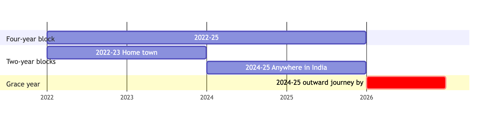
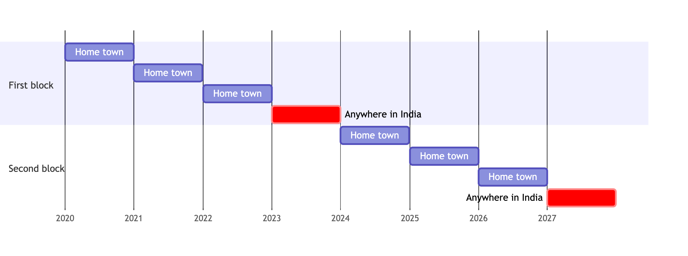

# Salary, allowances etc.
Your salary is paid directly to your bank account on the last day of
the month. The _Financial Year_ for tax purposes is from April 1$^{\text{st}}$ of
a given year to March 31$^{\text{st}}$ of the following year. The income tax uses
_assessment year_ for submission of Income Tax Returns, which is the
financial year in which the return is filed[^taxyear]. The salary slip
is made available to every employee around the end of the month in
their SAP login, and it provides details of earnings, deductions and
the net pay that will be credited to the bank account of the
employee. The salary slip of every employee is uploaded on the
internal website of the Institute
[http://ep.iitb.ac.in](http://ep.iitb.ac.in).

[^taxyear]: As an example, at the time of writing (January 2024), the
    financial year is 2023-24, while the assessment year for this
    period would be 2024-25.

## Components of salary
The salary that you get has several components.

1. _Pay at Pay Level:_ We outline the pay scales with reference to the
   7$^{\text{th}}$ Pay Commission, that is currently in force,
   below. The position to which you are appointed (or move to after
   selection to a higher post) defines the salary. All Government
   servants in India are placed in one of these _pay levels_. Faculty
   members in Institutes such as IITs are placed in one of the
   following pay levels. D.A. stands for "Dearness Allowance",
   described subsequently.

   - *Pay Level 10*: Salary range ₹ 57,700 to ₹ 98,200 (plus D.A.)
     per month.
   - *Pay Level 11*: Salary range ₹ 68,900 to ₹ 117,200 (plus
     D.A.) per month.
   - *Pay Level 12*: Salary range ₹ 101,500 to ₹ 167,400 (plus
     D.A.) per month.
   - *Pay Level 13A1*: Salary range ₹ 131,400 to ₹ 204,700 (plus
     D.A.) per month.
   - *Pay Level 13A2*: Salary range ₹ 139,600 to ₹ 211,300 (plus
     D.A.) per month.
   - *Pay Level 14A*: Salary range ₹ 159,100 to ₹ 220,200 (plus
     D.A.) per month.
   - *Pay Level 15*: Salary range ₹ 182,200 to ₹ 224,100 (plus
     D.A.) per month.

   Your salary within the pay band is fixed at the time of your
   appointment and increases every year by an _increment_, as defined
   in the 7$^{\text{th}}$ Pay Commission Pay Matrix. The various cadres, processes
   for selections, and salary scales (that is, Pay Levels as listed
   above) for the faculty are as follows. Note that they are
   automatically moved to the higher levels as they gain experience
   through their career.

   - _Assistant Professor:_ Assistant Professors fall into the
     following levels, based on their experience:
	 - _0 to 3 years of post-PhD experience (Assistant Professor Grade II):_ Pay
Level 10 or 11, with increments based on experience, plus D.A.
	 - _3 years or more of post-PhD experience (Assistant Professor Grade I):_ Pay Level 12, with a starting salary of ₹ 101,500, with increments based on experience, plus D.A. per month.
	 - _After 3 years in Pay Level 12 (Assistant Professor Grade I)_:
       Pay Level 13A1 with a starting salary of ₹ 131,400, with increments based on experience, plus D.A. per month.

	 If you have joined IIT after having served for some time as
	 Assistant Professor in another IIT or a central University or
	 NIT, your previous experience will be counted for movement to
	 Assistant Professor (Grade I).

	 As mentioned earlier, selected candidates with less than the
	 requisite experience as specified in the advertisement may be
	 taken as _Assistant Professor (Grade II)_ in Pay Level
	 10 or 11. While, technically,
	 appointment to this position does not automatically imply
	 ultimate absorption in the IIT, we have adopted a system of
	 internal assessment as explained [in the section on regularization](#sec:regularization).

   - _Associate Professor:_  Pay Level 13A2, with increments based on experience, plus D.A.

   - _Professor:_ Pay Level 14A, with increments based on experience, plus D.A.

   The Institute website (see 'Recruitment' link) carries the
   minimum eligibility criteria for all the above positions.

   In addition, the following scales are applicable as appropriate to faculty:

   - _Professor (HAG Scale):_ From 18$^{\text{th}}$ August 2009, a
   senior cadre of Professors has been created. The scale pay for this
   cadre is known as HAG (Higher Administrative Grade). The minimum
   eligibility criteria for this scale is six years of service as a
   Professor. A maximum of 40% of the total number of Professors can
   be placed in this scale. The corresponding Pay Level is 15, and the
   salary range is from ₹ 182,200 to ₹ 224,100 per month. Currently,
   it takes about 12 years to become a HAG scale Professor after
   becoming Professor. Those Professors of CFTIs who are appointed as
   Director in CFTIs by the MoE, shall be deemed to have been placed
   in the HAG scale notionally from the day they took charge as
   Director in CFTIs or from the day guidelines were issued by MHRD
   vide its letter No. F.23-1/2008-TS.II dated 18.08.2009, whichever
   is later.

   - _Institute and Endowed Chairs for faculty:_ As a means of
   recognizing outstanding performance, the Institute has several
   Chair Professor positions. While most of these are at the Professor's level, there are a few at other levels
   also.  Funding for several of these comes from endowments, and is
   managed by the Dean (ACR)'s office, which also takes an active role
   in raising funds for further Chairs. The selection to these Chairs is done by a Selection Committees. The tenure of the Chair Professorship position is for a period of three years, and the chair is re-advertised at the end of that
   period. Faculty who hold Chairs receive a salary top up of ₹
   30,000 per month and a contingency grant of ₹ 90,000 per year, in
   addition to their salaries.

   ::: {.review}
   **Revised from 21.06.2024:**

   - *Chair Professor* (full Professors): ₹9 lakhs per year, made up of
     a monthly honorarium of ₹50,000 and an annual research grant of ₹3
     lakhs; 3 years; at most 20% of Professors at a time.
   - *Chair Faculty* (Associate and Assistant Professors): ₹6.6 lakhs
     per year, made up of a monthly honorarium of ₹30,000 and an annual
     research grant of ₹3 lakhs; 3 years; at most 5% of Associate
     Professors and 5% of Assistant Professors at a time.
   - *Distinguished Chair* (new; highly accomplished faculty members and
     emeritus fellows): ₹1 lakh per month and a research grant of ₹5
     lakhs per year; 3 years; limited to four or five faculty members at
     any time.

   Other existing terms of Chair Professorship continue.
   (*Source:* [Circular No. Reg/F&SS/2024 dated
   15.01.2025](https://bighome.iitb.ac.in/index.php/s/MHscnHMFz349YHK).)
   [Reviewer: the ₹30,000 per month and ₹90,000 per year figures above
   predate this circular.]
   :::

3. _Dearness Allowance:_ A component termed as Dearness Allowance to
   take care of rising prices due to inflation is also a part of your
   pay package. The rate of Dearness Allowance is revised by the
   Government every January and July based on consumer price indices.

4. _House Rent Allowance (HRA):_ If you do not stay in
   Institute-provided accommodation, you will also receive House Rent
   Allowance (HRA) which is 30% of your basic pay. The allowance is
   payable even when you stay in an accommodation owned by
   you. (Interestingly, if both spouses are employees of the
   Institute, both can claim HRA if the accommodation is rented or is
   owned. However, if either of them has a Government accommodation, HRA
   cannot be claimed by either). HRA is taxable. If, however, you live
   in a rented accommodation, the HRA that you receive may be fully or
   partially exempt from income tax. The amount of exemption that can
   be claimed is the least amount out of the following three: (i) the
   HRA received, (ii) rent that you actually paid over and above 10%
   of your basic pay and (iii) 50% of your basic salary.

5. _Transport Allowance:_ All employees, irrespective of whether they
   live within the campus or commute from outside, are eligible to
   receive a transport allowance. For those in the faculty cadre, the
   rate of transport allowance is ₹ 7,200 per month. In addition, the
   Dearness Allowance at prevailing rate is payable on this amount as
   well. (Note: The transport allowance payable to the blind or
   orthopedically handicapped employees is double this rate).

## Annual Increment
Every year employees are given an increment in their salary. The pay
in the pay band increases to an amount that is the next cell in the
Pay Matrix (corresponding to an approximately 3% increase in salary).
The yearly increment is given from the first day of January or July of
every year. However, the first increment can be availed only after
completing six months in a given pay. This means that, if you are
appointed between July and 1$^{\text{st}}$ January, (of the following year), you
are eligible for an increment in the following July but if the date of
appointment is between 2nd January to June, you will get the first
increment in January of the following year.  If the employee is on
leave, other than casual leave, on the first day of the increment, the
increment is given from the day when the employee rejoins the duty.

*Level $\rightarrow$*     10      11       12       13A1     13A2      14      14A      15
----------              ------- -------- -------- -------- -------- -------- -------- --------
*Cell $\downarrow$*
   1                    57700   68900    101500   131400   139600   144200   159100   182200
   2                    59400   71000    104500   135300   143800   148500   163900   187700
   3                    61200   73100    107600   139400   148100   153000   168800   193300
   4                    63000   75300    110800   143600   152500   157600   173900   199100
   5                    64900   77600    114100   147900   157100   162300   179100   205100
   6                    66800   79900    117500   152300   161800   167200   184500   211300
   7                    68800   82300    121000   156900   166700   172200   190000   217600
   8                    70900   84800    124600   161600   171700   177400   195700   224100
   9                    73000   87300    128300   166400   176900   182700   201600
   10                   75200   89900    132100   171400   182200   188200   207600
   11                   77500   92600    136100   176500   187700   193800   213800
   12                   79800   95400    140200   181800   193300   199600   220200
   13                   82200   98300    144400   187300   199100   205600
   14                   84700   101200   148700   192900   205100   211800
   15                   87200   104200   153200   198700   211300
   16                   89800   107300   157800   204700
   17                   92500   110500   162500
   18                   95300   113800   167400
   19                   98200   117200

Table:  7$^{\text{th}}$ Commission Pay Matrix

## Deductions
When you receive your salary slip, you will find some deductions as well. The primary deductions are:

1. _Income Tax:_ Income tax rates are as per finance bill passed by
   the Parliament every year. It is possible to minimize your tax
   liability through some tax saving mechanisms. Almost every
   academic unit has a local expert on such matters for advising you on
   this. Filing an income tax return every year is compulsory. Unless
   the last date is extended, returns have to be filed by 31$^{\text{st}}$ July of
   the following financial year for which the return is being
   filed. From the assessment year 2013-14 e-filing of your income tax
   return has been made mandatory. You
   will need to complete a one-time registration process at the
   [Income Tax e-Filing
   website](https://www.incometax.gov.in/iec/foportal/). Your PAN number
   will be your user-id. You will also be required to link your
   Aadhaar to your PAN at this stage. You can view your tax credit (form 26AS) once
   you login (you will also be able to see it at your net banking
   website). The income tax return can be filled up directly on the e-Filing website.  On
   successful submission of your return, the system will generate an
   acknowledgement (called ITR-V). You can either choose to e-verify
   your return submission using an Aadhaar based OTP. Otherwise, take a print out of this
   acknowledgement, sign it and send it to the address mentioned in
   this form by ordinary post or speed post and you are done.
   (Incidentally ITR-V is password protected with a long 18 digit
   password consisting of your pan number in lower case followed by
   your date of birth in ddmmyyyy format.) You can get all the
   necessary information from the Income Tax Department website
   [http://incometaxindia.gov.in](http://incometaxindia.gov.in).

   Please note that if you have income from sources other than from
   the Institute and the bank deposits, or if you are expecting a
   refund of income tax, you have to add these while filing your
   return.

2. _Professional Tax:_ Currently ₹ 2,500 per year.

3. Contribution to CPF/GPF/NPS.

4. License Fee and utility charges for your quarter in the campus.

5. There will be deductions for Group Term Insurance and Scheme (GTIS)
   and Post Retirement Medical Scheme (PRMS).

## Leave Travel Concession (LTC)

Once every two years, you are eligible for a paid travel to your home
town. For the purpose of LTC, block years are defined for two years
starting 1$^{\text{st}}$ January of an even year (e.g. 2024)  to 31$^{\text{st}}$ December of
an odd year. If you do not avail LTC during this block year it
generally lapses. However, it has been the practice of the Government
to allow for a grace year, that is,  LTC for the block year 2024-25 can be
availed (that is,  outward journey commenced) up to 31$^{\text{st}}$ December 2026.

Two of the above blocks are combined together to define a four year
block, e.g. the block years 2022-23 and 2024-25 are combined to define
a four year block of 2022-25.

In this four year block, one can avail LTC for home town travel in one
two-year block and another LTC to anywhere in India (including home
town) in the other second two-year block. The four year block also has
a grace period of one year, that is, the 2024-25 block must be
utilized (that is outward journey commenced) before 31/12/2026.

{#fig-ltc-block}

### Eligibility:

The employee appointed on scale must have completed one year of
service in the block to be eligible for LTC in the block, that is,
those who are appointed up to 31-12-2024. are eligible for LTC in the
block year 2025 but those appointed after this day are not eligible.

All the declared dependents are eligible for LTC and the travel need
not be taken up together. All return journeys must be completed within
six months of outward journey.

If both the spouses are working for the Institute, they can claim LTC
separately only if the declared dependents are different. The children can avail LTC only from one of the
parents. If you take LTC for spouse under your LTC entitlement, he/she
cannot independently claim LTC for self. Each spouse can declare
separate "Home Town" and take LTC for their respective hometowns.

### Special provision for New Appointees:

Fresh appointees are eligible for LTC once every year for two blocks
of four years each. This means that, during the first eight years of
service, an employee can avail one LTC every year. The definition of
the block years remain the same. (Illustration: Suppose an employee
joined in 2019. He/she can travel on LTC to his/her hometown in 2020,
2021 and 2022 and one anywhere in India LTC in 2023. In the next
block, that is 2024-2027 he/she can avail three home towns and one
anywhere in India, till he/she completes eight years of service.)
After the first 8 years of service, the regular LTC rules described
earlier apply.

{#fig-ltc-new-appointee}

The all India LTC can be availed only on the 4th occasion of the block and not at random.

### Encashment of Leave for LTC:
Normally, Government employees cannot encash their accumulated earned
leave excepting at the time of retirement. However, at the time of
taking LTC an employee is permitted to encash up to 10 days of
accumulated earned leave with prior approval, subject to the condition that such encashment
will not exceed 60 days during the entire career of an employee for which a balance of at least 30 days of earned leave is must. The request for each encashment should be made prior to availing the LTC. If
both husband and wife are employees, each can encash such earned leave
even when they are traveling together.  The encashment of earned leave
for the purpose of LTC will not have any bearing on the maximum number
of days (300) for which earned leave can be cashed at the time of
retirement.

### Travel Eligibility:

Faculty and all dependents are eligible to travel by
air[^airindia]. Employees in Pay Level 9 to 13 are eligible for
Economy Class, while those in Pay Level 14 and above (Professors) are
eligible for Business Class. Similarly, employees in Pay Levels up to
11 are eligible for Second Class AC train fare, while those in Pay
Levels 12 and above are eligible for First Class AC train fare. These
are the same classes as for official tours (see [Domestic travel](cpda.qmd#sec-domestic-ta-da)). Please note that no taxi or
road mileage is admissible to reach the airport/railway station or for
internal travel to destination except where road travel is done by
buses run by Government organizations (for which you will have to
produce the tickets). LTC rules are strictly observed, and it is
necessary to attach photocopies of your tickets along with your claim
(in case of air travel, boarding passes must be retained and produced
along with e-tickets; production of an e-ticket without the boarding
passes is not acceptable as proof of travel.) For journeys which
involve water transport, detailed rules are available with the
administration.

[^airindia]: Tickets should be booked only through M/S Balmer Lawrie &
    Co. Ltd., M/S Ashok Travels and Tours, or M/S Indian Railways
    Catering and Tourism Corporation Ltd.

::: {.review}
**Booking air tickets for LTC**

- Air tickets for LTC must be booked through one of the Authorized
  Travel Agencies: [Balmer Lawrie & Co.
  Ltd.](https://govemp.balmerlawrietravelapp.com), [Ashok Travels &
  Tours](https://www.attitdc.in) or [IRCTC](https://www.air.irctc.co.in).
- Tickets must be booked under the category "LTC", not "Corporate";
  otherwise the claim cannot be allowed. The ticket must show the word
  "LTC".
- Booking on the website of one of these three agents is itself proof
  that the cheapest fare was booked; no screenshot is needed. (Employees
  not entitled to air travel who fly under the Special Dispensation
  Scheme to NER/J&K/A&N/Ladakh must still keep a printout of the flight
  and fare details for the relevant railhead.)
- For official travel (TA) by air, no screenshot is required.
  Employees should choose the "Best Available Fare" in their entitled
  class, the cheapest fare available, preferably non-stop, in the
  desired 3-hour time slot on the day of travel, with a 10% price band
  allowed for convenience.

*Sources:* [Circular No. C&A/LTC/2026 dated
22.04.2026](https://bighome.iitb.ac.in/index.php/s/yy9CTcPT6WN7gj9);
[Circular No. C&A/TA/2026 dated
30.06.2026](https://bighome.iitb.ac.in/index.php/s/3dbY7LDCGHEeKaF);
[DoPT OM F.No.31011/07/2025-PP.A-IV dated 01.07.2025, FAQs on CCS
(LTC) Rules](https://bighome.iitb.ac.in/index.php/s/qL3MtQN99Z4byr8),
circulated to faculty on 05.01.2026.
:::

### LTC Advance:
90% of the estimated cost of journey can be taken as an advance, only
where the journey is expected to be completed by all persons
travelling (including the return journey) within 90 days of taking the
advance. In case the expected date of completion is more than 90 days,
please draw advance only for outward journey.

When LTC advance is drawn and the tickets purchased for an amount
lower than the advance drawn, the excess amount should be refunded to
the Institute immediately. If this is not done penal interest on the
excess amount is charged, which cannot be waived by authorities.

The employee must take formal leave for availing LTC for self. You
cannot avail LTC using only the officially closed days. Faculty
members can avail LTC during vacation also, but with prior intimation
(with the destination specified) to administration. Submit the final
LTC claim as soon as the return journey is completed.

Final LTC claim settlement:
Where advance has been drawn, the claim for reimbursement shall be submitted within one month of the completion of the return journey. Failing which outstanding advance will be recovered suo-moto with penal interest @ 2% over GPF interest from the date of drawal to the date of recovery, as per rules.

Where no advance has be drawn, the claim for reimbursement shall be submitted within three months of the completion of the return journey.

Tickets for LTC travel are required to be booked through authorised agents viz. M/s Balmer Lawrie & Company, M/s Ashok Travels, or IRCTC.

## Telephone Expense Reimbursement

A faculty member is entitled to reimbursement of telephone (landline
at home and/or mobile connection) expenses up to ₹ 18,000 (₹
21,600 for a Professor) per financial year. The amount includes ₹ 4800 towards internet connection at home. Since internet
connections for all campus residents are provided by the Institute,
the amounts accordingly reduce to ₹ 13,200 (₹ 16,800 for a Professor)
for campus residents. For those not staying on campus (including those
staying in Institute-leased accommodation off campus) the full amount
is available for reimbursement provided they have supporting evidence
for internet connection at home.

To claim this, telephone bills (including mobile bills and bills for
internet charges) should be submitted to the accounts section. The faculty may choose to submit bills monthly, semi-annually or annually. As it is a reimbursement, no tax liability is due on
this amount.

::: {.review}
## Newspaper Reimbursement

Employees at Pay Level 9 and above can claim reimbursement for
newspapers bought or delivered at their residence, under the circular
dated 02.01.2019. Claims are made every six months, online at
[my.iitb.ac.in/b/claims](https://my.iitb.ac.in/b/claims/). The
Administration announces the deadline for each period; for January to
June 2026 it was 31.07.2026, and claims after the deadline are not
accepted. A [user guide (PDF)](https://bighome.iitb.ac.in/index.php/s/ENNsJBZYFzfcc6Z)
and a [video](https://bighome.iitb.ac.in/index.php/s/ELTtgTnEoLG2SmL)
explain the claim form.

*Source:* [Circular No. Admin/NR/2026 dated
13.07.2026](https://bighome.iitb.ac.in/index.php/s/Q7HPWADPbmLgGJq),
emailed to faculty-notices on 16.07.2026.
:::

## Children's Education Allowance
Expenses incurred in admitting upto two children through school (from Jr. KG to twelfth class) can be reimbursed.
As per 7th CPC, the procedure for claiming the reimbursement of
CEA/Hostel subsidy is changed to once in a year after completion of
the financial year/end of Academic year. The CEA amount is fixed to
₹ 2,812.5/- per month per child irrespective of the actual expenses
incurred by the Government Servant and Hostel subsidy ceiling amount
is ₹ 8,437.5/- per month. The reimbursement will be done against the submission of a bonafide certificate issued by the Head of the Institution OR self attested copy of the report card OR self attested fee receipts confirming that the fee has been deposited for the entire academic year or for the period /year for which claim has been preferred. The Hostel Subsidy and Children Education Allowance can be claimed concurrently.

In order to claim reimbursement of hostel subsidy for an academic year, a certificate is to be produced from the Head of the Institution confirming that the child studied in the school along with amount of expenditure incurred by the Government servant towards lodging and boarding in the residential complex.